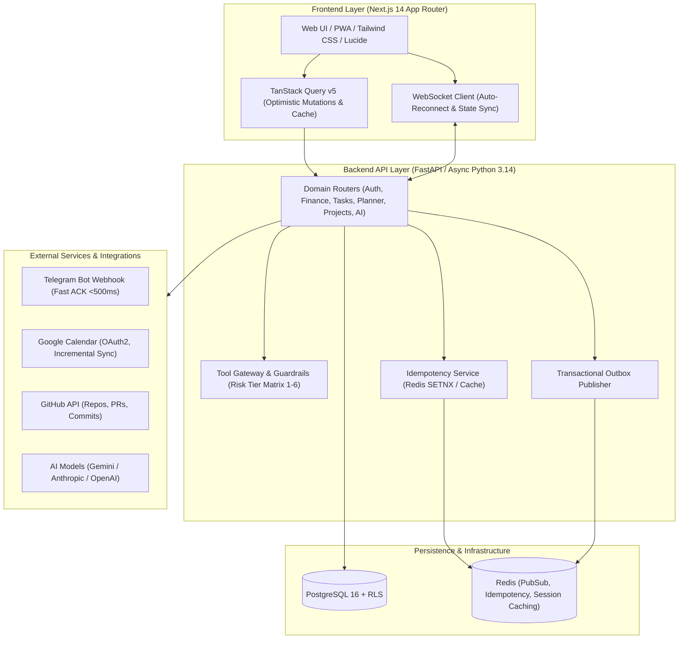
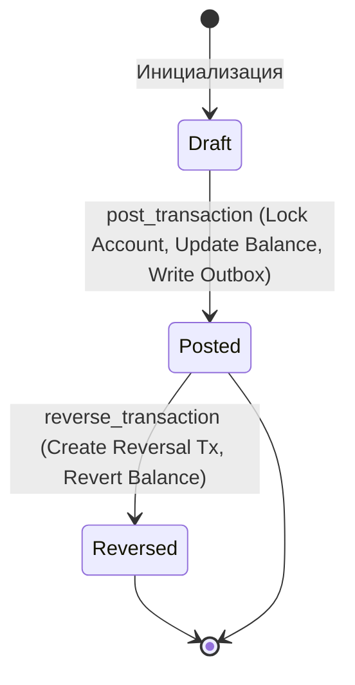
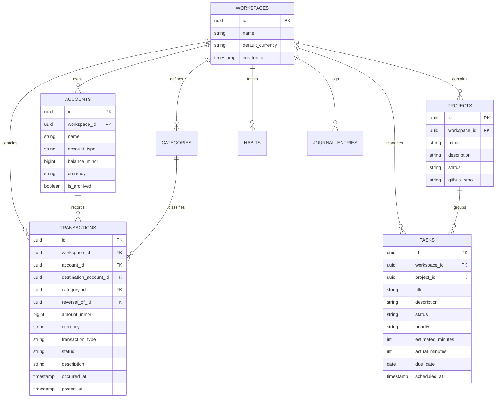

# Техническое задание и спецификация бизнес-логики: Personal AI OS

---

## 1. Введение и назначение системы

**Personal AI OS** — это персональная мультидоменная операционная система с интегрированным ИИ-ассистентом для комплексного управления жизнью, личными финансами, задачами, расписанием, привычками, проектами и внешними сервисами.

### Ключевые цели системы:
1. **Единый командный центр (Single Source of Truth):** объединение задач, календаря, финансов, привычек, заметок и проектов в одном высокопроизводительном интерфейсе.
2. **Интеллектуальная автоматизация (AI Co-pilot):** разбор естественного языка (RU/EN/UZ), автопланирование дня, умный учет расходов, категоризация и шлюз безопасности с подтверждением рискованных операций.
3. **Строгая финансовая надежность:** неизменяемый журнал финансовых операций (Immutable Transaction Ledger с атомарным обновлением балансов счетов, компенсаторные операции сторнирования, учет в минимальных денежных единицах `minor units`, локализация под валюту UZS и сегмент Узбекистана).
4. **Сквозная омниканальность:** управление через веб-приложение (PWA/Desktop) и Telegram-бота с мгновенным откликом (Fast ACK).
5. **Безопасность и изоляция данных:** мультитенантность на базе воркспейсов с Row-Level Security (RLS) в PostgreSQL и аппаратным шифрованием секретов AES-256-GCM.

---

## 2. Архитектура системы

### 2.1. Стек технологий

### 2.2. Архитектурные паттерны
- **Domain-Driven Design (DDD):** Разделение на слабосвязанные домены (`identity`, `finance`, `tasks`, `planner`, `projects`, `knowledge`, `calendar`, `notifications`, `ai_advisor`).
- **Transactional Outbox Pattern:** События доменов (`finance.transaction.posted.v1`, `task.created.v1`) сохраняются в таблицу `outbox_events` в рамках одной транзакции базы данных с бизнес-сущностями, гарантируя доставку At-Least-Once.
- **Optimistic UI with Instant Feedback:** Фронтенд оптимистично обновляет состояние на клиенте и автоматически откатывает кэш при ошибках сервера.
- **Zero-Trust Security for AI Tools:** ИИ не имеет прямого неконтролируемого доступа к базе данных или финансам; все действия валидируются через `ToolGateway` с распределением по 6 уровням риска.

---

## 3. Спецификация доменных модулей и бизнес-логики

---

### 3.1. Домен «Финансы» (Finance)

#### Назначение
Учет личных финансов, счетов, банковских карт, наличных средств, транзакций и бюджетов с акцентом на рынок Узбекистана (валюта `UZS / сум`).

#### Архитектурная модель:
Система использует **неизменяемый журнал финансовых операций (Immutable Transaction Ledger)** с атомарным обновлением балансов счетов. Каждая операция представляет собой целостную запись в журнале транзакций (`Transaction`) с автоматическим пересчетом баланса привязанного счета (`Account.balance_minor`) в транзакции базы данных.

#### Бизнес-правила:
1. **Денежные единицы:** Все денежные суммы в базе данных и API хранятся исключительно как целые числа в минимальных единицах (`amount_minor`).
   - Для `UZS`, `RUB`, `USD`, `EUR`: 1 единица = 100 тийинов/копеек/центов. Сумма 50 000 сум хранится как `5000000`.
2. **Типы счетов:**
   - `bank` — Банковский счет / вклад.
   - `debit_card` — Дебетовая карта (Uzcard, Humo, Visa, Mastercard).
   - `credit_card` — Кредитная карта / рассрочка.
   - `cash` — Наличные деньги.
   - `wallet` — Электронный кошелек / накопительный счет.
3. **Защита от удаления счетов:**
   - Счета с историей транзакций не удаляются физически, а мягко архивируются (`is_archived = true`) для сохранения аудиторского следа и целостности балансов.
4. **Неизменяемость проведенных транзакций (Immutability):**
   - Проведенная транзакция (`status = 'posted'`) не подлежит прямому редактированию или удалению.
   - Для отмены ошибочной транзакции выполняется операция **Reversal (сторно)**: создается корректирующая транзакция типа `reversal` с ссылкой `reversed_transaction_id`, которая зеркально возвращает баланс счета.
   - Защита от повторного сторнирования: транзакцию типа `reversal` повторно сторнировать запрещено (`HTTP 409 Conflict`).
5. **Операция сверки баланса (Reconciliation):**
   - Сверка предназначена для синхронизации баланса счета с реальной банковской выпиской или пересчетом наличных без ручного изменения полей счета.
   - Эндпоинт: `POST /v1/finance/accounts/{id}/reconcile`.
   - Вычисление разницы: $\Delta = actual\_balance\_minor - current\_balance\_minor$.
   - При $\Delta > 0$ (излишек) баланс увеличивается; при $\Delta < 0$ (недостача) баланс уменьшается.
   - В журнале фиксируется транзакция с `type = 'reconciliation'`, `amount_minor = abs(\Delta)`, `status = 'posted'`, `note = 'Reconciliation (+/-X): {reason}'`.
   - При $\Delta = 0$ возвращается `HTTP 409 Conflict` («No Adjustment Needed»).
   - Транзакции типа `reconciliation` не подлежат сторнированию через `/reverse` (возвращается `HTTP 409 Conflict`). Для изменения баланса выполняется новая сверка.
   - В аналитике доходов и расходов сверка исключается из операционных потоков и учитывается как балансовая корректировка.
   - В AI Tool Gateway операция сверки классифицируется как `MEDIUM_WRITE` и требует обязательного интерактивного подтверждения пользователя.
6. **Атомарность и блокировки:**
   - При проведении транзакции баланс счета модифицируется атомарно в транзакции базы данных с блокировкой `SELECT ... FOR UPDATE` для предотвращения race condition.
   - `expense` (Расход): уменьшает `balance_minor` счета списания.
   - `income` (Доход): увеличивает `balance_minor` счета зачисления.
   - `transfer` (Перевод): списывает со счета-источника и зачисляет на счет-получатель в единой транзакции.
7. **Бюджетирование и аналитика:**
   - Бюджеты фиксируются на календарный месяц (`YYYY-MM`) с лимитом по категориям в валюте по умолчанию (`UZS`).
   - Прогресс расхода бюджета рассчитывается на основе агрегации транзакций типа `expense` за соответствующий период.

---

### 3.2. Домен «Задачи и Канбан» (Tasks & Kanban)

#### Назначение
Управление персональной продуктивностью по методологии GTD (Getting Things Done) и визуализация через интерактивную Канбан-доску.

#### Бизнес-правила:
1. **Канонические статусы доменной модели (8 статусов):**
   - `inbox` — Входящая необработанная задача.
   - `todo` — Задача в очереди к выполнению.
   - `scheduled` — Запланировано на конкретную дату (`due_date` / `scheduled_date`).
   - `in_progress` — В активной работе прямо сейчас.
   - `waiting` — Ожидает внешнего действия / заблокирована.
   - `done` — Успешно завершена (фиксируется `completed_at`).
   - `cancelled` — Отменена (фиксируется `cancelled_at`).
   - `archived` — Скрытое техническое состояние в архиве (холодное хранилище).

| Статус | Тип состояния | Отображение в Kanban | Отображение в истории/фильтрах | Правила восстановления (Reopen) |
|---|---|---|---|---|
| `inbox` | Активное / Входящее | Да (Колонка Inbox) | Да | Базовое состояние |
| `todo` | Активное / Очередь | Да (Колонка Todo) | Да | Переход из любых активных/терминальных |
| `scheduled` | Активное / Запланировано | Да (Колонка Scheduled) | Да | Переход в `in_progress` / `todo` |
| `in_progress` | Активное / В работе | Да (Колонка In Progress) | Да | Переход в `waiting` / `done` / `todo` |
| `waiting` | Активное / Блокировка | Да (Колонка Waiting) | Да | Переход в `in_progress` / `todo` |
| `done` | Завершённое (Completed) | Секция Done / свернуто | Да (История / Архив) | Разрешено: возврат в `todo` / `in_progress` |
| `cancelled` | Терминальное (Dropped) | Нет | Да (Фильтр Cancelled) | Разрешено: восстановление в `todo` |
| `archived` | Холодное хранилище | Нет | Только явный поиск в архиве | Разрешено: разархивация в `todo` |

2. **Отображение на Канбан-доске:**
   - **Рабочие колонки (5 колонок):** `Inbox`, `Todo`, `Scheduled`, `In Progress`, `Waiting`.
   - **Секция завершенных:** задачи со статусами `Done` и `Cancelled` отображаются в завершенном списке или свернутой колонке.
   - **Динамический фильтр «Сегодня» (Today View):** выборка задач, у которых `due_date <= today` или `scheduled_date <= today`. «Сегодня» является динамическим фильтром/проекцией, а не отдельным статусом.
3. **Операция завершения:**
   - Выделенный эндпоинт `POST /v1/tasks/{id}/complete` переводит задачу в статус `done`, фиксирует `completed_at = now()` и инкрементирует версию для оптимистичной блокировки.
4. **Оптимистичная блокировка (Concurrency Control):**
   - Задачи содержат поле `version`. При параллельном обновлении заголовок `If-Match: W/"{version}"` защищает от перезаписи чужих изменений (`HTTP 409 Conflict`).
5. **Приоритеты:** `low` (низкий), `medium` (средний), `high` (высокий), `urgent` (критический).

---

### 3.3. Домен «Планировщик и Фокус» (Planner & Focus)

#### Назначение
Организация структуры дня, тайм-блокинг, формирование полезных привычек, фиксация рефлексии и глубокая концентрация.

#### Состав модуля:
1. **Hourly Agenda Grid (Почасовое расписание):**
   - Сетка дня (00:00 — 23:00) для распределения временных слотов и фиксации встреч/задач.
2. **Daily Habits Tracker (Трекер привычек):**
   - Учет ежедневных ритуалов (спорт, чтение, вода, медитация, учеба).
   - Расчет непрерывных серий выполнения (`streak_days`) и процента продуктивности за неделю.
3. **Daily Journal (Дневник рефлексии):**
   - Утренний план и вечерний аудит дня.
   - Оценка настроения (`mood` от 1 до 5), фиксация главных побед дня (Wins) и заметок.
4. **Focus Pomodoro Timer:**
   - Классический таймер глубокой работы (25 мин фокус / 5 мин отдых).
   - Привязка сессий таймера к конкретным задачам с авто-инкрементом `actual_minutes`.

---

### 3.4. Домен «Проекты» (Projects)

#### Назначение
Координация долгосрочных целей, группировка задач, заметок и интеграция с репозиториями кода.

#### Бизнес-правила:
1. **Канонические статусы проектов и стратегических целей (5 единых статусов):**
   - `planning` — Предварительное планирование и формулирование скоупа.
   - `active` — В активной разработке.
   - `on_hold` — Приостановлен / на паузе.
   - `completed` — Успешно завершен.
   - `archived` — Помещен в архив.
2. **Область действия Legacy Input Alias (`paused`):**
   - Значение `paused` является устаревшим алиасом ввода (Legacy Input Alias).
   - Принимается **исключительно на входных границах API** (`GoalCreate`, `GoalUpdate`, `ProjectCreate`, `ProjectUpdate`) и автоматически нормализуется в `on_hold`.
   - Значение `paused` **никогда не возвращается** в ответах API, не сохраняется в БД, не используется во фронтенд-фильтрах и не фигурирует во внутренних событиях системы.
3. **Семантика миграций и откатов (Schema vs Data Downgrade):**
   - *Schema Downgrade:* Поддерживается на уровне структуры БД (Alembic восстанавливает прежние Check Constraints).
   - *Data Downgrade:* Необратима на уровне данных (исторические записи, переведённые из `paused` в `on_hold`, при откате схемы остаются `on_hold`, так как исходный контекст нормализован).
4. **Расчет прогресса:** Процент завершенности вычисляется динамически на основе соотношения выполненных (`done`) и общего числа задач проекта.
5. **GitHub Integration:** Привязка GitHub-репозитория к проекту для отображения коммитов, открытых PR и Issues в контексте проекта.

---

### 3.5. Домен «AI Advisor & Tool Gateway» (ИИ-советник и шлюз инструментов)

#### Назначение
Автономный ассистент для планирования дня, умного распознавания команд и безопасного выполнения действий.

#### Матрица уровней риска (Risk Tier Matrix):

| Уровень (Tier) | Категория | Описание | Политика выполнения |
| :--- | :--- | :--- | :--- |
| **Tier 1 (Read)** | Чтение | `get_tasks`, `get_finances`, `get_calendar` | Автоматическое выполнение |
| **Tier 2 (Low Mutation)** | Создание черновиков | `create_task_draft`, `create_note` | Автоматическое выполнение |
| **Tier 3 (Medium)** | Обновление сущностей | `update_task_status`, `reschedule_task` | Автоматически с логированием |
| **Tier 4 (Financial)** | Финансовые операции | `post_expense`, `post_income`, `transfer` | **Требуется подтверждение пользователя** |
| **Tier 5 (System)** | Интеграции | `sync_calendar`, `reconnect_oauth` | Требуется подтверждение |
| **Tier 6 (Destructive)**| Удаление / Очистка | `delete_account`, `truncate_data` | **Жесткая блокировка / Двойной фактор** |

#### Quick Add Parser (Умный парсер естественного языка):
- Распознает намерение пользователя из свободного текста:
  - *«Купил обед 45 000 сум с карты Uzcard»* $\rightarrow$ Создание расхода `4500000 minor`, категория «Еда», счет «Uzcard».
  - *«Завтра в 14:00 созвон с инвестором на 45 минут»* $\rightarrow$ Создание задачи с датой завтра, временем 14:00, длительностью 45 мин.

---

### 3.6. Домен «Внешние интеграции» (Integrations)

#### 1. Telegram Bot Integration (Полный жизненный цикл и Opaque UUID Webhook):
- **Модель подключения:** Один Telegram-бот обслуживает одно рабочее пространство пользователя (1:1 Workspace Model).
- **Жизненный цикл интеграции:**
  1. *Connect (`POST /v1/integrations/telegram/connect`):* Валидация токена через Telegram `getMe`, генерация уникального непрозрачного `webhook_id` (UUID) и криптографического `webhook_secret` (AES-256-GCM шифрование токена).
     - *Webhook mode:* При наличии публичного HTTPS URL (`webhook_url` или `TELEGRAM_WEBHOOK_BASE_URL`) формируется URL вида `https://{domain}/v1/webhooks/telegram/{webhook_id}` (токен бота никогда не включается в URL) и выполняется вызов Telegram `setWebhook` с передачей `secret_token` и `allowed_updates`. В БД фиксируется `mode: "webhook"`, `webhook_registered: true`, `webhook_id`.
     - *Polling fallback mode:* Если HTTPS URL отсутствует или Telegram API возвращает ошибку, интеграция переводится в `mode: "polling"`, `webhook_registered: false` для обработки фоновым воркером без сбоя подключения воркспейса.
  2. *Receive Updates (`POST /v1/webhooks/telegram/{webhook_id}`):* Поиск активной интеграции по `webhook_id` (неизвестный ID возвращает 404), проверка валидности `X-Telegram-Bot-Api-Secret-Token` (неверный secret возвращает 403), Fast ACK (`{"ok": true}`) < 500мс, дедупликация `update_id` через Redis `SETNX` (TTL 24ч), асинхронный запуск обработки через `BackgroundTasks`.
  3. *Disconnect (`DELETE /v1/integrations/telegram`):* Вызов Telegram `deleteWebhook` через Bot API, отзыв и удаление зашифрованного bot token, инвалидация `webhook_id` и `webhook_secret` в базе данных.
  4. *Reconnect:* Повторное подключение генерирует новый уникальный `webhook_id`, делая старый webhook полностью недействительным.
- **Интерактивные подтверждения:** Подтверждение финансовых операций и создание задач через Inline Keyboard.
- **Безопасность URL вебхука:**
  - URL вебхука использует исключительно непрозрачный UUID (`/v1/webhooks/telegram/{webhook_id}`), что исключает утечку bot token в access logs, reverse proxy, tracing, APM и системы мониторинга.
  - Проверка заголовка `X-Telegram-Bot-Api-Secret-Token` выполняется в режиме constant-time (`hmac.compare_digest`) для защиты от timing-атак.

#### 2. Google Calendar Integration:
- Двунаправленная синхронизация событий по протоколу OAuth2.
- Настройка Client ID и Client Secret через пользовательский интерфейс (`POST /v1/integrations/google/configure`).
- Инкрементальная синхронизация с сохранением `sync_token`.
- Автоматическая обработка ошибки `410 Gone` (сброс токена и полный resync).

#### 3. Безопасность токенов:
- Все токены доступа (`access_token`, `refresh_token`, `bot_token`) шифруются алгоритмом **AES-256-GCM** перед сохранением в базе данных. Вектор инициализации (IV) и Auth Tag генерируются уникально на каждую запись.

#### 4. Сетевая топология и конфигурация портов:
- **Хост-порт API (Default Host Port):** `8008` (основной порт бэкенда для локальной разработки и обращений веб-клиента `http://localhost:8008`).
- **Внутренний порт Docker-контейнера API:** `8000` (проброс портов `8008:8000` в `docker-compose.yml`).
- **Фронтенд веб-приложения (Next.js):** `3000` (`http://localhost:3000`).
- **Публичный Reverse Proxy (Nginx/Traefik):** `443` (HTTPS) / `80` (HTTP).
- **Google OAuth Callback URL:** По умолчанию `http://localhost:8008/v1/integrations/google/callback` (конфигурируется через `GOOGLE_REDIRECT_URI` в `.env` или через Web UI форму).
- **Telegram Webhook Base URL:** Задается через переменную `TELEGRAM_WEBHOOK_BASE_URL` (например, `https://api.personal-os.com`).

#### 5. Мониторинг работоспособности (Health Checks):
- **Liveness Probe (`GET /v1/health/live`, alias `GET /v1/health`):** Проверка жизнеспособности HTTP-сервера (возвращает 200 OK при работающем uvicorn).
- **Readiness Probe (`GET /v1/health/ready`):** Глубокая проверка готовности зависимостей — выполняет SQL-запрос `SELECT 1` в PostgreSQL и валидирует наличие ключа шифрования `AES_GCM_SECRET_KEY` (возвращает 503 при сбое).

---

## 4. Схема данных (База данных PostgreSQL)

---

## 5. Нефункциональные требования (NFR)

1. **Производительность:**
   - Время ответа базовых API endpoints $\le 100$ мс (p95).
   - Ответ на вебхуки Telegram (Fast ACK) $\le 300$ мс.
   - Первая отрисовка страниц (FCP) $\le 1.2$ с, Time to Interactive (TTI) $\le 2.0$ с.
2. **Масштабируемость и отказоустойчивость:**
   - Stateless архитектура бэкенда (горизонтальное масштабирование FastAPI инстансов).
   - Изоляция сессий и транзакций баз данных.
   - Корректная работа WebSocket соединений с автореконнектом и экспоненциальным backoff.
3. **Безопасность:**
   - Полная изоляция рабочих пространств (Row Level Security в Postgres).
   - Защита от CSRF, XSS, инъекций и подделки заголовков.
   - Шифрование персональных данных и внешних токенов по стандарту NIST AES-GCM.
4. **Интернационализация и локализация:**
   - Поддержка числовых и денежных форматов в соответствии с узбекским и международным стандартом (разделители групп разрядов, суффикс `сум`).

---

## 6. Регламент тестирования и контроль качества

- **Backend Unit & Integration Tests (pytest):** Покрытие критических доменов (финансы, задачи, безопасность, аутентификация, вебхуки) тестами $\ge 85\%$.
- **Frontend Unit & Component Tests (Vitest):** Тестирование утилит форматирования, графиков, калькуляторов и Zustand-хранилищ.
- **E2E & Type Integrity:** Обязательная проверка типов (`tsc --noEmit`) и успешная сборка продакшен-бандла перед любым релизом.
