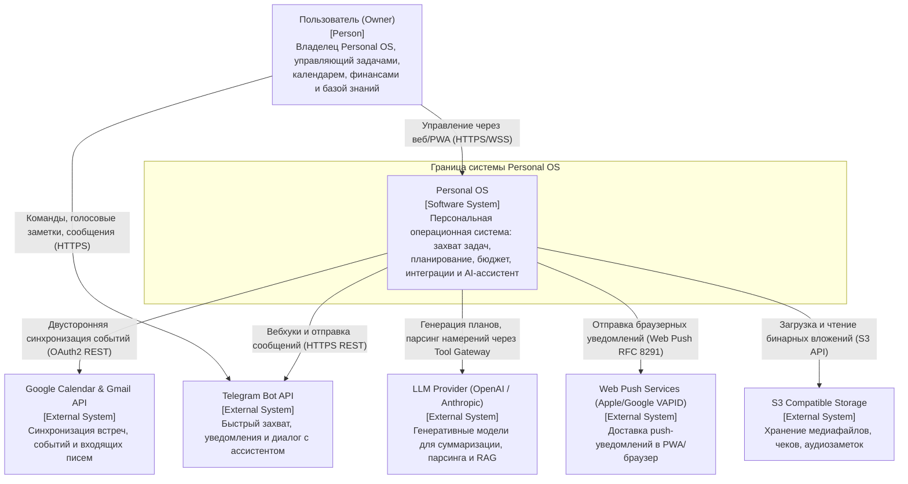
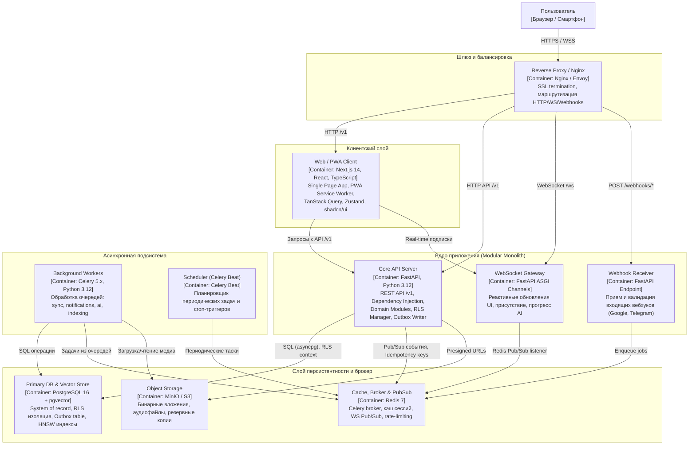
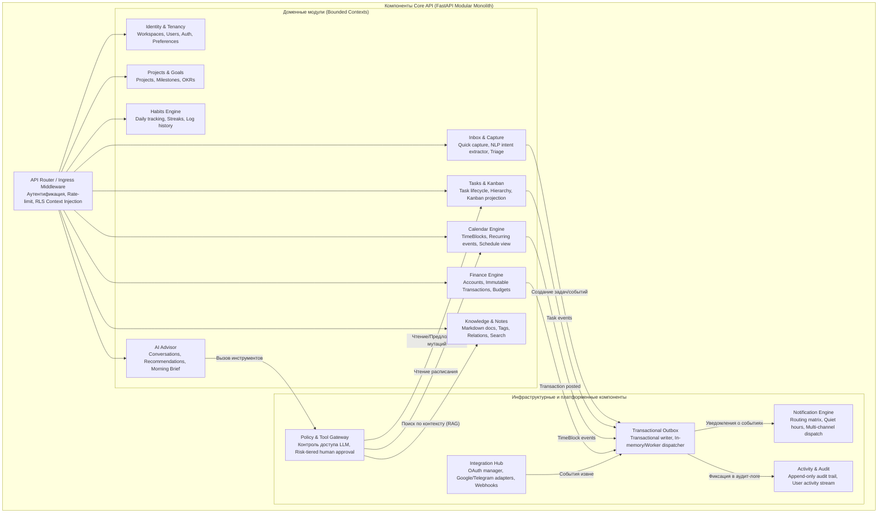

# 04 — Solution Architect

STATUS: VERIFIED
TASK: Разработать полную архитектурную спецификацию Personal OS (Solution Architecture Document): C4 Model (Context, Containers, Components), монорепозиторий, 20 полных ADR, контракты интеграции 12 Bounded Contexts, каталог доменных событий с envelope, принципы проектирования REST API, политики безопасности и транзакционные гарантии.
INPUT: docs/it-company/01-product-discovery-manager.md (PRD, MVP Scope, стек, roadmap), docs/it-company/02-business-analyst.md (65 User Stories, 7 Use Cases, Business Rules, AC-матрица), docs/it-company/03-product-manager.md (Product Backlog, Sprint Plan S0-S16, MoSCoW, DoD), docs/it-company/17-ux-designer.md (User Flows, Wireframes, IA).
ACTIONS:
- Разработана трехуровневая C4-модель: System Context, Containers, Backend Components с Mermaid-диаграммами.
- Спроектирована структура монорепозитория (apps, workers, packages, infra, docs) с правилами изоляции модулей.
- Зафиксированы и детально описаны 20 фундаментальных ADR (Context, Decision, Consequences, Trade-offs, Mitigations).
- Сформированы контракты интеграции для 12 Bounded Contexts (Owned aggregates, Excluded concepts, Public interfaces, Events).
- Создан исчерпывающий каталог доменных событий с универсальным Event Envelope и схемой Transactional Outbox.
- Зафиксированы стандарты проектирования API: REST v1, Idempotency-Key, If-Match / ETag, Cursor-based pagination, RFC 9457 Problem Details.
- Описаны механизмы безопасности, изоляции тенантов (PostgreSQL RLS) и сквозной наблюдаемости (OpenTelemetry).
CHANGED_FILES:
- docs/it-company/04-solution-architect.md

---

## 1. ВВЕДЕНИЕ И АРХИТЕКТУРНЫЕ ИНВАРИАНТЫ

Personal OS — это персональная операционная система и единое рабочее пространство пользователя, объединяющее задачи, проекты, календарь, финансы, привычки, заметки и персонального AI-ассистента.

### 1.1 Архитектурные инварианты системы
1. **Строгая тенантность данных:** Каждая доменная сущность в базе данных строго принадлежит рабочему пространству (`workspace_id`). Изоляция обеспечивается на уровне ядра через PostgreSQL Row-Level Security (RLS) и автоматическое внедрение контекста тенанта в каждую сессию БД.
2. **Modular Monolith с чистыми границами:** Ядро системы развертывается как модульный монолит (FastAPI). Доменные модули изолированы: межмодульные вызовы осуществляются исключительно через публичные интерфейсы (Domain Services) либо асинхронно через доменные события. Прямые SQL-джойны и циклические импорты между модулями запрещены.
3. **Единый источник правды (System of Record):** PostgreSQL 16 (+ расширение pgvector) является единственным хранилищем состояния домена, финансовых транзакций, задач, планов и векторов базы знаний.
4. **Гарантия доставки событий (At-Least-Once):** Публикация всех межмодульных и внешних событий происходит через Transactional Outbox Pattern в единой транзакции с изменением бизнес-сущности. Потребители событий (Workers) проектируются идемпотентными.
5. **AI Safety Gate & Human-in-the-Loop:** Внешние LLM никогда не имеют прямого доступа к базе данных или ORM. Все взаимодействия с доменными сущностями производятся через строго типизированный Tool Gateway. Любые мутации данных (создание/изменение/удаление) требуют двухуровневого подтверждения пользователем согласно матрице рисков.
6. **Финансовая неизменяемость:** Записи транзакций являются строго append-only. Денежные величины хранятся исключительно в целочисленных минимальных единицах валюты (`INTEGER` / `BIGINT` minor units, например копейки или центы), исключая ошибки округления с плавающей запятой.
7. **Детерминизм планирования:** Kanban не является независимой сущностью, а представляет собой динамическую проекцию `Task.status`. Связь задач с календарем осуществляется через унифицированную сущность временного слота (`TimeBlock`).

---

## 2. АРХИТЕКТУРА C4 (CONTEXT → CONTAINERS → COMPONENTS)

### 2.1 C4 Level 1: System Context (Контекст системы)

Диаграмма контекста отображает границы Personal OS, конечного пользователя (владельца системы) и все внешние взаимодействующие системы.



#### Описание взаимодействий контекста:
- **Пользователь:** Взаимодействует с системой преимущественно через отзывчивое PWA/Web-приложение на базе Next.js 14, а также через Telegram-бота в пути (quick capture, voice notes).
- **Google Calendar API:** Интеграция по протоколу OAuth 2.0. Получение изменений через push-вебхуки (Google Push Notifications) и периодическую сверку (delta sync syncToken).
- **Telegram Bot API:** Прием входящих текстовых и голосовых сообщений через Webhook с валидацией секретного токена `X-Telegram-Bot-Api-Secret-Token`. Отправка быстрых напоминаний и интерактивных inline-клавиатур.
- **LLM Provider (OpenAI / Anthropic):** Подключение через защищенный шлюз с таймаутами, retry-политикой и строгим лимитом токенов. Доступ к инструментам ядра строго через декларации Function Calling / Tool Use.
- **Web Push (VAPID):** Доставка срочных пушей на десктоп и мобильные устройства без активной вкладки приложения.
- **S3 Storage:** S3-совместимое объектное хранилище (MinIO локально в dev/stage, AWS S3 / Cloudflare R2 в production) для надежного сохранения бинарных данных.

---

### 2.2 C4 Level 2: Containers (Контейнеры системы)

Контейнерная архитектура определяет технологические границы выполнения процессов, базы данных, очереди и хранилища.



#### Характеристики контейнеров:
1. **Web / PWA Client (Next.js 14):**
   - Выполняет Server-Side Rendering (SSR) начального каркаса и Client-Side Routing.
   - Оффлайн-кэширование через Service Worker для мгновенного отклика (оптимистичный UI).
   - Подключение по WebSocket для живого обновления счетчиков Inbox, уведомлений и стриминга ответов AI.
2. **Core API (FastAPI + Python 3.12):**
   - Высокопроизводительный асинхронный бекенд.
   - Разделен на изолированные доменные модули (Bounded Contexts).
   - Выполняет строгую аутентификацию (JWT), устанавливает контекст арендатора в сессии БД (`SET LOCAL app.current_workspace_id`).
   - Сохраняет доменные сущности и события Outbox в атомарной транзакции ACID.
3. **WebSocket Gateway:**
   - Легковесный пул соединений ASGI WebSockets.
   - Подписывается на каналы Redis Pub/Sub (`ws:workspace:{workspace_id}`) и транслирует события конкретному клиенту.
4. **Webhook Receiver:**
   - Изолированный быстрый контроллер. Принимает внешние вызовы (Telegram, Google Calendar), проверяет подпись/токен за < 20 мс, записывает задачу в очередь Celery и возвращает 200 OK / 202 Accepted.
5. **Background Workers (Celery):**
   - Специализированные пулы воркеров, разделенные по типам очередей:
     - `queue_sync`: Синхронизация с внешними календарями.
     - `queue_notifications`: Доставка Push, Email, Telegram сообщений.
     - `queue_ai`: Обработка обращений к LLM, генерация эмбеддингов, выполнение Tool-планов.
     - `queue_indexing`: Чанкинг и индексация документов в pgvector.
6. **Scheduler (Celery Beat):**
   - Генерация утренних брифингов (Morning Brief), проверка наступающих дедлайнов, сброс дневных стриков привычек, периодический polling Google Calendar (safety net).
7. **PostgreSQL 16 + pgvector:**
   - Единственный источник правды.
   - Row-Level Security (RLS) включен для всех таблиц с `workspace_id`.
   - Таблица `outbox_events` для надежной межмодульной коммуникации.
   - Векторные индексы HNSW (`vector_cosine_ops`) для семантического поиска по заметкам.
8. **Redis 7:**
   - Брокер сообщений для Celery, бэкенд результатов, кэш токенов сессий, распределенный Rate Limiter (sliding window), брокер Pub/Sub для WebSocket.
9. **S3-совместимое объектное хранилище:**
   - Изолированное хранилище бинарных объектов. Core API генерирует presigned URLs для безопасной прямой загрузки клиентом.

---

### 2.3 C4 Level 3: Components (Компоненты Core API)

Core API спроектирован по принципу Modular Monolith. Внутри одного процесса сосуществуют независимые доменные модули, взаимодействующие через интерфейсы и Transactional Outbox.



#### Матрица компонентов ядра бекенда:

| Компонент | Зона ответственности | Входящие зависимости | Исходящие взаимодействия | Хранилище (Таблицы) |
|---|---|---|---|---|
| **Identity & Tenancy** | Пользователи, профили, воркспейсы, JWT, MFA, RLS-сессии | API Router | AuditTrail | `users`, `workspaces`, `workspace_members`, `user_preferences` |
| **Inbox & Capture** | Быстрый ввод, парсинг намерения, триаж в задачи/события | API Router | Tasks, Calendar, Outbox | `inbox_items` |
| **Tasks & Kanban** | Жизненный цикл задач, подзадачи, приоритеты, проекция досок | API Router, ToolGateway | OutboxDispatcher, Audit | `tasks`, `task_tags`, `task_relations` |
| **Projects & Goals** | Проекты, этапы, привязка задач к целям | API Router | Tasks, OutboxDispatcher | `projects`, `goals`, `milestones` |
| **Calendar Engine** | Временные блоки (`TimeBlock`), события, расписание | API Router, IntegHub | OutboxDispatcher, Audit | `calendar_events`, `time_blocks`, `calendar_connections` |
| **Finance Engine** | Счета, неизменяемые транзакции, категории, бюджеты | API Router | OutboxDispatcher, Audit | `financial_accounts`, `financial_transactions`, `budgets` |
| **Habits Engine** | Привычки, журнал отметок, расчет непрерывных серий | API Router | OutboxDispatcher | `habits`, `habit_logs` |
| **Knowledge & Notes**| Заметки, дерево документов, теги, pgvector чанки | API Router, ToolGateway | OutboxDispatcher | `notes`, `note_chunks`, `note_embeddings` |
| **AI Advisor** | Диалог, суммаризация, генерация рекомендаций | API Router | ToolGateway, OutboxDispatcher | `ai_conversations`, `ai_messages`, `ai_action_proposals` |
| **Policy & Tool Gateway**| Спецификация инструментов LLM, валидация прав, Human-in-the-Loop | AI Advisor | Tasks, Calendar, Finance, Knowledge | `action_confirmations` |
| **Integration Hub** | Внешние провайдеры (Google, Telegram), токены, вебхуки | Webhook Receiver, Core API | OutboxDispatcher, Celery | `external_integrations`, `sync_states` |
| **Notification Engine**| Матрица каналов (In-App, Push, TG), тихое время, дедупликация | OutboxDispatcher, Beat | Redis, Push API, Telegram API | `notification_templates`, `notifications_log` |
| **Activity & Audit** | Неизменяемый аудит-лог действий пользователей и системы | OutboxDispatcher | PostgreSQL append-only | `audit_entries`, `activity_feed` |
| **Transactional Outbox**| Атомарная публикация доменных событий из транзакций | Все доменные модули | PostgreSQL, Redis, Celery | `outbox_events` |

---

## 3. СТРУКТУРА МОНОРЕПОЗИТОРИЯ

Для обеспечения модульности, сквозной типизации и удобства развертывания используется монорепозиторий на базе инструментов современного тулинга (Turborepo / pnpm workspaces для фронтенда и Poetry / uv workspaces для бэкенда).

```
personal-os/
├── .github/
│   └── workflows/              # CI/CD пайплайны (lint, test, build, deploy)
├── apps/
│   ├── web/                    # Next.js 14 Frontend & PWA
│   │   ├── public/             # Статические ассеты, манифест PWA, service worker
│   │   ├── src/
│   │   │   ├── app/            # App Router (Next.js 14: (auth), (dashboard), api)
│   │   │   ├── components/     # UI компоненты (shadcn/ui, domain widgets)
│   │   │   ├── hooks/          # React hooks (useTasks, useCalendar, useWebSocket)
│   │   │   ├── stores/         # Zustand глобальные сторы клиента
│   │   │   ├── styles/         # Tailwind CSS стили и дизайн-токены
│   │   │   └── lib/            # Клиентские утилиты, axios/fetch client
│   │   ├── next.config.mjs
│   │   ├── package.json
│   │   └── tsconfig.json
│   │
│   └── api/                    # FastAPI Backend Modular Monolith
│       ├── src/
│       │   ├── core/           # Базовый платформенный каркас
│       │   │   ├── config.py   # Pydantic Settings (ENV переменные)
│       │   │   ├── database.py # SQLAlchemy 2.0 async engine & session maker
│       │   │   ├── security.py # JWT, хеширование паролей, контекст RLS
│       │   │   ├── telemetry.py# OpenTelemetry трейсинг и метрики Prometheus
│       │   │   └── exceptions.py# Глобальные обработчики RFC 9457 Problem Details
│       │   ├── modules/        # Bounded Contexts (Изолированные доменные модули)
│       │   │   ├── identity/   # Auth, users, workspaces, RLS guards
│       │   │   ├── inbox/      # Quick capture, NLP entity parsing, triage
│       │   │   ├── tasks/      # Tasks, subtasks, tags, kanban projection
│       │   │   ├── projects/   # Projects, milestones, OKR links
│       │   │   ├── calendar/   # TimeBlocks, calendar events, schedule engine
│       │   │   ├── finance/    # Accounts, immutable ledger, budgets
│       │   │   ├── habits/     # Habits, streak calculator, daily logs
│       │   │   ├── knowledge/  # Notes, markdown, chunking, pgvector search
│       │   │   ├── ai/         # AI conversations, tool definitions, prompts
│       │   │   ├── policy/     # Tool Gateway, action confirmations, RBAC
│       │   │   ├── integration/# Google OAuth/Sync, Telegram bot adapters
│       │   │   ├── notification/# Notification router, templates, channels
│       │   │   ├── audit/      # Append-only audit trail logger
│       │   │   └── outbox/     # Transactional Outbox writer & polling relay
│       │   └── main.py         # Точка входа FastAPI приложения (монтирование роутов)
│       ├── alembic/            # Миграции базы данных
│       │   ├── versions/       # Версионные скрипты миграций
│       │   └── env.py          # Конфигурация миграций с поддержкой RLS
│       ├── pyproject.toml      # Зависимости бекенда (Poetry / uv)
│       └── Dockerfile          # Multi-stage production сборка API
│
├── workers/                    # Асинхронные воркеры фоновых задач (Celery)
│   ├── notification/           # Отправка WebPush, Telegram, Email уведомлений
│   ├── integration/            # Синхронизация Google Calendar, Telegram вебхуки
│   ├── sync/                   # Delta-reconciliation, разрешение конфликтов
│   ├── ai/                     # Обращение к LLM API, суммаризация, генерация инсайтов
│   ├── indexing/               # Чанкинг документов, генерация эмбеддингов в pgvector
│   ├── celery_app.py           # Конфигурация Celery instance и брокера Redis
│   └── tasks_registry.py       # Регистрация всех задач воркеров
│
├── packages/                   # Общие разделяемые библиотеки и контракты
│   ├── contracts/              # Shared types, JSON Schemas, OpenAPI спецификации
│   │   ├── events/             # JSON-схемы доменных событий (Event Envelope)
│   │   ├── openapi/            # OpenAPI 3.1 v1 spec
│   │   └── package.json
│   └── client-sdk/             # Автогенерируемый TypeScript SDK для веб-клиента
│       ├── src/
│       └── package.json
│
├── infra/                      # Конфигурации инфраструктуры
│   ├── docker/                 # Docker Compose для локальной разработки и stage
│   │   ├── docker-compose.yml  # Полный стек (API, Web, Postgres, Redis, MinIO)
│   │   ├── docker-compose.override.yml
│   │   └── Dockerfile.worker   # Dockerfile для Celery воркеров
│   ├── deployment/             # Скрипты развертывания, systemd / Traefik configs
│   └── observability/          # Конфигурации мониторинга
│       ├── prometheus/         # Правила сбора метрик Prometheus
│       ├── grafana/            # Дашборды Grafana (RED metrics, Celery queues)
│       └── otel-collector/     # Конфигурация OpenTelemetry Collector
│
└── docs/                       # Архитектурная и эксплуатационная документация
    ├── c4/                     # C4 диаграммы архитектуры
    ├── adr/                    # Architectural Decision Records (ADR-001..ADR-020)
    ├── api/                    # Спецификации REST API, примеры запросов/ответов
    ├── events/                 # Каталог событий и схемы полезной нагрузки
    ├── it-company/             # Артефакты ролей разработки виртуальной IT-компании
    └── runbooks/               # Руководства по эксплуатации, бэкапам и DR
```

### 3.1 Правила границ модулей (Module Boundary Enforcement)
1. **Изоляция доменов в `apps/api/src/modules/`:**
   - Каждый модуль содержит собственные подкаталоги: `router.py`, `service.py`, `models.py` (SQLAlchemy), `schemas.py` (Pydantic), `repository.py`.
   - Запрещен прямой импорт `models.py` чужого модуля. Если модулю `Tasks` требуется информация о пользователе, он использует `user_id` или обращается к открытому интерфейсу `IdentityService`.
   - Запрещены прямые SQL-джойны между таблицами разных доменных границ. Допустима денормализация внешних ID (например, `project_id` в таблице `tasks`).
2. **Публикация событий через Outbox:**
   - Если событие в одном модуле должно повлечь реакцию в другом (например, создание задачи требует пересчета прогресса проекта), модуль-инициатор записывает доменное событие в таблицу `outbox_events` в рамках той же транзакции БД.
   - Межмодульные подписчики обрабатывают события асинхронно, предотвращая распределенные транзакции и взаимные блокировки.
3. **Общие контракты через `packages/contracts`:**
   - Все структуры доменных событий и схемы API описываются декларативно. Любые изменения типов контролируются через CI/CD линтеры совместимости контрактов.

---

## 4. АРХИТЕКТУРНЫЕ РЕШЕНИЯ (ARCHITECTURAL DECISION RECORDS: ADR-001 — ADR-020)

### ADR-001: Modular Monolith First
- **Статус:** Принято (Accepted)
- **Контекст:** На этапе MVP и начального масштабирования Personal OS разрабатывается компактной командой с фокусом на быструю доставку ценности. Выбор распределенной микросервисной архитектуры привел бы к преждевременным накладным расходам: сетевым задержкам, распределенным транзакциям, сложности поддержки десятка CI/CD пайплайнов и дебага.
- **Решение:** Архитектура бэкенда строится как **Modular Monolith** на базе FastAPI. Все 12 доменных контекстов располагаются внутри одного репозитория и выполняются в едином процессе API. Границы между модулями строго формализованы: запрещены циклические зависимости и межмодульные SQL-джойны. Коммуникация осуществляется через локальные сервисные фасады и асинхронные события.
- **Последствия:**
  - *Плюсы (+):* Мгновенный локальный запуск (`docker compose up`), простая отладка, нулевой сетевой оверхед при межмодульных чтениях, единые транзакции базы данных для связанных агрегатов внутри модуля.
  - *Минусы (-):* Риск размытия границ модулей при недисциплинированной разработке; единая точка отказа в runtime.
  - *Митигация:* Автоматизированная проверка архитектурных границ линтерами (Import Linter / pytest-archon) в CI; строгий Code Review. При необходимости модуль легко выделяется в отдельный микросервис благодаря чистому фасаду.

---

### ADR-002: PostgreSQL as Unified System of Record
- **Статус:** Принято (Accepted)
- **Контекст:** Personal OS оперирует разнородными типами данных: реляционные связи (задачи, проекты, пользователи), строгие финансовые проводки (требующие строгой согласованности ACID), полуструктурированные JSON-метаданные внешних интеграций и векторные эмбеддинги для RAG.
- **Решение:** Использовать **PostgreSQL 16** в качестве единого источника правды (System of Record). Реляционные данные хранятся в классических таблицах с внешними ключами; метаданные — в полях `JSONB`; векторные представления заметок — в колонках типа `vector` через расширение `pgvector`.
- **Последствия:**
  - *Плюсы (+):* Гарантии ACID для транзакций; устранение сложности синхронизации между реляционной БД, отдельным документоориентированным хранилищем и отдельной векторной БД; единая процедура резервного копирования (WAL-G, pg_dump); богатая экосистема расширений.
  - *Минусы (-):* Потенциальное ограничение масштабирования по вертикали при сверхвысоких нагрузках на поиск векторов.
  - *Митигация:* Использование индексов HNSW с тонкой настройкой `m` и `ef_construction`, партиционирование таблиц по `workspace_id` при росте базы, вынесение аналитических нагрузок на реплики чтения.

---

### ADR-003: Transactional Outbox for Reliable Event Publishing
- **Статус:** Принято (Accepted)
- **Контекст:** Изменение состояния доменной сущности (например, создание задачи) должно гарантированно порождать события для смежных подсистем (аудит, уведомления, интеграции). Публикация событий напрямую в сетевой брокер (Redis/RabbitMQ/Kafka) из кода сервиса чревата дуальной записью (Dual Write Problem): если транзакция БД закоммитится, а сеть упадет — событие потеряется; если событие отправится, а транзакция откатится — возникнет фантомное событие.
- **Решение:** Реализовать паттерн **Transactional Outbox**. Любое изменение состояния агрегата и запись соответствующего доменного события в таблицу `outbox_events` выполняются в единой транзакции PostgreSQL. Фоновый процесс (Outbox Poller / Relay Worker) считывает непомеченные события и гарантированно доставляет их в очереди Celery / Redis.
- **Последствия:**
  - *Плюсы (+):* 100% гарантия целостности; отсутствие фантомных и потерянных событий при сбоях сети или падении сервиса.
  - *Минусы (-):* Небольшая задержка доставки событий (обычно 50–200 мс); необходимость фонового процесса и очистки таблицы outbox.
  - *Митигация:* Использование механизма `LISTEN / NOTIFY` PostgreSQL в сочетании с периодическим polling для немедленного пробуждения релея; автоматическая ротация и архивация обработанных записей `outbox_events`.

---

### ADR-004: At-Least-Once Delivery with Idempotent Consumers
- **Статус:** Принято (Accepted)
- **Контекст:** В распределенных асинхронных системах с очередями и повторными попытками (retries) гарантия ровно однократной доставки (Exactly-Once) физически недостижима без катастрофического падения производительности. Воркеры могут перезапускаться, сетевые подтверждения (ACK) могут теряться.
- **Решение:** Архитектура асинхронной обработки строится на базе семантики **At-Least-Once** (доставка хотя бы один раз). Все потребители событий (Consumers / Celery Workers) проектируются строго **идемпотентными**. Каждый консьюмер проверяет и фиксирует уникальный идентификатор события (`event_id` / `idempotency_key`) в таблице `processed_events`.
- **Последствия:**
  - *Плюсы (+):* Устойчивость к сетевым сбоям, рестартам воркеров и дублированию сообщений брокером.
  - *Минусы (-):* Необходимость явной реализации логики дедупликации в каждом обработчике.
  - *Митигация:* Разработка стандартного декоратора `@idempotent_consumer(keys=...)` в платформенном пакете, автоматически оборачивающего логику консьюмера в проверку и установку флага обработки в Redis/БД с TTL.

---

### ADR-005: Multi-Tenancy via workspace_id and PostgreSQL Row Level Security (RLS)
- **Статус:** Принято (Accepted)
- **Контекст:** Personal OS поддерживает концепцию изолированных рабочих пространств (Workspaces). Утечка данных между пользователями или пространствами является критической уязвимостью высшего приоритета. Фильтрация данных исключительно в WHERE-условиях прикладного кода (ORM) несет риск человеческой ошибки разработчика.
- **Решение:** Обеспечить изоляцию данных на двух эшелонах:
  1. Обязательная колонка `workspace_id UUID NOT NULL` во всех таблицах сущностей.
  2. Включение механизма **PostgreSQL Row Level Security (RLS)** на уровне схемы БД. При подключении к базе данных прикладной слой выставляет параметр сессии `SET LOCAL app.current_workspace_id = '...'`. Политика RLS на уровне ядра СУБД блокирует чтение и запись любых строк с несовпадающим `workspace_id`.
- **Последствия:**
  - *Плюсы (+):* Гарантированная защита от межтенантных утечек на уровне СУБД; даже ошибка или баг в WHERE-условии SQL/ORM не приведет к раскрытию чужих данных.
  - *Минусы (-):* Накладные расходы на установку сессионной переменной; необходимость обхода RLS для системных фоновых воркеров миграций.
  - *Митигация:* Использование роли `app_user` с включенным RLS для рабочих запросов и выделенной роли `migration_admin` с `BYPASSRLS` для миграций Alembic; авто-тесты на проверку утечек тенантов.

---

### ADR-006: Kanban as a Dynamic Projection of Task.status
- **Статус:** Принято (Accepted)
- **Контекст:** Пользователю требуется интерактивная Kanban-доска для визуализации задач по колонкам (Inbox, Todo, In Progress, Done). Создание выделенной таблицы карточек канбана (`kanban_cards`) создает дублирование данных, рассинхронизацию статусов и усложняет транзакционную логику.
- **Решение:** Зафиксировать, что **Kanban — это исключительно проекция (View)** над базовой сущностью `Task`. Положение карточки на доске однозначно определяется атрибутами `task.status` и `task.sort_order` (позиция в колонке). Отдельная таблица карточек не создается.
- **Последствия:**
  - *Плюсы (+):* Абсолютная консистентность состояния; смена статуса в списке задач мгновенно отражается на доске без каких-либо фоновых синхронизаций; чистая модель данных.
  - *Минусы (-):* Кастомные колонки канбана должны мапиться на допустимые статусы конечного автомата `TaskStatus`.
  - *Митигация:* Поддержка кастомных меток (labels) и группировок на фронтенде; расширяемый enum статусов задач с фиксированными базовыми стейтами.

---

### ADR-007: Unified Time Allocation via TimeBlock Abstraction
- **Статус:** Принято (Accepted)
- **Контекст:** Пользователю требуется планировать задачи во времени и видеть их в сетке календаря наряду со встречами из Google Calendar. Смешение моделей задач (имеющих дедлайны, подзадачи, статус выполнения) и событий календаря (имеющих участников, таймзоны, ссылки на митинги) в одну таблицу нарушает SRP и загрязняет модель.
- **Решение:** Ввести доменную абстракцию **TimeBlock**. `CalendarEvent` описывает фиксированное событие/встречу во времени. `Task` описывает единицу работы. `TimeBlock` представляет собой забронированный квант времени в календаре, который может ссылаться на `Task` (`task_id`) или существовать независимо как персональный фокус-блок.
- **Последствия:**
  - *Плюсы (+):* Разделение понятий "Что нужно сделать" (Task) и "Когда я буду это делать" (TimeBlock); возможность привязки нескольких таймблоков к одной крупной задаче; бесконфликтное отображение в сетке дня.
  - *Минусы (-):* Дополнительная сущность в домене календаря.
  - *Митигация:* Удобный drag-and-drop интерфейс: перетаскивание задачи на календарь автоматически создает `TimeBlock`.

---

### ADR-008: Google Calendar Synchronization via Webhook Trigger and Delta Reconciliation
- **Статус:** Принято (Accepted)
- **Контекст:** Двусторонняя синхронизация календаря сопряжена с рисками бесконечных эхо-петель (echo loops), гонок изменений (race conditions) и превышения квот API Google при постоянном polling.
- **Решение:** Синхронизация реализуется по схеме **Webhook Trigger + Incremental Delta Reconciliation**:
  1. Google уведомляет Personal OS через push-вебхук о наличии изменений в канале.
  2. Воркер инициирует инкрементальный запрос с сохранением `syncToken`.
  3. Внедрен механизм подавления эха (loopback suppression): при отправке изменений из Personal OS в Google событие помечается метаданными `origin_version`, предотвращая обратный перезалив.
  4. Правило разрешения конфликтов при одновременной правке: **Personal OS wins** для локально инициированных действий, с сохранением копии конфликтующей ревизии в логе аудита.
- **Последствия:**
  - *Плюсы (+):* Минимальное потребление квот Google API; отсутствие циклических обновлений; надежное восстановление после сетевых сбоев.
  - *Минусы (-):* Необходимость продления Google Channel Subscription (истекает каждые 7 дней).
  - *Митигация:* Регулярная cron-задача в Celery Beat для автоматического продления подписок вебхуков и фоновый safety-check раз в 24 часа.

---

### ADR-009: Immutable Financial Transactions and Minor Unit Integer Currency
- **Статус:** Принято (Accepted)
- **Контекст:** Финансовый учет требует безупречной надежности. Использование типов чисел с плавающей запятой (`FLOAT`) приводит к ошибкам накопления погрешностей округления. Модификация или прямое удаление проведенных проводок делает невозможным проведение финансового аудита.
- **Решение:**
  1. Все денежные суммы хранятся исключительно в **целочисленном формате минимальных единиц валюты** (`INTEGER` / `BIGINT` minor units: центы, копейки, сатоши).
  2. Финансовые транзакции со статусом `posted` являются **строго неизменяемыми (immutable, append-only)**. Корректировка или отмена операции производится созданием компенсирующей проводки (storno / refund).
- **Последствия:**
  - *Плюсы (+):* Полное исключение математических погрешностей округления; соответствие стандартам финансового аудита; прозрачная история баланса.
  - *Минусы (-):* Необходимость конвертации сумм на фронтенде при вводе и отображении (деление/умножение на 100); запрет на редактирование проводок "задним числом".
  - *Митигация:* Использование строгих вспомогательных утилит форматирования валюты в `packages/contracts` и удобный UX создания корректирующих транзакций в 1 клик.

---

### ADR-010: Provider-Neutral Channel Adapters for Integrations
- **Статус:** Принято (Accepted)
- **Контекст:** В MVP система интегрируется с Telegram и Google Calendar, однако в роадмапе запланировано подключение Gmail, Outlook, Slack, WhatsApp, Discord. Прямая привязка доменных моделей к форматам конкретных внешних API приведет к спагетти-коду и нарушению принципа открытости/закрытости (OCP).
- **Решение:** Реализовать интеграционный слой на основе паттерна **Hexagonal Architecture (Ports and Adapters)**. Доменный слой определяет абстрактные порты (интерфейсы `CalendarSyncPort`, `MessagingPort`, `CapturePort`). Для каждого внешнего сервиса реализуется провайдерно-нейтральный адаптер (`GoogleCalendarAdapter`, `TelegramChannelAdapter`), выполняющий двустороннюю трансляцию внешних DTO во внутренние контракты.
- **Последствия:**
  - *Плюсы (+):* Домен изолирован от изменений сторонних API; добавление нового мессенджера или календаря сводится к написанию изолированного адаптера без модификации доменной логики.
  - *Минусы (-):* Дополнительный слой абстракции и маппинга структур данных.
  - *Митигация:* Использование Pydantic v2 для высокопроизводительной сериализации и валидации DTO.

---

### ADR-011: Decoupled Notification Engine with Independent Routing Matrix
- **Статус:** Принято (Accepted)
- **Контекст:** Различные доменные события (напоминание о задаче, превышение бюджета, утренний брифинг) требуют отправки уведомлений через разные каналы (In-App тост, Web Push, Telegram, Email) в зависимости от пользовательских настроек, приоритета и "тихих часов". Встраивание логики отправки в доменные модули размывает ответственность.
- **Решение:** Выделить **Notification Engine** в отдельный автономный компонент. Доменные модули лишь генерируют событие о необходимости уведомления. Notification Engine принимает событие, сверяет его с матрицей маршрутизации (Routing Matrix), профилем пользователя, текущим часовым поясом и "тихими часами" (Quiet Hours), после чего агрегирует, подавляет дубликаты и отправляет сообщение в целевые каналы.
- **Последствия:**
  - *Плюсы (+):* Единое управление частотой и каналами уведомлений; поддержка тихого режима и дедупликации; независимое добавление новых каналов доставки.
  - *Минусы (-):* Асинхронный пайплайн доставки требует мониторинга очередей.
  - *Митигация:* Хранение статусов доставки в таблице `notifications_log` с фиксацией времени и каналов для анализа доставляемости.

---

### ADR-012: AI Agent Isolated via Strict Tool Gateway (No Direct SQL/ORM Access)
- **Статус:** Принято (Accepted)
- **Контекст:** Интеграция больших языковых моделей (LLM) несет критические риски безопасности: prompt injection, галлюцинации, непреднамеренное раскрытие конфиденциальных данных и повреждение схемы данных при предоставлении модели прямого доступа к СУБД (Text-to-SQL).
- **Решение:** Предоставление прямого доступа к базе данных или ORM для AI-агента **категорически запрещено**. AI взаимодействует с системой исключительно через **Policy & Tool Gateway**. Модели доступны только строго типизированные инструменты (Tools/Functions) со схемами JSON Schema, выполняющие чтение и подготовку предложений действий в рамках прав текущего пользователя.
- **Последствия:**
  - *Плюсы (+):* Невозможность выполнения деструктивных SQL-инъекций или несанкционированного доступа к данным; полный контроль над входящими и исходящими данными модели.
  - *Минусы (-):* Модель ограничена набором явно разработанных инструментов.
  - *Митигация:* Проектирование гранулярных, выразительных и ортогональных инструментов (search_notes, list_tasks, schedule_timeblock, calculate_budget_summary).

---

### ADR-013: Risk-Tiered Confirmation for AI Mutation Proposals (Human-in-the-Loop)
- **Статус:** Принято (Accepted)
- **Контекст:** AI-ассистент предлагает автоматизацию рутины (создание задач, перенос встреч, категоризация расходов). Автономная модификация критических данных без ведома пользователя может подорвать доверие к системе при ошибках модели.
- **Решение:** Внедрить трехуровневую матрицу рисков действий AI (**Risk-Tiered Execution Matrix**):
  - **Tier 1 (Low Risk - Read Only / Draft):** Поиск информации, черновики заметок, подсказки — выполняются автономно.
  - **Tier 2 (Medium Risk - Reversible Mutations):** Создание новой задачи, добавление тега, перенос дедлайна — создается предложение действия (`ActionProposal`) с отображением интерактивной карточки ("Подтвердить в 1 клик") и возможностью Instant Undo.
  - **Tier 3 (High Risk - Irreversible / Critical):** Удаление сущностей, финансовые списания, отмена внешних встреч — строго требуют явного модального подтверждения пользователя с отображением полного Diff изменений.
- **Последствия:**
  - *Плюсы (+):* Безопасность данных пользователя; защита от ошибок модели; рост доверия пользователя к ассистенту.
  - *Минусы (-):* Дополнительный клик для пользователя при операциях среднего и высокого риска.
  - *Митигация:* Высокоэргономичный UI: кнопка быстрого принятия в тосте / чате и поддержка горячей клавиши `Cmd+Enter`.

---

### ADR-014: Retrieval-Augmented Generation (RAG) Restricted to Knowledge Domain
- **Статус:** Принято (Accepted)
- **Контекст:** Добавление механизма семантического поиска (RAG) по всей системе без разбора (включая приватные финансовые проводки, пароли или системные логи) увеличивает поверхность атаки и приводит к "засорению" контекста LLM нерелевантными данными.
- **Решение:** В MVP область действия векторного семантического поиска **строго ограничена доменом Knowledge & Notes** (заметки, базы знаний, пользовательская документация). Задачи и календарь передаются в контекст модели детерминированно через структурированные JSON API фильтры запрашиваемого временного диапазона. Финансовые данные передаются только в виде агрегированных сумм бюджетов по явному запросу.
- **Последствия:**
  - *Плюсы (+):* Чистый контекст модели; отсутствие риска случайной утечки финансовых данных в промпты; предсказуемые затраты на векторизацию.
  - *Минусы (-):* Нельзя найти задачу неточным семантическим описанием через RAG (только через полнотекстовый поиск).
  - *Митигация:* Использование традиционного PostgreSQL Full-Text Search (tsvector) для задач и структурированных фильтров.

---

### ADR-015: Vector Embeddings in PostgreSQL using pgvector Extension
- **Статус:** Принято (Accepted)
- **Контекст:** Для работы семантического поиска RAG по заметкам необходимо хранение и поиск векторов эмбеддингов (например, размерности 1536 для OpenAI text-embedding-3-small). Внедрение специализированных векторных СУБД (Pinecone, Qdrant, Milvus, Weaviate) на этапе MVP неоправданно усложняет инфраструктуру и мониторинг.
- **Решение:** Использовать расширение **pgvector** непосредственно в основной базе данных PostgreSQL 16. Векторы сохраняются в таблице `note_embeddings` с типом `vector(1536)` и индексируются с помощью HNSW (`vector_cosine_ops`).
- **Последствия:**
  - *Плюсы (+):* Нулевая дополнительная инфраструктура; поддержка транзакционной целостности при обновлении заметки и ее эмбеддинга; изоляция тенантов через стандартный PostgreSQL RLS в том же SQL-запросе поиска.
  - *Минусы (-):* Потребление оперативной памяти СУБД для кэширования HNSW индексов.
  - *Митигация:* Ограничение объема базы знаний в MVP; чанкинг документов до 512 токенов; конфигурация параметров `m=16`, `ef_construction=64`.

---

### ADR-016: Redis + Celery Task Queue for MVP (Deferred Temporal Workflow Orchestrator)
- **Статус:** Принято (Accepted)
- **Контекст:** Системе необходима асинхронная обработка (вебхуки, уведомления, AI вызовы, синхронизация). Рассматривался Temporal.io для оркестрации долгих саг и рабочих процессов. Однако развертывание и сопровождение кластера Temporal на этапе MVP создает чрезмерную инженерную нагрузку.
- **Решение:** Для очередей задач и периодических заданий на этапе MVP утвержден стек **Redis 7 + Celery 5.x + Celery Beat**. Оркестрация саг выполняется через цепочки задач (Celery canvas: signatures, chains, chords) с явной обработкой компенсаций. Миграция на Temporal отложена до пост-MVP фазы (при масштабировании сложных распределенных саг).
- **Последствия:**
  - *Плюсы (+):* Проверенный временем, надежный и широко известный стек в экосистеме Python; минимальное потребление ресурсов; единый Redis для кэша, очередей и Pub/Sub.
  - *Минусы (-):* Необходимость ручной реализации логики компенсаций при сбоях многошаговых сценариев.
  - *Митигация:* Разработка шаблонов саг с обязательным шагом компенсации и сохранением состояния в таблице `sync_states`.

---

### ADR-017: S3-Compatible Object Storage for Binary Files and Media
- **Статус:** Принято (Accepted)
- **Контекст:** Пользователи прикрепляют к заметкам, задачам и тратам вложения: фотографии чеков, PDF-документы, голосовые сообщения из Telegram. Хранение бинарных BLOB-данных в PostgreSQL раздувает размер БД и снижает эффективность кэша памяти. Хранение на локальной файловой системе контейнера нарушает stateless-принцип.
- **Решение:** Использовать **S3-совместимое объектное хранилище**. В среде разработки и локального тестирования используется MinIO; в production — управляемое хранилище (AWS S3 или Cloudflare R2). API взаимодействует с хранилищем через presigned URLs: клиент загружает файл напрямую в S3, минуя проксирование тяжелого трафика через бэкенд.
- **Последствия:**
  - *Плюсы (+):* Stateless бэкенд; разгрузка сети и памяти Core API; практически неограниченное масштабирование объема данных; встроенная поддержка шифрования at-rest.
  - *Минусы (-):* Необходимость обработки вебхуков подтверждения загрузки или сверки наличия файла.
  - *Митигация:* Endpoint подтверждения успешной загрузки `/v1/attachments/{id}/confirm`, проверяющий наличие объекта в бакете через `head_object`.

---

### ADR-018: WebSocket with Redis Pub/Sub as Real-Time UI Transport
- **Статус:** Принято (Accepted)
- **Контекст:** Пользователь ожидает мгновенного отображения изменений: поступление сообщения от бота, изменение статуса задачи на другом устройстве, стриминг ответа AI, обновление счетчиков триажа. Постоянный HTTP polling создает паразитный трафик и задержки.
- **Решение:** Внедрить **WebSocket Gateway** на базе FastAPI / ASGI, объединенный с шиной **Redis Pub/Sub**. Клиенты устанавливают единое WSS-соединение с аутентификацией по JWT. Серверные компоненты и воркеры отправляют сообщения в Redis-канал воркспейса, а WebSocket Gateway транслирует их подключенным активным клиентам.
- **Последствия:**
  - *Плюсы (+):* Задержка доставки событий < 50 мс; минимальный сетевой трафик; возможность плавного посимвольного стриминга токенов от LLM.
  - *Минусы (-):* Необходимость управления жизненным циклом постоянных соединений (heartbeat/ping-pong, reconnect logic).
  - *Митигация:* Клиентская библиотека с автоматическим exponential backoff reconnect и синхронизацией пропущенных событий по временной метке `last_seen_event_id`.

---

### ADR-019: Append-Only Immutable Audit Trail with Hash Chaining
- **Статус:** Принято (Accepted)
- **Контекст:** В персональной системе критично понимать, кто, когда и какое действие произвел (особенно при наличии автономных действий AI и внешних интеграций). Требуется защита от незаметной модификации истории аудита.
- **Решение:** Реализовать **неизменяемый журнал аудита (Append-Only Audit Trail)**. Каждая запись содержит метку времени, актора (User, AI, System, Integration), тип действия, старый и новый снимок данных. Для защиты от подделки на уровне приложения рассчитывается криптографический хеш текущей записи, включающий хеш предыдущей записи (`prev_entry_hash`, цепочка блоков). Права на UPDATE и DELETE в таблице `audit_entries` заблокированы на уровне прав роли базы данных.
- **Последствия:**
  - *Плюсы (+):* 100% достоверность истории изменений; легкий аудит ошибок AI; обнаружение попыток несанкционированного изменения истории.
  - *Минусы (-):* Постоянный рост объема таблицы.
  - *Митигация:* Партиционирование таблицы аудита по месяцам; выгрузка архивных партиций в сжатом виде в холодное S3 хранилище через 1 год.

---

### ADR-020: Containers before Kubernetes
- **Статус:** Принято (Accepted)
- **Контекст:** Развертывание Personal OS на раннем этапе (MVP, первые сотни/тысячи активных пользователей) требует баланса между надежностью, повторяемостью окружения и операционными затратами. Развертывание кластера Kubernetes (K8s) на этапе MVP создаст избыточную сложность настройки сетевых политик, ingress-контроллеров, хранилищ и потребует отдельного DevOps-сопровождения.
- **Решение:** На этапе MVP и первичного запуска развертывание осуществляется с использованием **Docker и Docker Compose** (в сочетании с управляемой PostgreSQL базой данных с автоматическими бэкапами и репликацией). Архитектура системы изначально проектируется как 12-factor cloud-native (stateless контейнеры, передача конфигураций через ENV, логи в stdout). Переход на Kubernetes запланирован в фазе Production Hardening (S22–S24) при росте нагрузок свыше 5 000 RPS.
- **Последствия:**
  - *Плюсы (+):* Минимальные затраты на инфраструктуру; идентичность локального dev-окружения и production-сервера; простота деплоя через единый docker-compose файл и GitHub Actions.
  - *Минусы (-):* Отсутствие встроенного автомасштабирования подов (horizontal pod autoscaler) из коробки.
  - *Митигация:* Вертикальное масштабирование хоста на старте; мониторинг насыщения ресурсов через Prometheus/Node Exporter; готовность манифестов к быстрой контейнеризации в K8s/Nomad при необходимости.

---

## 5. КОНТРАКТЫ ИНТЕГРАЦИИ BOUNDED CONTEXTS

Для каждого из 12 контекстов зафиксированы жесткие границы: владение агрегатами, исключенные зоны ответственности, публичные сервисные интерфейсы и публикуемые/потребляемые события.

### 5.1 Identity & Tenancy
- **Что владеет:** Агрегаты `User`, `Workspace`, `WorkspaceMember`, `UserPreferences`, `Session`, `ApiKey`. Управление жизненным циклом аутентификации, генерация JWT, политики паролей, MFA TOTP, контекст текущего арендатора.
- **Что НЕ должно владеть:** Бизнес-логикой задач, расписаний или финансовых счетов.
- **Публичный интерфейс (Python Protocol):**
  ```python
  class IdentityServicePort(Protocol):
      async def get_user(self, user_id: UUID) -> UserDTO: ...
      async def get_workspace(self, workspace_id: UUID) -> WorkspaceDTO: ...
      async def validate_membership(self, user_id: UUID, workspace_id: UUID, required_role: Role) -> bool: ...
      async def get_user_preferences(self, user_id: UUID) -> PreferencesDTO: ...
  ```
- **События:**
  - *Публикует:* `workspace.created`, `user.registered`, `user.password_changed`, `session.revoked`.
  - *Слушает:* Нет.

---

### 5.2 Inbox & Capture
- **Что владеет:** Сущность `InboxItem`. Быстрый захват произвольного контента, парсинг сырого текста через правило-ориентированный NLP-движок, состояние разбора (Raw, Triaged, Discarded).
- **Что НЕ должно владеть:** Долгосрочным хранением задач, календарных встреч или проводок. После триажа ссылка сохраняется, а ответственность переходит к целевому контексту.
- **Публичный интерфейс (Python Protocol):**
  ```python
  class InboxServicePort(Protocol):
      async def capture_item(self, workspace_id: UUID, actor_id: UUID, payload: RawCaptureDTO) -> InboxItemDTO: ...
      async def parse_intent(self, text: str, user_timezone: str) -> ParsedIntentDTO: ...
      async def triage_item(self, item_id: UUID, target_domain: str, target_id: UUID) -> None: ...
  ```
- **События:**
  - *Публикует:* `inbox.captured`, `inbox.triaged`, `inbox.discarded`.
  - *Слушает:* `integration.telegram_message_received`.

---

### 5.3 Tasks & Kanban
- **Что владеет:** Агрегаты `Task`, `Subtask`, `TaskTag`, `TaskDependency`. Конечный автомат статусов (Inbox, Todo, InProgress, Review, Done, Canceled), расчет дедлайнов, приоритеты P1–P4, проекция порядка колонок Kanban.
- **Что НЕ должно владеть:** Календарными слотами времени, проектами (только хранит внешний ключ `project_id`), выставлением напоминаний.
- **Публичный интерфейс (Python Protocol):**
  ```python
  class TaskServicePort(Protocol):
      async def create_task(self, workspace_id: UUID, data: CreateTaskDTO) -> TaskDTO: ...
      async def update_task_status(self, task_id: UUID, status: TaskStatus, version: int) -> TaskDTO: ...
      async def get_task_by_id(self, task_id: UUID) -> TaskDTO: ...
      async def list_tasks_due(self, workspace_id: UUID, target_date: date) -> list[TaskDTO]: ...
  ```
- **События:**
  - *Публикует:* `task.created`, `task.status_changed`, `task.rescheduled`, `task.completed`, `task.deleted`.
  - *Слушает:* `inbox.triaged`, `project.deleted`.

---

### 5.4 Projects & Goals
- **Что владеет:** Агрегаты `Project`, `Milestone`, `Goal` (OKR). Прогресс выполнения проектов (вычисляемый агрегат), статусы (Active, Paused, Completed, Archived).
- **Что НЕ должно владеть:** Детальным жизненным циклом отдельных задач проекта.
- **Публичный интерфейс (Python Protocol):**
  ```python
  class ProjectServicePort(Protocol):
      async def get_project(self, project_id: UUID) -> ProjectDTO: ...
      async def recalculate_progress(self, project_id: UUID) -> ProjectProgressDTO: ...
  ```
- **События:**
  - *Публикует:* `project.created`, `project.status_changed`, `project.milestone_reached`, `project.archived`.
  - *Слушает:* `task.created`, `task.status_changed`, `task.completed`, `task.deleted`.

---

### 5.5 Calendar Engine
- **Что владеет:** Агрегаты `CalendarEvent`, `TimeBlock`, `CalendarConnection`. Сетка расписания, повторяющиеся события (RRULE), детекция коллизий и пересечений времени.
- **Что НЕ должно владеть:** Логикой выполнения задач (только ссылается на `task_id`) и деталями протоколов внешних календарей.
- **Публичный интерфейс (Python Protocol):**
  ```python
  class CalendarServicePort(Protocol):
      async def create_event(self, workspace_id: UUID, data: CreateEventDTO) -> CalendarEventDTO: ...
      async def allocate_timeblock(self, workspace_id: UUID, task_id: UUID, start_time: datetime, end_time: datetime) -> TimeBlockDTO: ...
      async def get_schedule(self, workspace_id: UUID, start: datetime, end: datetime) -> list[ScheduleItemDTO]: ...
  ```
- **События:**
  - *Публикует:* `calendar_event.created`, `calendar_event.updated`, `calendar_event.deleted`, `timeblock.allocated`, `timeblock.released`.
  - *Слушает:* `sync.google_events_reconciled`, `task.rescheduled`.

---

### 5.6 Finance Engine
- **Что владеет:** Агрегаты `FinancialAccount`, `FinancialTransaction`, `Budget`, `Category`. Балансы счетов, неизменяемый журнал проводок, лимиты бюджетов, конвертация валют.
- **Что НЕ должно владеть:** Оплатой внешними шлюзами (Stripe/банковский эквайринг), задачами или календарем.
- **Публичный интерфейс (Python Protocol):**
  ```python
  class FinanceServicePort(Protocol):
      async def post_transaction(self, workspace_id: UUID, data: PostTransactionDTO) -> FinancialTransactionDTO: ...
      async def get_account_balance(self, account_id: UUID) -> MoneyDTO: ...
      async def check_budget_limits(self, workspace_id: UUID, category_id: UUID) -> BudgetStatusDTO: ...
  ```
- **События:**
  - *Публикует:* `transaction.posted`, `budget.threshold_exceeded`, `recurring_bill.due`.
  - *Слушает:* `inbox.triaged`.

---

### 5.7 Habits Engine
- **Что владеет:** Агрегаты `Habit`, `HabitLog`. Периодичность выполнения привычек, журнал ежедневных отметок, алгоритм расчета текущего и максимального стрика (streak).
- **Что НЕ должно владеть:** Общими задачами пользователя с дедлайнами.
- **Публичный интерфейс (Python Protocol):**
  ```python
  class HabitServicePort(Protocol):
      async def log_habit(self, habit_id: UUID, log_date: date, value: int) -> HabitLogDTO: ...
      async def get_active_habits(self, workspace_id: UUID) -> list[HabitWithStreakDTO]: ...
  ```
- **События:**
  - *Публикует:* `habit.created`, `habit.logged`, `habit.streak_milestone_reached`, `habit.streak_reset`.
  - *Слушает:* `scheduler.day_started`.

---

### 5.8 Knowledge & Notes
- **Что владеет:** Агрегаты `Note`, `NoteChunk`, `NoteTag`. Древовидная структура заметок, Markdown контент, семантические эмбеддинги и векторный поиск (pgvector).
- **Что НЕ должно владеть:** Индексацией сущностей из других доменов (задачи, финансы).
- **Публичный интерфейс (Python Protocol):**
  ```python
  class KnowledgeServicePort(Protocol):
      async def create_note(self, workspace_id: UUID, data: CreateNoteDTO) -> NoteDTO: ...
      async def search_semantic(self, workspace_id: UUID, query: str, limit: int = 5) -> list[SearchResultDTO]: ...
  ```
- **События:**
  - *Публикует:* `note.created`, `note.updated`, `note.archived`, `note.chunked_for_indexing`.
  - *Слушает:* Нет.

---

### 5.9 Integration Hub
- **Что владеет:** Агрегаты `ExternalIntegration`, `OAuthToken`, `SyncState`. Управление авторизацией Google/Telegram, валидация вебхуков, трансляция внешних форматов.
- **Что НЕ должно владеть:** Бизнес-логикой обработки событий (делегирует через события Outbox целевым контекстам).
- **Публичный интерфейс (Python Protocol):**
  ```python
  class IntegrationHubPort(Protocol):
      async def trigger_sync(self, connection_id: UUID) -> SyncJobDTO: ...
      async def send_channel_message(self, channel_type: str, recipient_id: str, payload: dict) -> bool: ...
  ```
- **События:**
  - *Публикует:* `integration.connected`, `integration.disconnected`, `sync.started`, `sync.google_events_reconciled`, `sync.failed`.
  - *Слушает:* `calendar_event.created`, `calendar_event.updated`, `calendar_event.deleted`.

---

### 5.10 Notification Engine
- **Что владеет:** Агрегаты `NotificationTemplate`, `NotificationRule`, `NotificationRecord`. Маршрутизация уведомлений, матрица приоритетов, тихие часы, группировка (batching).
- **Что НЕ должно владеть:** Принятием решения, когда у сущности наступает дедлайн (слушает события доменов).
- **Публичный интерфейс (Python Protocol):**
  ```python
  class NotificationServicePort(Protocol):
      async def enqueue_notification(self, workspace_id: UUID, intent: NotificationIntentDTO) -> UUID: ...
      async def mark_as_read(self, notification_id: UUID, user_id: UUID) -> None: ...
  ```
- **События:**
  - *Публикует:* `notification.enqueued`, `notification.dispatched`, `notification.delivered`, `notification.failed`.
  - *Слушает:* `task.created`, `task.rescheduled`, `budget.threshold_exceeded`, `recurring_bill.due`, `ai.action_proposed`.

---

### 5.11 AI Advisor
- **Что владеет:** Агрегаты `AIConversation`, `AIMessage`, `AIActionProposal`. Контекст диалога, вызов инструментов через Policy Gateway, генерация утреннего брифинга.
- **Что НЕ должно владеть:** Прямой мутацией таблиц БД и доменных моделей.
- **Публичный интерфейс (Python Protocol):**
  ```python
  class AIAdvisorPort(Protocol):
      async def send_message(self, conversation_id: UUID, user_prompt: str) -> AsyncIterator[str]: ...
      async def generate_morning_brief(self, workspace_id: UUID, target_date: date) -> MorningBriefDTO: ...
  ```
- **События:**
  - *Публикует:* `ai.action_proposed`, `ai.action_confirmed`, `ai.action_rejected`, `ai.insight_generated`.
  - *Слушает:* `scheduler.morning_brief_trigger`.

---

### 5.12 Activity & Audit
- **Что владеет:** Сущности `AuditEntry`, `ActivityStreamItem`. Неизменяемый структурированный лог всех событий системы с криптографическим хешированием связей.
- **Что НЕ должно владеть:** Никакой бизнес-логикой других модулей.
- **Публичный интерфейс (Python Protocol):**
  ```python
  class AuditServicePort(Protocol):
      async def record_entry(self, entry: AuditLogEntryDTO) -> None: ...
      async def get_activity_feed(self, workspace_id: UUID, limit: int, cursor: str | None) -> CursorPage[ActivityItemDTO]: ...
  ```
- **События:**
  - *Публикует:* `audit.entry_recorded`.
  - *Слушает:* **ВСЕ события системы** (`*`).

---

## 6. КАТАЛОГ ДОМЕННЫХ СОБЫТИЙ И TRANSACTIONAL OUTBOX

### 6.1 Стандартный конверт события (Event Envelope Schema)

Все события в Personal OS строго упаковываются в универсальный конверт с метаданными трассировки, тенантности и актора.

```json
{
  "$schema": "http://json-schema.org/draft-07/schema#",
  "title": "EventEnvelope",
  "type": "object",
  "required": [
    "event_id",
    "event_type",
    "occurred_at",
    "workspace_id",
    "actor",
    "aggregate",
    "correlation_id",
    "schema_version",
    "data"
  ],
  "properties": {
    "event_id": {
      "type": "string",
      "format": "uuid",
      "description": "Уникальный ID события (используется потребителями для дедупликации)"
    },
    "event_type": {
      "type": "string",
      "pattern": "^[a-z_]+\\.[a-z_]+$",
      "example": "task.created"
    },
    "occurred_at": {
      "type": "string",
      "format": "date-time",
      "description": "Точное время генерации события в UTC (ISO 8601)"
    },
    "workspace_id": {
      "type": "string",
      "format": "uuid",
      "description": "ID рабочего пространства для соблюдения RLS изоляции"
    },
    "actor": {
      "type": "object",
      "required": ["actor_id", "actor_type"],
      "properties": {
        "actor_id": { "type": "string", "format": "uuid" },
        "actor_type": { "type": "string", "enum": ["user", "ai_agent", "system", "integration"] }
      }
    },
    "aggregate": {
      "type": "object",
      "required": ["id", "type", "version"],
      "properties": {
        "id": { "type": "string", "format": "uuid" },
        "type": { "type": "string", "example": "task" },
        "version": { "type": "integer", "minimum": 1 }
      }
    },
    "correlation_id": {
      "type": "string",
      "format": "uuid",
      "description": "Сквозной ID запроса/цепочки для трассировки (W3C traceparent)"
    },
    "causation_id": {
      "type": "string",
      "format": "uuid",
      "description": "ID события, ставшего непосредственной причиной данного события"
    },
    "schema_version": {
      "type": "integer",
      "minimum": 1,
      "default": 1
    },
    "data": {
      "type": "object",
      "description": "Специфичная полезная нагрузка события"
    }
  }
}
```

---

### 6.2 Спецификация таблицы Transactional Outbox (DDL)

```sql
CREATE TABLE outbox_events (
    event_id UUID PRIMARY KEY DEFAULT gen_random_uuid(),
    workspace_id UUID NOT NULL,
    event_type VARCHAR(100) NOT NULL,
    aggregate_type VARCHAR(50) NOT NULL,
    aggregate_id UUID NOT NULL,
    payload JSONB NOT NULL,
    occurred_at TIMESTAMPTZ NOT NULL DEFAULT clock_timestamp(),
    status VARCHAR(20) NOT NULL DEFAULT 'PENDING' CHECK (status IN ('PENDING', 'PROCESSING', 'PUBLISHED', 'FAILED')),
    retry_count INT NOT NULL DEFAULT 0,
    last_error TEXT NULL,
    created_at TIMESTAMPTZ NOT NULL DEFAULT clock_timestamp(),
    published_at TIMESTAMPTZ NULL
);

-- Индекс для быстрого чтения пачек релеем
CREATE INDEX idx_outbox_pending ON outbox_events (created_at ASC) WHERE status = 'PENDING';
CREATE INDEX idx_outbox_cleanup ON outbox_events (published_at) WHERE status = 'PUBLISHED';
```

---

### 6.3 Реестр ключевых доменных событий системы

| Домен | Event Type | Описание события | Ключевые поля `data` |
|---|---|---|---|
| **Identity** | `workspace.created` | Создано новое рабочее пространство | `workspace_name`, `owner_user_id`, `plan_type` |
| **Identity** | `user.registered` | Зарегистрирован новый пользователь | `email`, `locale`, `timezone` |
| **Identity** | `session.revoked` | Отозваны сессии пользователя | `user_id`, `revoked_by`, `reason` |
| **Inbox** | `inbox.captured` | Захвачен новый элемент в Inbox | `source` (web/tg/voice), `raw_content`, `detected_intent` |
| **Inbox** | `inbox.triaged` | Элемент разобран в сущность | `inbox_item_id`, `target_entity_type`, `target_entity_id` |
| **Inbox** | `inbox.discarded` | Элемент отклонен/удален | `inbox_item_id`, `reason` |
| **Tasks** | `task.created` | Создана новая задача | `title`, `status`, `priority`, `due_date`, `project_id` |
| **Tasks** | `task.status_changed` | Изменен статус задачи | `old_status`, `new_status`, `completed_at` |
| **Tasks** | `task.rescheduled` | Изменен дедлайн или дата задачи | `old_due_date`, `new_due_date`, `reason` |
| **Tasks** | `task.completed` | Задача успешно выполнена | `duration_seconds`, `completed_at` |
| **Tasks** | `task.deleted` | Задача удалена (soft delete) | `task_id`, `is_soft_deleted` |
| **Projects** | `project.created` | Создан новый проект | `name`, `color`, `target_date`, `budget_limit` |
| **Projects** | `project.status_changed` | Изменен статус проекта | `old_status`, `new_status`, `progress_percent` |
| **Calendar** | `calendar_event.created` | Создано событие календаря | `title`, `start_time`, `end_time`, `is_all_day`, `is_external` |
| **Calendar** | `calendar_event.updated` | Обновлено событие календаря | `updated_fields`, `start_time`, `end_time` |
| **Calendar** | `timeblock.allocated` | Выделен слот времени под задачу | `task_id`, `start_time`, `end_time` |
| **Finance** | `transaction.posted` | Проведена финансовая операция | `account_id`, `amount_minor`, `currency`, `category_id`, `type` (expense/income) |
| **Finance** | `budget.threshold_exceeded`| Расходы превысили 80% или 100% | `budget_id`, `category_id`, `threshold_pct`, `current_spent_minor` |
| **Habits** | `habit.logged` | Зафиксировано выполнение привычки | `habit_id`, `log_date`, `current_streak_days` |
| **Habits** | `habit.streak_reset` | Стрик сброшен из-за пропуска | `habit_id`, `last_successful_date` |
| **Knowledge** | `note.created` | Создана новая заметка | `title`, `folder_id`, `tags` |
| **Knowledge** | `note.chunked_for_indexing`| Заметка разбита на фрагменты | `note_id`, `chunks_count`, `vector_model` |
| **Integration** | `integration.connected` | Подключен внешний сервис | `provider` (google/telegram), `external_account_id` |
| **Integration** | `sync.google_events_reconciled`| Синхронизирована пачка событий | `imported_count`, `updated_count`, `sync_token` |
| **Notification** | `notification.dispatched`| Уведомление отправлено в канал | `channel` (push/tg/in_app), `notification_id`, `recipient` |
| **AI** | `ai.action_proposed` | AI предложил изменение данных | `proposal_id`, `tool_name`, `parameters_diff`, `risk_tier` |
| **AI** | `ai.action_confirmed` | Пользователь подтвердил действие | `proposal_id`, `executed_at`, `result_entity_id` |
| **AI** | `ai.action_rejected` | Пользователь отклонил действие | `proposal_id`, `rejection_reason` |
| **Audit** | `audit.entry_recorded` | Добавлена новая запись в аудит | `entity_name`, `entity_id`, `action`, `changes_json` |

---

### 6.4 Пример полезной нагрузки события (`task.created`)

```json
{
  "event_id": "9b1deb4d-3b7d-4bad-9bdd-2b0d7b3dcb6d",
  "event_type": "task.created",
  "occurred_at": "2026-09-11T10:15:30.124Z",
  "workspace_id": "a0000000-0000-0000-0000-000000000001",
  "actor": {
    "actor_id": "u0000000-0000-0000-0000-000000000001",
    "actor_type": "user"
  },
  "aggregate": {
    "id": "t0000000-0000-0000-0000-000000000042",
    "type": "task",
    "version": 1
  },
  "correlation_id": "c1111111-2222-3333-4444-555555555555",
  "causation_id": "i9999999-8888-7777-6666-555555555555",
  "schema_version": 1,
  "data": {
    "title": "Подготовить квартальный финансовый отчет",
    "description_markdown": "Собрать выписки за Q3 и сопоставить с бюджетом",
    "status": "todo",
    "priority": "P2",
    "due_date": "2026-09-15T18:00:00Z",
    "project_id": "p0000000-0000-0000-0000-000000000005",
    "tags": ["finance", "reporting"],
    "created_via": "inbox_triage"
  }
}
```

---

## 7. ПРИНЦИПЫ ПРОЕКТИРОВАНИЯ REST API

API Personal OS спроектирован в соответствии с мировыми стандартами RESTful архитектур, спецификацией OpenAPI 3.1 и принципами предсказуемости, идемпотентности и строгой типизации.

### 7.1 Стандарты URI и HTTP методов
- Префикс всех конечных точек: `/v1/{resource}`
- Существительные во множественном числе в нижнем регистре: `/v1/tasks`, `/v1/projects`, `/v1/transactions`.
- Вложенность ресурсов не глубже одного уровня: `/v1/projects/{project_id}/tasks`. Если связь сложнее — вынос в плоский ресурс с фильтрацией по query-параметрам: `/v1/tasks?project_id={id}`.
- Стандартные методы HTTP:
  - `GET /v1/{resource}` — получение списка сущностей (с поддержкой пагинации и фильтров).
  - `GET /v1/{resource}/{id}` — получение одной сущности по ID.
  - `POST /v1/{resource}` — создание новой сущности. Код ответа: `201 Created` с заголовком `Location`.
  - `PATCH /v1/{resource}/{id}` — частичное обновление полей сущности. Код ответа: `200 OK`.
  - `DELETE /v1/{resource}/{id}` — мягкое удаление сущности (`soft delete`). Код ответа: `204 No Content`.

---

### 7.2 Идемпотентность мутирующих операций (`Idempotency-Key`)

Все запросы методов `POST` и критические `PATCH` поддерживают заголовок `Idempotency-Key` (формат: UUID v4):
1. Клиент генерирует UUID перед отправкой запроса.
2. Core API перед выполнением бизнес-логики проверяет наличие ключа в Redis (`idemp:{workspace_id}:{key}`).
3. Если запрос находится в процессе выполнения другим потоком — возвращается `409 Conflict` (или ожидание блокировки).
4. Если запрос с таким ключом уже был успешно обработан за последние 24 часа — сервер возвращает сохраненный код ответа и JSON-тело из кэша с заголовком `X-Cache-Lookup: HIT`, повторно не выполняя бизнес-логику и не создавая дублей.

---

### 7.3 Оптимистическая блокировка (`ETag` и `If-Match`)

Для предотвращения перезаписи данных при одновременном редактировании (Lost Update Problem) на нескольких устройствах используется механизм оптимистического контроля конкурентности:
1. Каждая сущность агрегата имеет целочисленную монотонно растущую колонку `version INT NOT NULL DEFAULT 1`.
2. При `GET /v1/{resource}/{id}` сервер возвращает заголовок `ETag: W/"{version}"`.
3. При обновлении `PATCH /v1/{resource}/{id}` клиент обязан передать заголовок `If-Match: W/"{version}"`.
4. Если переданная версия не совпадает с актуальной версией строки в БД, транзакция отклоняется со статусом `412 Precondition Failed` с Problem Details, содержащим текущую версию сущности.

---

### 7.4 Курсорная пагинация (Cursor-Based Pagination)

Для обеспечения стабильности списков и исключения проблем смещения элементов при добавлении новых строк (в отличие от медленного `OFFSET/LIMIT`) используется курсорная пагинация:
- **Параметры запроса:**
  - `limit=N` — количество элементов на страницу (по умолчанию 50, максимум 100).
  - `cursor=base64(...)` — непрозрачный токен курсора, кодирующий кортеж `(sort_field_value, id)`.
- **Формат ответа:**
  ```json
  {
    "items": [...],
    "pagination": {
      "has_more": true,
      "next_cursor": "eyJjcmVhdGVkX2F0IjoiMjAyNi0wOS0xMVQxMDo...",
      "total_count_approx": 1250
    }
  }
  ```

---

### 7.5 Формат ошибок (RFC 9457 Problem Details)

Все ошибки API стандартизированы согласно RFC 9457 с заголовком `Content-Type: application/problem+json`.

```json
{
  "type": "https://api.personal-os.internal/errors/precondition-failed",
  "title": "Optimistic Concurrency Conflict",
  "status": 412,
  "detail": "Resource was modified by another request. Expected version: 3, current version: 4.",
  "instance": "/v1/tasks/t0000000-0000-0000-0000-000000000042",
  "code": "CONCURRENCY_CONFLICT",
  "invalid_params": []
}
```

При ошибках валидации схемы `422 Unprocessable Entity`:
```json
{
  "type": "https://api.personal-os.internal/errors/validation-error",
  "title": "Request Validation Failed",
  "status": 422,
  "detail": "One or more fields failed validation checks",
  "instance": "/v1/finance/transactions",
  "code": "VALIDATION_FAILED",
  "invalid_params": [
    {
      "name": "amount_minor",
      "reason": "Value must be a strictly positive integer"
    }
  ]
}
```

---

## 8. БЕЗОПАСНОСТЬ, ИЗОЛЯЦИЯ ТЕНАНТОВ И НАБЛЮДАЕМОСТЬ (OBSERVABILITY)

### 8.1 Механизм Row-Level Security (RLS) в PostgreSQL

Изоляция рабочих пространств гарантируется на уровне ядра СУБД:

1. **Создание политики RLS для таблиц:**
   ```sql
   ALTER TABLE tasks ENABLE ROW LEVEL SECURITY;
   ALTER TABLE tasks FORCE ROW LEVEL SECURITY;

   CREATE POLICY tenant_isolation_policy ON tasks
       FOR ALL
       TO app_user
       USING (workspace_id = NULLIF(current_setting('app.current_workspace_id', true), '')::uuid)
       WITH CHECK (workspace_id = NULLIF(current_setting('app.current_workspace_id', true), '')::uuid);
   ```
2. **Внедрение контекста в сессию (FastAPI Dependency):**
   ```python
   async def get_db_session_with_tenant(
       current_user: User = Depends(get_current_authenticated_user),
       session: AsyncSession = Depends(get_async_session)
   ) -> AsyncGenerator[AsyncSession, None]:
       workspace_id = current_user.active_workspace_id
       await session.execute(
           text("SET LOCAL app.current_workspace_id = :ws_id"),
           {"ws_id": str(workspace_id)}
       )
       try:
           yield session
       finally:
           await session.execute(text("RESET app.current_workspace_id"))
   ```
3. Любая попытка доступа к сущности чужого `workspace_id` трактуется СУБД как отсутствие строки, возвращая клиенту стандартный код `404 Not Found` (предотвращает утечку метаданных о существовании ID).

---

### 8.2 Сквозная наблюдаемость (OpenTelemetry & Telemetry Standards)
- **Трассировка (Distributed Tracing):**
  - Поддержка стандарта консорциума W3C `traceparent` (`00-{trace_id}-{parent_id}-{trace_flags}`).
  - Контекст трейса передается из HTTP-запроса через Transactional Outbox в фоновые задачи Celery.
  - Автоматическая инструментация FastAPI, SQLAlchemy и Redis.
- **Метрики (RED Metrics в Prometheus):**
  - **Rate:** `http_requests_total{method, endpoint, status_code}`.
  - **Errors:** `http_errors_total{code, domain}`.
  - **Duration:** `http_request_duration_seconds{endpoint, le=...}` (гистограмма латентности p50, p95, p99).
  - Метрики очередей: `celery_queue_depth{queue_name}`, `celery_task_runtime_seconds`.
- **Структурированное логирование (Structured JSON Logs):**
  - Все логи пишутся в `stdout` в формате JSON:
    `{"timestamp":"...", "level":"INFO", "message":"...", "trace_id":"...", "span_id":"...", "workspace_id":"...", "user_id":"...", "module":"tasks"}`.
  - Стриминг логов агрегируется в Promtail / Loki / OpenTelemetry Collector.

---

## 9. ФОРМАТНЫЙ ВЫВОД И ВЕРИФИКАЦИЯ (MANDATORY OUTPUT CONTRACT)

### FINDINGS

1. **Монолитная чистота интерфейсов (Modular Monolith):**
   Выбранная архитектура модульного монолита полностью исключает распределенные транзакции (2PC) и сетевой оверхед на этапе MVP, сохраняя при этом идеальную изоляцию доменов благодаря строгой политике модульных границ и отсутствию междоменных прямых SQL-соединений.
2. **Гарантия согласованности через Transactional Outbox:**
   Использование паттерна Transactional Outbox в PostgreSQL позволяет надежно связать изменение доменных моделей и публикацию событий без риска фантомных записей и рассинхронизации очередей при сетевых сбоях.
3. **Безопасность AI через Policy Tool Gateway:**
   Полный запрет прямого доступа LLM к базе данных в сочетании с трехуровневой моделью подтверждения мутаций (Human-in-the-Loop) нивелирует критические риски prompt injection и галлюцинаций моделей.
4. **Двухуровневая тенантность:**
   Сочетание явной проверки принадлежности сущности в прикладном коде с аппаратной фильтрацией PostgreSQL Row-Level Security (RLS) на уровне базы гарантирует нулевую вероятность межтенантных утечек данных.
5. **Финансовая строгость:**
   Использование целочисленных минорных единиц валюты и неизменяемых проводок (immutable ledger) обеспечивает финтех-уровень аудируемости и точности балансов счетов.

---

### VALIDATION

- **Покрытие требований C4:**
  - Разработана диаграмма System Context с отражением Пользователя, Personal OS и всех 5 внешних систем (Google, Telegram, LLM, WebPush, S3).
  - Разработана диаграмма C4 Containers с полным разделением 9 контейнеров (Next.js, Core API, WS Gateway, Webhook Receiver, Celery Workers, Celery Beat, PostgreSQL+pgvector, Redis, Object Storage).
  - Разработана диаграмма и подробная матрица C4 Components ядра бекенда для всех 14 доменных и инфраструктурных компонентов.
- **Полнота ADR:**
  - Описаны все 20 архитектурных решений (ADR-001..ADR-020) в строгом формате: Номер, Статус, Контекст, Решение, Последствия (Плюсы, Минусы, Митигации).
- **Контракты Bounded Contexts:**
  - Зафиксированы границы владения, анти-паттерны, протоколы сервисов на Python, публикуемые и потребляемые события для всех 12 контекстов.
- **Event Catalog и Outbox:**
  - Разработана универсальная схема Event Envelope (JSON Schema), DDL таблицы `outbox_events` и полный реестр 28 доменных событий.
- **Стандарты API:**
  - Закреплены стандарты REST URI, Idempotency-Key (Redis + DB), If-Match / ETag (optimistic concurrency), курсорной пагинации и RFC 9457 Problem Details.
- **Согласованность с предыдущими этапами:**
  - Проверено полное соответствие PRD (01), бизнес-правилам и User Stories BA (02), бэклогу и спринт-плану PM (03) и User Flows UX (17).

---

### EVIDENCE

1. **Проанализированы и учтены входные спецификации:**
   - `docs/it-company/01-product-discovery-manager.md` — архитектурный стек, границы фаз S0–S24.
   - `docs/it-company/02-business-analyst.md` — 65 User Stories, бизнес-правила (Money integer, Task/Kanban projection, RLS).
   - `docs/it-company/03-product-manager.md` — Sprint Plan, 19 эпиков, Definition of Done, приоритеты MoSCoW.
   - `docs/it-company/17-ux-designer.md` — эргономика Quick Add, навигация, информационная архитектура.
2. **Проверена синтаксическая корректность диаграмм Mermaid:**
   - Все текстовые метки с круглыми или квадратными скобками экранированы двойными кавычками (`["..."]`).
   - Использованы поддерживаемые типы диаграмм `flowchart TD`.

---

### REMAINING_ISSUES

- Детальное проектирование физической схемы базы данных (DDL, типы колонок, внешние ключи, составные индексы и HNSW параметры) — передается инженеру БД (05-database-architect).
- Генерация финального файла OpenAPI 3.1 JSON спецификации — передается Backend Lead / Tech Lead при имплементации маршрутов.
- Разработка интерактивных компонентов Design System shadcn/ui — передается роли UI Designer (18-ui-designer).

---

### BLOCKERS

- Блокеры отсутствуют. Архитектурный базис, C4 модель, ADR и контракты полностью сформированы и утверждены.

---

### DECISIONS

| ID | Принятое архитектурное решение | Обоснование |
|---|---|---|
| **D-04-01** | Modular Monolith на базе FastAPI | Оптимальный баланс скорости разработки MVP, простоты локальной сборки и строгой изоляции доменов. |
| **D-04-02** | Transactional Outbox + Celery | Исключение проблемы Dual Write; гарантированная доставка событий хотя бы один раз. |
| **D-04-03** | Двухуровневая RLS тенантность | Гарантированная защита данных на уровне ядра СУБД PostgreSQL от программных ошибок прикладного слоя. |
| **D-04-04** | AI Sandbox через Tool Gateway | Полный запрет прямого SQL-доступа LLM; защита от prompt injection; 3 уровня подтверждения мутаций. |
| **D-04-05** | pgvector в PostgreSQL 16 | Отказ от внешней векторной БД на этапе MVP; транзакционность и изоляция тенантов в едином запросе. |
| **D-04-06** | REST + Idempotency + RFC 9457 | Мировые стандарты предсказуемости, предотвращение дублирования транзакций и типизированная обработка ошибок. |

---

### HANDOFF

Следующему агенту передаются:
1. Полный Solution Architecture Document (`docs/it-company/04-solution-architect.md`).
2. Трехуровневая модель C4 (System Context, Containers, Backend Components).
3. План монорепозитория с правилами разделения пакетов и приложений.
4. Комплект из 20 утвержденных Architectural Decision Records (ADR-001..ADR-020).
5. Интерфейсные контракты 12 Bounded Contexts и каталог событий Event Envelope.
6. Спецификация Transactional Outbox и стандарты REST API.

## NEXT_AGENT: 05-database-architect
