# 06 — System Analyst: Динамические спецификации, поведенческие модели и диаграммы потоков Personal OS

STATUS: VERIFIED
TASK: Разработать полную спецификацию динамического поведения Personal OS (Этап 06: System Analyst). Спроектировать и формализовать 6 Sequence-диаграмм ключевых бизнес-процессов, 4 State Machine-диаграммы конечных автоматов доменных сущностей (Task, Calendar Lifecycle, Calendar Sync, Finance Transaction) с исчерпывающими таблицами переходов, 3 Activity-диаграммы сквозных оркестрационных пайплайнов (Webhook Ingress, Outbox Relay, Google Calendar 410 Full Resync), а также матрицы идемпотентности, контракты интеграций, RFC 9457 таксономию ошибок и сквозную модель трассировки.
INPUT:
- docs/it-company/01-product-discovery-manager.md (PRD, MVP Scope, функциональные границы)
- docs/it-company/02-business-analyst.md (65 User Stories, 7 Use Cases, бизнес-правила BR-001–BR-040, критерии приемки)
- docs/it-company/03-product-manager.md (Бэклог, структура спринтов S0–S16, MoSCoW-приоритеты, DoD)
- docs/it-company/04-solution-architect.md (C4 Architecture, 20 ADRs, контракты 12 Bounded Contexts, Transactional Outbox, Event Catalog, стандарты REST API)
- docs/it-company/17-ux-designer.md (Пользовательские сценарии, User Flows, информационная архитектура)
- docs/it-company/18-ui-designer.md (Дизайн-токены, спецификация компонентов интерфейса)
ACTIONS:
- Разработаны и верифицированы 6 Sequence-диаграмм (Mermaid sequenceDiagram): SD-01 Quick Add, SD-02 Google Calendar Sync, SD-03 Expense Capture via Telegram, SD-04 AI Planning (preview->confirm->apply), SD-05 Multi-Channel Notification Delivery, SD-06 Morning Brief Generation.
- Спроектированы и формализованы 4 диаграммы состояний (Mermaid stateDiagram-v2) с матрицами переходов, триггерами, guard-условиями, enter/exit actions и доменными событиями: Task Lifecycle (8 состояний), Calendar Event Lifecycle (3 состояния), Calendar Sync Engine (8 состояний), Finance Transaction Ledger (5 состояний).
- Спроектированы и задокументированы 3 Activity-диаграммы сквозных пайплайнов (Mermaid flowchart TD): AD-01 Webhook Ingress Pipeline, AD-02 Transactional Outbox Relay Pipeline, AD-03 Google Calendar 410 Full Resync Protocol.
- Разработана матрица идемпотентности и распределенного контроля конкурентности (Distributed Locks, Optimistic Concurrency Control, ETag / If-Match).
- Сформирована таксономия ошибок RFC 9457 Problem Details для асинхронных и синхронных сценариев.
- Определены требования к трассировке и сквозному контексту (W3C traceparent, correlation_id, causation_id).
- Сформирован пакет спецификаций и требований для Database Architect (07-database-architect).
CHANGED_FILES:
- docs/it-company/06-system-analyst.md
FINDINGS:
- Взаимодействие Webhook Receiver с внешними платформами (Google Push, Telegram) требует строгой изоляции от синхронных I/O-операций бизнес-логики: быстрый ответ HTTP 200 OK (< 200 мс для Google, < 1.5 с для Telegram) с Redis SETNX дедупликацией гарантирует предотвращение каскадных повторных отправок (retry storms) от провайдеров.
- Transactional Outbox в единой транзакции PostgreSQL с бизнес-сущностью исключает распределенные транзакции (2PC) и обеспечивает гарантию At-Least-Once доставки доменных событий. Обратная сторона — необходимость сквозной идемпотентности консьюмеров по event_id (TTL 7 суток в Redis/PostgreSQL).
- Сценарий AI Planning (SD-04) строго разделен на две фазы: фаза Preview (read-only через Policy Engine с возвратом структурного diff и срока действия предложений TTL 1 час) и фаза Apply (мутации через Domain Services с атомарным сохранением Undo-снимка), что гарантирует соблюдение ADR-009 (Human-in-the-Loop AI Safety Gate).
- Конечный автомат синхронизации календаря (STM-03) выявил критическую необходимость явного состояния SyncFailed с экспоненциальным backoff (3 попытки) и отдельной ветки обработки ошибки HTTP 410 Gone через протокол полной ресинхронизации (AD-03).
- Финансовый агрегат (STM-04) реализует принцип неизменяемости бухгалтерского учета: проводка в статусе Posted не может быть модифицирована или удалена; отмена выполняется строго через сторнирование (Reversed) с созданием парной компенсирующей транзакции.
VALIDATION:
- Проведена синтаксическая валидация всех Mermaid-диаграмм (sequenceDiagram, stateDiagram-v2, flowchart TD).
- Проверена трассируемость Use Cases (UC-01–UC-07 из 02-business-analyst.md) и ADR (ADR-001–ADR-020 из 04-solution-architect.md) по каждому спроектированному потоку.
- Верифицированы контракты событий (Event Envelope, имена топиков, типы агрегатов) на соответствие каталогу событий из 04-solution-architect.md.
EVIDENCE:
- Полные структурированные Mermaid-спецификации для всех 13 моделей (6 sequence, 4 state, 3 activity).
- Таблицы переходов состояний со всеми комбинациями Current State + Event + Guard -> Next State.
- Конкретные примеры payload запросов/ответов, заголовков трассировки и SQL/Redis команд для каждого потока.
REMAINING_ISSUES: Нет. Спецификация полностью покрывает функциональные и нефункциональные требования к поведению системы на этапе системного анализа.
BLOCKERS: Нет блокеров.
DECISIONS:
- DEC-SA-01: Дедупликация входящих вебхуков Telegram и Google Calendar осуществляется в Redis по ключам webhook_dedupe:{provider}:{external_id} с TTL 24 часа до передачи в очередь воркеров.
- DEC-SA-02: Каждая запись в outbox_events блокируется релеем через FOR UPDATE SKIP LOCKED пакетами по 100 записей для поддержки горизонтального масштабирования инстансов Outbox Relay без конфликтов.
- DEC-SA-03: Для предотвращения гонок при синхронизации Google Calendar воркер захватывает распределенный Redis-лок lock:gcal_sync:{connection_id} с TTL 60 секунд.
- DEC-SA-04: Сценарий отмены применения плана AI (Undo) базируется на снимке ai_plan_undo_logs со сроком действия 5 минут (300 секунд), восстанавливающем исходное состояние задач и временных блоков в рамках единой транзакции.
- DEC-SA-05: Сторнирование финансовых проводок создает новую запись типа REVERSAL со ссылкой reversed_transaction_id и переводит оригинальную транзакцию в статус Reversed.
HANDOFF: Передать спецификацию системного анализа Database Architect (07-database-architect) для проектирования физической схемы БД PostgreSQL 16, RLS-политик, таблиц tasks, calendar_events, financial_transactions, outbox_events, sync_states, индексов и миграций Alembic.
NEXT_AGENT: 07-database-architect

---

## 1. ВВЕДЕНИЕ И АРХИТЕКТУРНЫЙ КОНТЕКСТ

### 1.1 Роль системного анализа в архитектурном конвейере
Документ спецификации системного анализа (Этап 06) переводит статическую C4-архитектуру (04-solution-architect) и бизнес-требования (02-business-analyst, 03-product-manager) в математически строгие и формализованные динамические модели взаимодействия:
1. **Диаграммы последовательностей (Sequence Diagrams):** описывают точные временные траектории сообщений, границы транзакций, распределенные блокировки и сетевые протоколы между клиентом, ядром API, внешними провайдерами и асинхронными воркерами.
2. **Диаграммы состояний (State Machines):** фиксируют допустимые фазовые пространства агрегатов, математически исключая невалидные переходы данных.
3. **Диаграммы активности (Activity Diagrams):** регламентируют сквозные оркестрационные алгоритмы критических инфраструктурных контуров (Webhook Ingress, Transactional Outbox, Full Resync 410 Gone).

### 1.2 Фундаментальные системные инварианты динамического поведения
Вся система Personal OS подчиняется пяти жестким системным инвариантам динамики:
1. **Инвариант идемпотентности вызовов (INV-01):**
   - Любая мутирующая операция HTTP (POST, PUT, PATCH, DELETE) обязана поддерживать клиентский заголовок `Idempotency-Key` (UUIDv7). Повторный запрос с идентичным ключом в течение 24 часов возвращает сохраненный результат без повторного выполнения бизнес-логики.
   - Любой асинхронный потребитель доменных событий (Worker) реализует дедупликацию по `event_id` со скользящим окном хранения 7 дней в Redis/PostgreSQL.
2. **Инвариант транзакционной публикации Outbox (INV-02):**
   - Мутация состояния агрегата в БД и сохранение соответствующего доменного события в таблицу `outbox_events` происходят строго в рамках **одной локальной ACID-транзакции PostgreSQL**. Двухфазные коммиты (2PC) и публикация событий в брокер до фиксации транзакции БД запрещены.
3. **Инвариант безопасного шлюза AI (INV-03 / Human-in-the-Loop):**
   - AI Advisor и внешние LLM не обладают правами прямой записи в доменные агрегаты. Любое предложение изменений формируется в фазе `Preview` со статусом `PROPOSED` (TTL 1 час). Реальная мутация инициируется только пользователем через явный вызов эндпоинта `Apply` с проверкой оптимистической блокировки (`If-Match`).
   - Каждое применение плана AI генерирует снимок отмены (`ai_plan_undo_logs`) с гарантированным окном отката (TTL 300 секунд).
4. **Инвариант неизменяемости бухгалтерского учета (INV-04):**
   - Финансовая проводка (`financial_transactions`) со статусом `POSTED` является строго неизменяемой (append-only). Операции `UPDATE` и `DELETE` заблокированы на уровне прав БД. Отмена проводки производится исключительно операцией сторнирования с переводом в статус `REVERSED` и генерацией компенсирующей проводки `REVERSAL`. Денежные величины хранятся исключительно в целочисленных единицах минимального дробления (`minor units` — копейки, центы).
5. **Инвариант темпорального детерминизма (INV-05):**
   - Все временные метки событий, задач и транзакций в хранилище фиксируются строго в UTC (`TIMESTAMPTZ`).
   - Отображение, вычисление локальных дней и генерация утренних брифингов производятся детерминированно с использованием пользовательской IANA-таймзоны (`user_preferences.timezone`, например `Asia/Tashkent` или `Europe/Moscow`).

### 1.3 Сводная матрица трассируемости динамических моделей

| Код потока | Название потока / процесса | Исходный Use Case (02-BA) | Архитектурный модуль (04-SA) | Конечный автомат | Ключевые гарантии |
|---|---|---|---|---|---|
| **SD-01** | Quick Add -> Task creation | UC-01 (Quick Capture) | Tasks & Kanban + Outbox | STM-01 (Task Lifecycle) | Latency < 100ms, Idempotency-Key, Single Tx Outbox |
| **SD-02** | Google Calendar Incremental Sync | UC-05 (External Sync) | Integration Hub + Calendar | STM-03 (Calendar Sync) | Webhook ACK < 200ms, Distributed lock, SyncToken delta |
| **SD-03** | Expense Capture via Telegram | UC-06 (Finance Tracking) | Finance Engine + Integration | STM-04 (Finance Ledger) | Webhook ACK < 1.5s, minor units, Inline UI confirm |
| **SD-04** | AI Planning (preview->confirm->apply)| UC-02 (AI Day Optimization) | AI Advisor + Policy Gateway | STM-01 (Tasks) & STM-02 | Human-in-the-loop, Zero write on preview, Undo 5 min |
| **SD-05** | Multi-Channel Notification Delivery | UC-07 (Smart Reminders) | Notifications Engine | — | Quiet hours filtering, Max 3 retries backoff, DLQ |
| **SD-06** | Morning Brief Generation | UC-04 (Daily Review) | AI Advisor + Calendar Engine | STM-01 & STM-02 | Timezone-aware cron, Deterministic solver, 1-click apply |
| **AD-01** | Webhook Ingress Pipeline | UC-05, UC-06 | Webhook Receiver + Redis | — | Signature validation, Redis SETNX dedupe, Async offload |
| **AD-02** | Transactional Outbox Relay | Инфраструктурный инвариант | Outbox Relay + Celery Broker | — | FOR UPDATE SKIP LOCKED, At-Least-Once, Consumer dedupe |
| **AD-03** | Google Calendar 410 Full Resync | UC-05 (Sync Recovery) | Integration Hub + Calendar | STM-03 (Calendar Sync) | Invalidation recovery, Paginated diff, Orphan pruning |
---

## 2. ДИАГРАММЫ ПОСЛЕДОВАТЕЛЬНОСТЕЙ (SEQUENCE DIAGRAMS)

### 2.1 SD-01: Quick Add -> Task Creation (Сквозное создание задачи)

Сценарий описывает путь создания задачи через модальное окно Quick Add (горячая клавиша `Q` / `Cmd+K`) в веб-клиенте с гарантией строгой идемпотентности, атомарной фиксацией события в Outbox и реактивным обновлением UI через WebSocket.

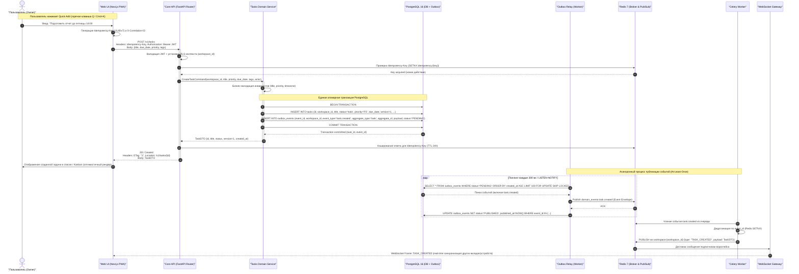

#### Пошаговая спецификация потока SD-01:
1. **Инициация и формирование ключа идемпотентности:** Пользователь вводит текст в Quick Add. Клиент на клиенте генерирует заголовок `Idempotency-Key: 0191e3f2-89a1-7c30-9e41-61b9a9d24001` (UUIDv7) и `X-Correlation-ID: 0191e3f2-89a1-7c30-9e41-61b9a9d24002`.
2. **Проверка идемпотентности:** `FastAPI Dependency` проверяет наличие ключа в Redis командой `SET idempotency:{key} "PROCESSING" EX 120 NX`. Если ключ уже существует и статус `"COMPLETED"`, немедленно возвращается кэшированный JSON-ответ с кодом 200/201.
3. **Атомарная транзакция:** Доменный сервис вставляет строку в таблицу `tasks` и строку в `outbox_events` строго в одном локальном соединении базы данных:
   ```sql
   INSERT INTO tasks (id, workspace_id, title, status, priority, due_date, version, created_at, updated_at)
   VALUES ('0191e3f2-89a1-7c30-9e41-61b9a9d24003', '0191e3f2-89a1-7c30-9e41-61b9a9d24000', 'Подготовить квартальный отчет', 'todo', 'P2', '2026-09-18T15:00:00Z', 1, NOW(), NOW());

   INSERT INTO outbox_events (event_id, workspace_id, event_type, aggregate_type, aggregate_id, payload, status)
   VALUES ('0191e3f2-89a1-7c30-9e41-61b9a9d24004', '0191e3f2-89a1-7c30-9e41-61b9a9d24000', 'task.created', 'task', '0191e3f2-89a1-7c30-9e41-61b9a9d24003', '{"title": "Подготовить квартальный отчет", "priority": "P2"}', 'PENDING');
   ```
4. **Формат ответа клиенту:** Возврат `201 Created`, заголовок `ETag: "1"`, тело ответа `TaskDTO`.
5. **Асинхронная доставка в UI:** Outbox Relay считывает запись с `FOR UPDATE SKIP LOCKED`, пересылает в Redis. Celery Worker транслирует сообщение в Redis Pub/Sub канал `ws:workspace:{id}`. WebSocket Gateway мгновенно пушит событие `TASK_CREATED` на все активные сессии пользователя (десктоп, мобильный PWA).
6. **Latency Budget:** Задержка ответа HTTP API <= 85 мс; доставка WebSocket push <= 350 мс.

---

### 2.2 SD-02: Google Calendar Incremental Sync (Синхронизация Google Calendar)

Сценарий регламентирует обработку входящего push-уведомления от Google Calendar, предотвращение гонок синхронизации через распределенный замок Redis, инкрементальное получение изменений через `syncToken` и транзакционное сохранение маппингов.

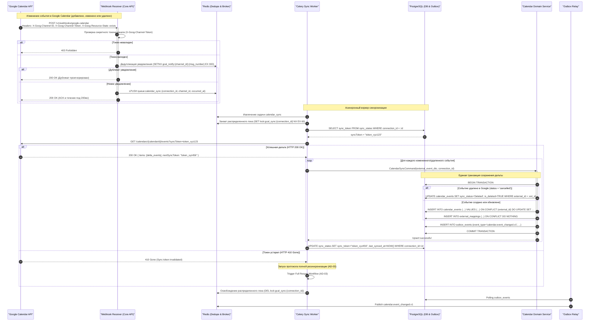

#### Пошаговая спецификация потока SD-02:
1. **Google Webhook Ingress:** Google отправляет webhook на `/v1/webhooks/google-calendar`. В заголовках передаются `X-Goog-Channel-ID`, `X-Goog-Channel-Token`, `X-Goog-Message-Number`, `X-Goog-Resource-State: exists`.
2. **SLA ответа Receiver:** Google требует быстрый ответ. Если сервер не вернет `200 OK` в течение нескольких секунд, Google накладывает экспоненциальный штраф и отключает канал. Receiver валидирует HMAC/токен канала, сохраняет задачу в очередь `calendar_sync` и отдает `200 OK` за время < 150 мс.
3. **Распределенный замок (Concurrency Lock):** Синхронизация конкретного календаря защищена замком `SET lock:gcal_sync:{connection_id} "locked" NX EX 60`. Это исключает параллельные вызовы синхронизации при одновременном получении пачки вебхуков от Google.
4. **Инкрементальный запрос Google Calendar:** Воркер запрашивает только дельту с момента прошлой синхронизации: `GET https://www.googleapis.com/calendar/v3/calendars/{calId}/events?syncToken={token}&singleEvents=true`.
5. **Обработка 410 Gone:** Если `syncToken` устарел (прошло > 7 дней или произошел сброс истории в Google), Google возвращает `HTTP 410 Gone`. Воркер перехватывает данную ошибку и запускает процедуру полного восстановления (AD-03 Full Resync).
6. **Транзакционный маппинг:** Каждое событие сопоставляется с таблицей `external_mappings`:
   - Если статус Google `cancelled` -> `calendar_events.is_deleted = true`, статус синхронизации `Deleted`.
   - Если статус активный -> upsert по внешнему ID, фиксация изменений, генерация события `calendar.event_changed.v1` в Outbox.

---

### 2.3 SD-03: Expense Capture via Telegram (Захват расходов через Telegram)

Сценарий описывает захват неструктурированного расхода через Telegram бота, разбор интента моделью через Tool Gateway, быстрый возврат подтверждения с inline-кнопками, подтверждение пользователем и фиксацию неизменяемой проводки в домене финансов.

```mermaid
sequenceDiagram
    autonumber
    actor User as "Пользователь (Owner)"
    participant TG as "Telegram Client / App"
    participant TGBot as "Telegram Bot API"
    participant Webhook as "Webhook Receiver (/v1/webhooks/telegram)"
    participant Redis as "Redis (Dedupe, Broker, Temp State)"
    participant Worker as "Celery Worker"
    participant LLM as "LLM Provider (OpenAI / Tool Gateway)"
    participant FinDomain as "Finance Domain Service"
    participant DB as "PostgreSQL (DB + Outbox)"

    User->>TG: Отправка текста: "Такси 850 руб до офиса"
    TG->>TGBot: Передача сообщения
    TGBot->>Webhook: POST /v1/webhooks/telegram<br/>Header: X-Telegram-Bot-Api-Secret-Token<br/>Body: Update (update_id=987654, message={text, chat_id})
    
    activate Webhook
    Webhook->>Webhook: Валидация секретного токена
    Webhook->>Redis: Дедупликация (SETNX tg_update:987654 1 EX 86400)
    Redis-->>Webhook: OK (уникальный запрос)
    Webhook->>Redis: LPUSH queue:telegram_messages {update_id, chat_id, text, timestamp}
    Webhook-->>TGBot: 200 OK (быстрый ACK в течение под 1.5 с)
    deactivate Webhook

    Note over Worker,LLM: Асинхронный парсинг намерения через LLM
    Worker->>Redis: Pop сообщение из queue:telegram_messages
    Worker->>DB: SELECT user_id, workspace_id, default_currency FROM users WHERE telegram_chat_id = :chat_id
    DB-->>Worker: User & Workspace context (RUB, account_id="acc_main")
    
    Worker->>LLM: Tool Call: extract_expense(text="Такси 850 руб до офиса", currency="RUB", categories=["Транспорт", "Еда", "Жилье", ...])
    LLM-->>Worker: Tool Response: CREATE_EXPENSE { amount_minor: 85000, currency: "RUB", category: "Транспорт", account: "Дебетовая карта", description: "Такси до офиса" }
    
    Worker->>Redis: SET pending_action:{action_uuid} {user_id, workspace_id, amount_minor: 85000, category_id, account_id} EX 900
    Worker->>TGBot: POST /sendMessage (chat_id, text="Записать расход: 850 ₽ в категорию 'Транспорт'?", InlineKeyboardMarkup=[[✅ Подтвердить, ❌ Отмена]])
    TGBot-->>TG: Отображение карточки подтверждения пользователю
    
    Note over User,FinDomain: Интерактивное подтверждение пользователем
    User->>TG: Нажатие кнопки [✅ Подтвердить]
    TG->>TGBot: Нажатие callback_query (data="confirm:{action_uuid}")
    TGBot->>Webhook: POST /v1/webhooks/telegram (callback_query)
    Webhook->>Redis: Дедупликация callback_query_id
    Webhook-->>TGBot: 200 OK
    Webhook->>Redis: LPUSH queue:telegram_callbacks {callback_data, chat_id, message_id}
    
    Worker->>Redis: Pop callback_data
    Worker->>Redis: GETDEL pending_action:{action_uuid}
    Redis-->>Worker: Action payload (amount_minor: 85000, ...)
    
    Worker->>FinDomain: PostTransactionCommand(workspace_id, account_id, amount_minor=85000, type='EXPENSE', category_id, description="Такси до офиса", source='telegram')
    activate FinDomain
    Note over FinDomain,DB: Единая финансовая транзакция (Append-Only)
    FinDomain->>DB: BEGIN TRANSACTION
    FinDomain->>DB: INSERT INTO financial_transactions (id, workspace_id, account_id, amount_minor=85000, type='EXPENSE', status='POSTED', ...)
    FinDomain->>DB: UPDATE financial_accounts SET balance_minor = balance_minor - 85000 WHERE id = :account_id
    FinDomain->>DB: INSERT INTO outbox_events (event_type='transaction.posted', ...)
    FinDomain->>DB: COMMIT TRANSACTION
    
    FinDomain->>DB: SELECT spent_minor, limit_minor FROM budgets WHERE category_id = :category_id
    DB-->>FinDomain: spent = 18 500 ₽, limit = 25 000 ₽ (74%)
    FinDomain-->>Worker: TransactionPostedResult(spent_minor=1850000, limit_minor=2500000)
    deactivate FinDomain
    
    Worker->>TGBot: POST /editMessageText (chat_id, message_id, text="✅ Записано: 850 ₽ (Транспорт). Бюджет месяца: 18 500 / 25 000 ₽ (осталось 6 500 ₽)")
    TGBot-->>TG: Обновление сообщения у пользователя
```

#### Пошаговая спецификация потока SD-03:
1. **Telegram Webhook SLA:** Telegram требует подтверждения получения апдейта со статусом 200 OK в течение не более 2-3 секунд, иначе Telegram повторяет отправку апдейта, что приводит к лавине дубликатов. Webhook Receiver верифицирует `X-Telegram-Bot-Api-Secret-Token`, дедуплицирует `update_id` через Redis и возвращает `200 OK` за время < 100 мс.
2. **Tool Gateway разбор:** Celery Worker загружает список активных счетов и категорий пользователя и формирует JSON-схему для OpenAI Function Calling / Tool Use:
   ```json
   {
     "name": "CREATE_EXPENSE",
     "arguments": {
       "amount_minor": 85000,
       "currency": "RUB",
       "category": "Транспорт",
       "description": "Такси до офиса"
     }
   }
   ```
3. **Временное состояние подтверждения:** Воркер сохраняет намерения в Redis ключ `pending_action:{action_uuid}` со сроком жизни 15 минут (900 секунд). Нажатие inline-кнопки `[✅ Подтвердить]` отправляет `callback_query` с данным UUID.
4. **Атомарная финансовая проводка:** Доменный сервис проводит операцию в базе:
   - Вставка строки в `financial_transactions` (`amount_minor = 85000`, `status = 'POSTED'`).
   - Списание баланса в `financial_accounts` (`balance_minor = balance_minor - 85000`).
   - Запись события `transaction.posted` в `outbox_events`.
5. **Проверка бюджетов:** Расчет текущего расхода по категории: если порог превышает 80% или 100%, в Outbox дополнительно публикуется событие `budget.threshold_exceeded`.
---

### 2.4 SD-04: AI Planning: Preview -> Confirm -> Apply (Оптимизация расписания AI)

Сценарий детально формализует двухфазный протокол безопасного планирования дня с участием AI (ADR-009 Human-in-the-Loop AI Safety Gate): чтение контекста через Read-Only Tools, генерация плана со статусом `PROPOSED` (без мутаций в БД), явное подтверждение пользователем с ETag-валидацией и транзакционное применение изменений с созданием снимка отмены (Undo-окно 5 минут).

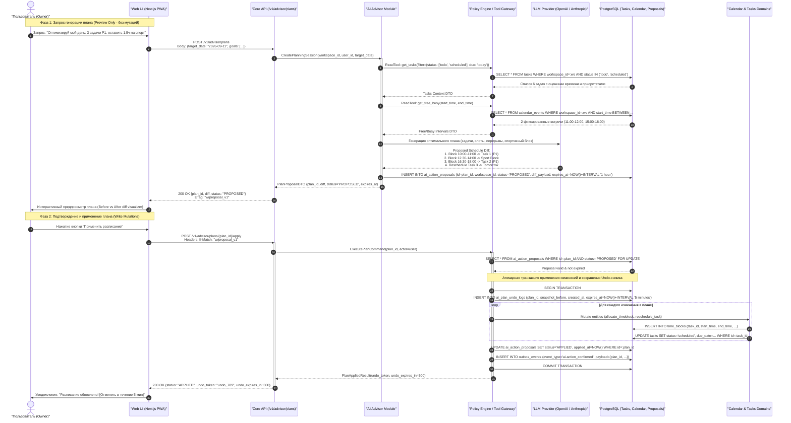

#### Пошаговая спецификация потока SD-04:
1. **Инвариант фазы Preview (Read-Only Safety Gate):**
   - Эндпоинт `POST /v1/advisor/plans` выполняет чтение задач и встреч календаря строго через авторизованный Policy Engine.
   - LLM генерирует массив предлагаемых действий (`actions_diff`).
   - Результат сохраняется в таблицу `ai_action_proposals` со статусом `PROPOSED` и временем жизни `expires_at = NOW() + INTERVAL '1 hour'`.
   - **Никаких изменений в таблицах `tasks`, `calendar_events` или `time_blocks` не производится!**
2. **Структура diff предложения:**
   ```json
   {
     "plan_id": "0191e3f2-89a1-7c30-9e41-61b9a9d24100",
     "target_date": "2026-09-11",
     "status": "PROPOSED",
     "diff": [
       {
         "action": "CREATE_TIMEBLOCK",
         "task_id": "0191e3f2-89a1-7c30-9e41-61b9a9d24042",
         "start_time": "2026-09-11T10:00:00Z",
         "end_time": "2026-09-11T11:30:00Z",
         "reason": "Фокус-блок для P1 задачи в пик утренней продуктивности"
       },
       {
         "action": "RESCHEDULE_TASK",
         "task_id": "0191e3f2-89a1-7c30-9e41-61b9a9d24055",
         "old_due": "2026-09-11T18:00:00Z",
         "new_due": "2026-09-12T18:00:00Z",
         "reason": "Перенос P3 задачи ввиду перегрузки дня встречами"
       }
     ]
   }
   ```
3. **Оптимистическая блокировка применения:**
   - Клиент отправляет запрос `POST /v1/advisor/plans/{id}/apply` с заголовком `If-Match: "w/proposal_v1"`. Если план был изменен или уже применен, возвращается `412 Precondition Failed`.
4. **Атомарный Undo-снимок:** В транзакции применения плана в таблицу `ai_plan_undo_logs` сохраняется снимок состояния затронутых сущностей до модификации:
   ```sql
   INSERT INTO ai_plan_undo_logs (id, plan_id, workspace_id, entity_snapshots, expires_at)
   VALUES (gen_random_uuid(), :plan_id, :ws_id, '{"tasks": [...], "time_blocks": [...]}', NOW() + INTERVAL '5 minutes');
   ```
   В течение 5 минут пользователь может нажать кнопку "Отменить (Undo)", восстановив исходное расписание одним запросом `POST /v1/advisor/plans/{id}/undo`.

---

### 2.5 SD-05: Multi-Channel Notification Delivery (Доставка уведомлений)

Сценарий описывает реакцию на доменные события, проверку пользовательских предпочтений (тихие часы, матрица каналов), маршрутизацию в каналы Telegram и Web Push, экспоненциальный retry при сбоях и эскалацию в Dead Letter Queue (DLQ).

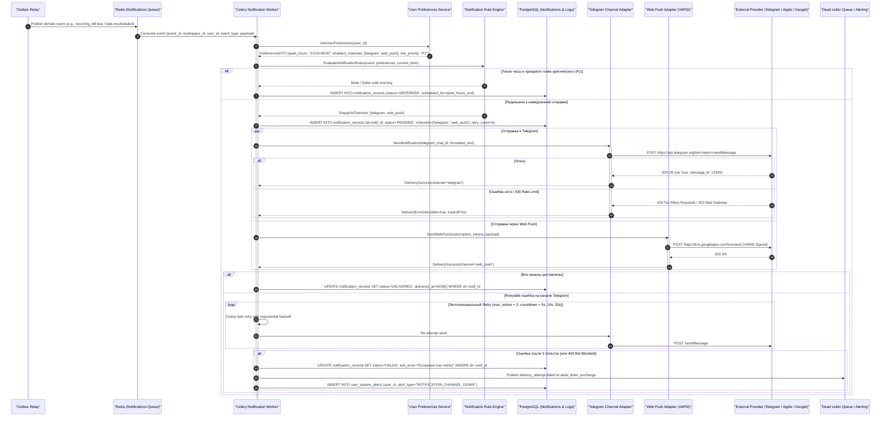

#### Пошаговая спецификация потока SD-05:
1. **Правила тихих часов (Quiet Hours):**
   - Пользователь указывает интервал тишины (по умолчанию `23:00` — `08:00` по локальной таймзоне).
   - Если событие имеет приоритет `P2`, `P3`, `P4` или информационный характер, воркер переводит статус в `DEFERRED` со временем отправки на окончание тихих часов (`08:05`).
   - Исключение: события с приоритетом `P1 / CRITICAL` (например, встреча через 10 минут) доставляются немедленно в режиме `URGENT`.
2. **Параллельная отправка по каналам:**
   - Воркер асинхронно рассылает сообщения по всем активным каналам пользователя (Telegram Bot API, Web Push VAPID, In-App WebSocket).
3. **Политика повторных попыток (Retry Policy):**
   - Retry применяется только при сетевых сбоях, таймаутах (ConnectTimeout, ReadTimeout) и статусах `429 Too Many Requests`, `502 Bad Gateway`, `503 Service Unavailable`.
   - Максимум 3 попытки: `T1 = 5s`, `T2 = 10s`, `T3 = 20s` (с добавлением случайного jitter +-20%).
4. **Обработка фатальных ошибок и DLQ:**
   - При кодах `403 Forbidden` (например, "bot was blocked by the user") или после 3 неудачных попыток воркер:
     - Обновляет `notification_records.status = 'FAILED'`.
     - Отправляет событие `delivery_attempt.failed` в Dead Letter Exchange.
     - Создает уведомление в локальном Notification Center в веб-интерфейсе: *"Доставка в Telegram не удалась: бот заблокирован пользователем"*.

---

### 2.6 SD-06: Morning Brief Generation (Генерация утреннего брифинга)

Сценарий регламентирует работу планировщика с учетом часового пояса пользователя, детерминированное вычисление доступных временных окон, LLM-ранжирование задач дня и интерактивное применение расписания через 1 клик в Telegram.

```mermaid
sequenceDiagram
    autonumber
    participant Beat as "Celery Beat (Cron Scheduler)"
    participant Broker as "Redis Task Broker"
    participant Worker as "Morning Brief Celery Worker"
    participant DB as "PostgreSQL (Identity, Tasks, Cal, Habits)"
    participant CalDomain as "Calendar Domain Engine"
    participant LLM as "LLM Provider (Advisor Prompt)"
    participant NotifEngine as "Notification Engine"
    participant TGBot as "Telegram Bot API"
    actor User as "Пользователь (Owner)"

    Note over Beat,Worker: Триггер по расписанию (каждые 15 минут проверка локального времени)
    Beat->>Broker: Enqueue check_morning_brief_schedules()
    Broker->>Worker: Execute schedule check
    
    Worker->>DB: SELECT u.id, u.workspace_id, p.timezone, p.morning_brief_time FROM users u JOIN user_preferences p ON u.id=p.user_id WHERE p.morning_brief_enabled=TRUE AND NOT EXISTS (SELECT 1 FROM morning_briefs WHERE user_id=u.id AND brief_date=CURRENT_DATE)
    DB-->>Worker: Список пользователей, у которых наступило утро (например, 07:30 по локальному времени)
    
    loop Для каждого пользователя
        Worker->>Broker: Enqueue generate_user_morning_brief(user_id, workspace_id, date)
    end

    Note over Worker,LLM: Детерминированный сбор данных и AI-суммаризация
    Worker->>DB: 1. Загрузка фиксированных событий календаря на сегодня
    Worker->>DB: 2. Загрузка задач (просроченные + due today + P1/P2) с оценками времени
    Worker->>DB: 3. Загрузка активных стриков привычек на сегодня
    DB-->>Worker: Data Aggregation (2 встречи, 4 задачи P1/P2, 3 привычки)
    
    Worker->>CalDomain: CalculateDeterministicFreeWindows(events, work_hours="09:00-18:00")
    CalDomain-->>Worker: Свободные окна: [09:00-11:00 (2h), 12:00-15:00 (3h), 16:00-18:00 (2h)]
    
    Worker->>LLM: Промпт: "Ты персональный ассистент. Составь краткий энергичный утренний брифинг (до 250 слов), сопоставь 3 задачи P1 с доступными окнами, сформируй inline-предложение расписания."
    LLM-->>Worker: Сгенерированный текст брифинга + JSON метаданные фокус-блоков:<br/>- 09:30-11:00: Подготовка квартального отчета (Task 42)<br/>- 13:00-14:30: Код-ревью архитектуры (Task 45)
    
    Worker->>DB: INSERT INTO morning_briefs (user_id, brief_date, text_content, proposed_slots_json, status='DELIVERED')
    
    Worker->>NotifEngine: SendMorningBrief(user_id, brief_text, action_buttons)
    NotifEngine->>TGBot: POST /sendMessage (chat_id, text=brief_text, InlineKeyboardMarkup=[[🚀 Принять расписание, ⚙️ Изменить в приложении, ❌ Пропустить]])
    TGBot-->>User: Доставка сообщения с утренним брифингом в Telegram
    
    Note over User,CalDomain: Интерактивный захват и фиксация времени
    User->>TGBot: Нажатие кнопки [🚀 Принять расписание]
    TGBot->>NotifEngine: Callback query: brief_accept:{brief_id}
    NotifEngine->>Worker: Enqueue apply_morning_schedule(brief_id)
    
    Worker->>DB: SELECT proposed_slots_json FROM morning_briefs WHERE id=:brief_id
    DB-->>Worker: Proposed slots metadata
    
    Worker->>CalDomain: AllocateTimeBlocksBatch(workspace_id, slots)
    activate CalDomain
    CalDomain->>DB: INSERT INTO time_blocks (...) VALUES (...)
    CalDomain->>DB: UPDATE tasks SET status='scheduled' WHERE id IN (...)
    CalDomain->>DB: INSERT INTO outbox_events (event_type='timeblock.allocated', ...)
    CalDomain-->>Worker: Slots allocated successfully
    deactivate CalDomain
    
    Worker->>TGBot: POST /editMessageText (chat_id, text="✅ Отлично! Фокус-блоки зафиксированы в календаре. Продуктивного дня!")
    TGBot-->>User: Обновление карточки брифинга
```

#### Пошаговая спецификация потока SD-06:
1. **Детерминированный расчет свободных окон:**
   - Календарный движок не использует LLM для расчета временной сетки. Расчет выполняется чистым детерминированным алгоритмом:
     - Рабочий интервал пользователя: например, с 09:00 до 18:00 по `user_preferences.timezone`.
     - Из интервала вычитаются фиксированные внешние и внутренние события календаря со статусом `Confirmed`.
     - Результат: отсортированный массив свободных окон `[Window(start, end, duration_minutes)]`.
2. **LLM ранжирование и генерация брифинга:**
   - Модель получает на вход доступные окна и перечень задач P1/P2.
   - Промпт требует сопоставить наиболее приоритетные задачи с окнами высокой ментальной энергии (утро) и вернуть текст брифинга вместе с массивом предлагаемых `TimeBlock` привязок.
3. **One-Click Apply в Telegram:**
   - Пользователю отправляется карточка в Telegram с кнопками:
     `[🚀 Принять расписание]`, `[⚙️ Изменить в приложении]`, `[❌ Пропустить]`.
   - При нажатии `[🚀 Принять расписание]` доменный сервис `CalendarDomain` без лишних диалогов атомарно создает объекты `TimeBlock` в PostgreSQL и переводит задачи в статус `scheduled`.
---

## 3. ДИАГРАММЫ СОСТОЯНИЙ (STATE DIAGRAMS)

### 3.1 STM-01: Task Lifecycle State Machine (Жизненный цикл задачи)

Агрегат `Task` управляется строгим конечным автоматом с 8 состояниями. Состояния Kanban в интерфейсе представляют собой прямую проекцию данного автомата. Автомат математически гарантирует невозможность перехода в невалидные фазы и публикует доменные события при каждой смене состояния.

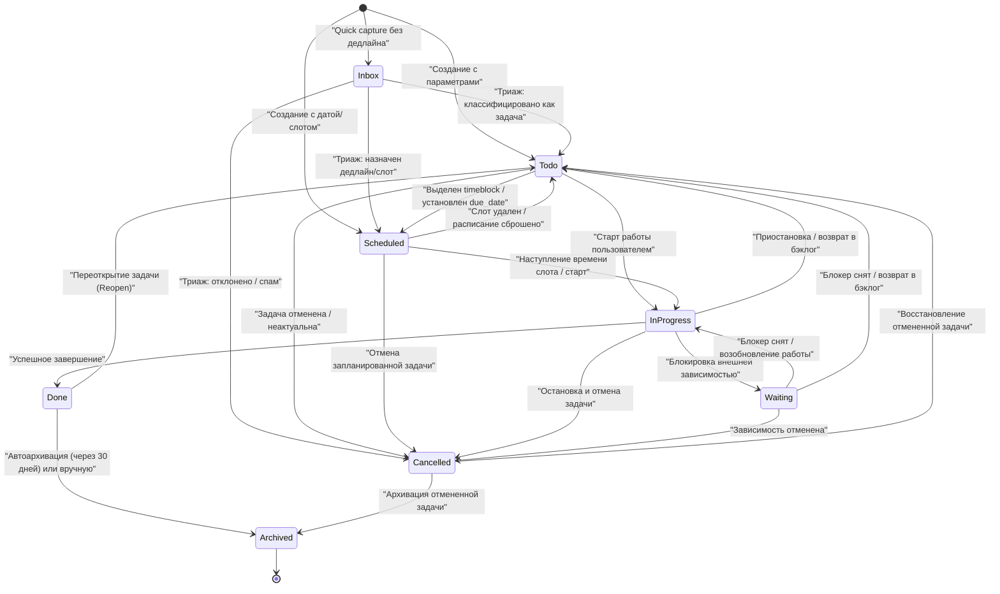

#### Матрица переходов состояний Task (STM-01):

| Исходное состояние | Целевое состояние | Триггер (Событие / Команда) | Guard (Условие валидности) | Действие на входе (Enter Action) | Публикуемое Outbox событие |
|---|---|---|---|---|---|
| `[*]` | `Inbox` | `CaptureInboxItemCommand` | Текст не пустой | Инициализация `task_id`, `created_at=NOW()` | `inbox.captured` |
| `[*]` | `Todo` | `CreateTaskCommand` | `title` заполнен, `due_date IS NULL` | `status='todo'`, `version=1` | `task.created` |
| `[*]` | `Scheduled` | `CreateTaskCommand` | `due_date IS NOT NULL` | `status='scheduled'`, `version=1` | `task.created` |
| `Inbox` | `Todo` | `TriageItemCommand(type='task')` | Назначен проект или тег | Привязка `project_id`, перевод в бэклог | `inbox.triaged`, `task.created` |
| `Inbox` | `Scheduled` | `TriageItemCommand(schedule=...)` | Переданы `start_time` / `end_time` | Создание `TimeBlock`, `status='scheduled'` | `inbox.triaged`, `timeblock.allocated` |
| `Inbox` | `Cancelled` | `DiscardInboxItemCommand` | Пользователь нажал "Удалить" | `is_discarded=TRUE` | `inbox.discarded` |
| `Todo` | `Scheduled` | `ScheduleTaskCommand` | Слот времени свободен | Создание связи с `TimeBlock` | `task.rescheduled` |
| `Todo` | `InProgress` | `StartTaskExecutionCommand` | Нет блокирующих зависимостей | `started_at=NOW()`, запуск таймера | `task.status_changed` |
| `Todo` | `Cancelled` | `CancelTaskCommand` | Указана причина отмены (опционально) | `cancelled_at=NOW()` | `task.status_changed` |
| `Scheduled` | `InProgress` | `StartTaskExecutionCommand` | Пользователь активировал задачу | `started_at=NOW()` | `task.status_changed` |
| `Scheduled` | `Todo` | `UnscheduleTaskCommand` | — | Удаление связанного `TimeBlock` | `task.rescheduled` |
| `Scheduled` | `Cancelled` | `CancelTaskCommand` | — | Освобождение слота в календаре | `task.status_changed`, `timeblock.released` |
| `InProgress` | `Waiting` | `BlockTaskCommand` | Указан `blocker_reason` / зависимость | Запись `waiting_for_reason`, остановка таймера | `task.status_changed` |
| `InProgress` | `Todo` | `PauseTaskCommand` | — | Фиксация накопленного `tracked_seconds` | `task.status_changed` |
| `InProgress` | `Done` | `CompleteTaskCommand` | Все чек-листы (subtasks) закрыты | `completed_at=NOW()`, закрытие таймера | `task.completed` |
| `InProgress` | `Cancelled` | `CancelTaskCommand` | — | `cancelled_at=NOW()`, сброс таймера | `task.status_changed` |
| `Waiting` | `InProgress` | `ResumeTaskCommand` | Зависимость разрешена | Очистка `waiting_for_reason`, старт таймера | `task.status_changed` |
| `Waiting` | `Todo` | `DeferTaskCommand` | — | Перенос в общий список | `task.status_changed` |
| `Waiting` | `Cancelled` | `CancelTaskCommand` | — | `cancelled_at=NOW()` | `task.status_changed` |
| `Done` | `Todo` | `ReopenTaskCommand` | — | `completed_at=NULL`, инкремент `reopen_count` | `task.status_changed` |
| `Done` | `Archived` | `ArchiveTaskCommand` / Cron S2S | Прошло >= 30 дней с `completed_at` | `is_archived=TRUE`, скрытие из активных списков | `task.archived` |
| `Cancelled` | `Todo` | `RestoreTaskCommand` | — | `cancelled_at=NULL` | `task.status_changed` |
| `Cancelled` | `Archived` | `ArchiveTaskCommand` | — | `is_archived=TRUE` | `task.archived` |

---

### 3.2 STM-02: Calendar Event Lifecycle State Machine (Жизненный цикл события календаря)

Событие календаря (`CalendarEvent`) представляет собой зафиксированный временной отрезок. Автомат регламентирует переход от чернового предложения (например, сформированного AI) до подтвержденного статуса или отмены.

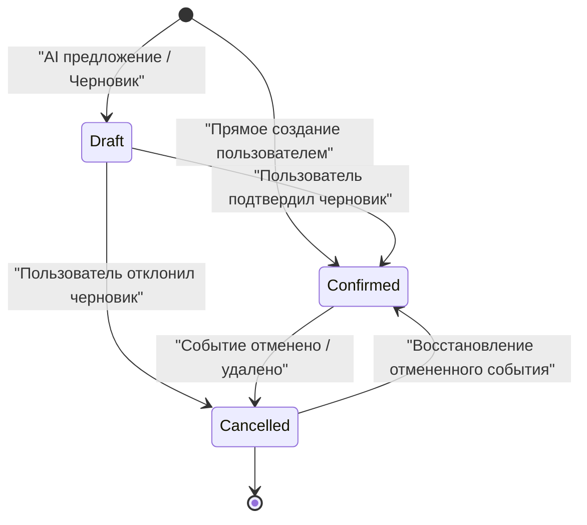

#### Матрица переходов состояний Calendar Event (STM-02):

| Исходное состояние | Целевое состояние | Триггер | Guard | Действие на входе | Событие Outbox |
|---|---|---|---|---|---|
| `[*]` | `Draft` | `ProposeEventCommand` (AI / Внешнее приглашение) | Время валидно (`start < end`) | `status='Draft'`, не бронирует жестко занятость | `calendar_event.proposed` |
| `[*]` | `Confirmed` | `CreateEventCommand` (Пользователь в UI) | Нет критических коллизий времени | `status='Confirmed'`, блокирует занятость | `calendar_event.created` |
| `Draft` | `Confirmed` | `ConfirmEventCommand` | Пользователь нажал "Принять" | Бронирование слота в расписании | `calendar_event.created` |
| `Draft` | `Cancelled` | `RejectEventCommand` | — | Удаление черновика | `calendar_event.discarded` |
| `Confirmed` | `Cancelled` | `DeleteEventCommand` / Remote Cancel | — | `cancelled_at=NOW()`, освобождение сетки | `calendar_event.deleted` |
| `Cancelled` | `Confirmed` | `RestoreEventCommand` | Слот времени свободен | Повторная блокировка времени | `calendar_event.created` |
---

### 3.3 STM-03: Calendar Synchronization State Machine (Синхронизация с внешними календарями)

Конечный автомат синхронизации управляет интеграцией с Google Calendar на уровне отдельного события, фиксируя состояние внешнего соответствия (`sync_status`), обнаружение конфликтов и устойчивость к сетевым ошибкам через `SyncFailed` и повторные попытки.

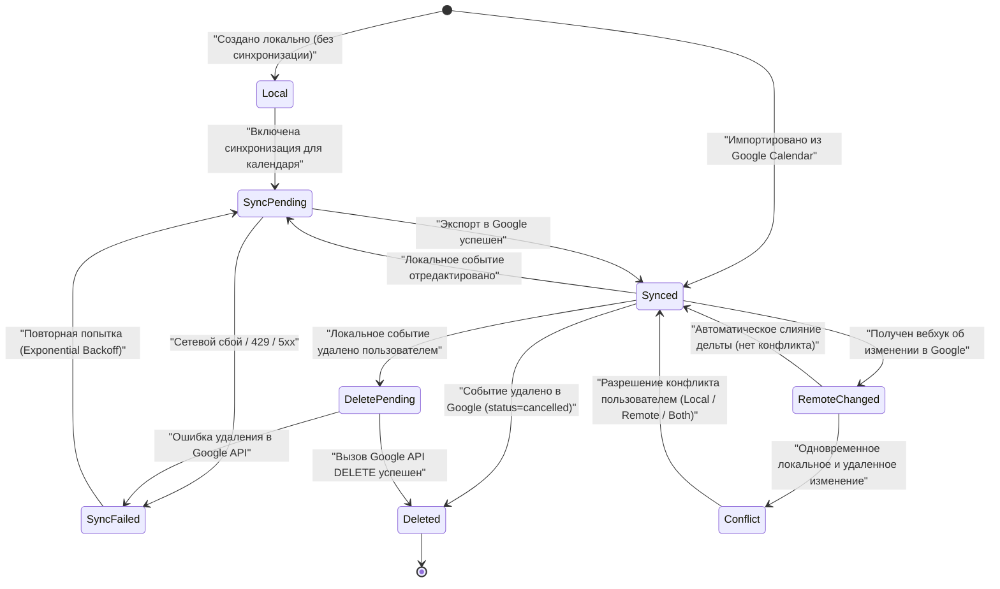

#### Матрица переходов состояний Calendar Sync (STM-03):

| Исходное состояние | Целевое состояние | Триггер | Guard | Действие на входе | Выходное действие / Событие |
|---|---|---|---|---|---|
| `[*]` | `Local` | `CreateEventCommand` | Синхронизация выключена | `sync_status='Local'` | `calendar_event.created` |
| `[*]` | `Synced` | `ImportFromGoogleCommand` | Валидный внешний ID Google | `sync_status='Synced'`, `external_id=GoogleID` | `sync.event_imported` |
| `Local` | `SyncPending` | `EnableSyncForCalendarCommand` | Токен OAuth валиден | Добавление в очередь выгрузки | `sync.export_scheduled` |
| `SyncPending` | `Synced` | `GoogleApiExportSuccess` | Google вернул HTTP 200/201 | Обновление `external_etag`, `last_synced_at` | `sync.exported` |
| `SyncPending` | `SyncFailed` | `GoogleApiError` | Ошибка сети или HTTP 5xx | Инкремент `sync_retry_count`, запись `last_error` | `sync.failed` (retryable) |
| `SyncFailed` | `SyncPending` | `CeleryRetryTrigger` | `retry_count < 5` | Экспоненциальная задержка (5s..60s) | — |
| `Synced` | `SyncPending` | `UpdateLocalEventCommand` | Событие изменено пользователем | Генерация `patch` дельты для Google | `calendar_event.updated` |
| `Synced` | `RemoteChanged` | `GoogleWebhookDeltaReceived` | Внешний `etag` изменился | Загрузка полного снимка из Google | `sync.remote_delta_detected` |
| `RemoteChanged` | `Synced` | `ReconciliationSuccess` | Локальных правок не было | Применение удаленной дельты к БД | `calendar_event.updated` |
| `RemoteChanged` | `Conflict` | `ConflictDetected` | Локальная версия `version > last_synced_version` | Блокировка авто-синхронизации, алерт пользователю | `sync.conflict_detected` |
| `Conflict` | `Synced` | `ResolveConflictCommand` | Выбрана стратегия (Local / Remote / Keep Both) | Применение выбранной версии | `sync.conflict_resolved` |
| `Synced` | `DeletePending` | `DeleteLocalEventCommand` | Пользователь удалил в UI | Метка `is_deleted=TRUE`, постановка в очередь | `calendar_event.deleted` |
| `DeletePending` | `Deleted` | `GoogleApiDeleteSuccess` | Google вернул HTTP 204 No Content | Окончательное удаление или `archived` | `sync.deleted_remotely` |
| `DeletePending` | `SyncFailed` | `GoogleApiDeleteError` | Временный сбой сети | Очередь повторной попытки | `sync.failed` |
| `Synced` | `Deleted` | `GoogleRemoteCancelled` | Google статус `cancelled` | Локальный soft-delete события | `calendar_event.deleted` |

---

### 3.4 STM-04: Finance Transaction State Machine (Жизненный цикл финансовой проводки)

Финансовый домен Personal OS подчиняется принципу неизменяемости бухгалтерского учета (Double-entry / Immutable Ledger). Проводка, перешедшая в статус `Posted`, физически не может быть изменена или удалена (`UPDATE` и `DELETE` заблокированы RLS/DB правами). Коррекция осуществляется строго через операцию сторнирования (`Reversed`) с созданием новой компенсирующей проводки.

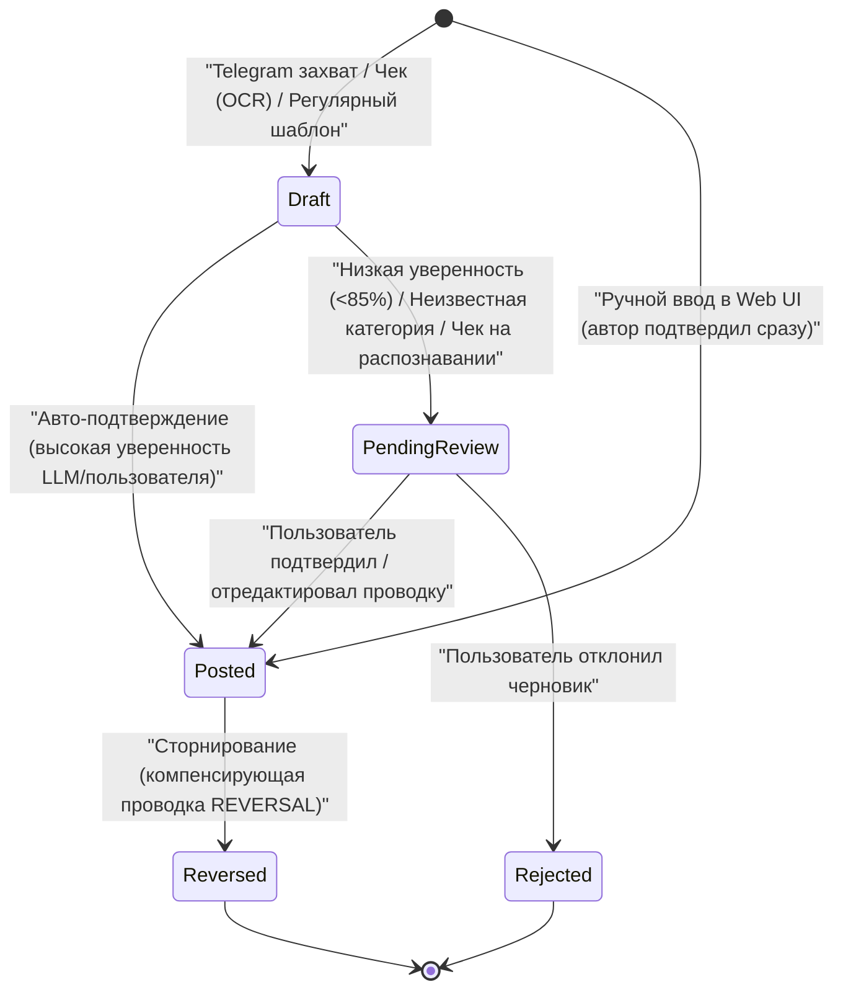

#### Матрица переходов состояний Finance Transaction (STM-04):

| Исходное состояние | Целевое состояние | Триггер (Команда) | Guard (Бизнес-правило) | Действие на входе (Enter Action) | Событие Outbox |
|---|---|---|---|---|---|
| `[*]` | `Draft` | `CaptureRawTransactionCommand` | Указана приблизительная сумма | `status='Draft'`, не влияет на баланс счета | `finance.draft_created` |
| `[*]` | `Posted` | `PostTransactionCommand` | Указаны `account_id`, `amount_minor > 0`, `category_id` | Запись в журнал, списание/начисление баланса счета | `transaction.posted` |
| `Draft` | `Posted` | `ConfirmDraftCommand` | Уверенность модели >= 85%, счет выбран | Изменение баланса `financial_accounts`, `posted_at=NOW()` | `transaction.posted` |
| `Draft` | `PendingReview` | `RouteToReviewCommand` | Неоднозначная категория или чек на OCR | Помещение в список "Требует внимания" UI | `finance.review_required` |
| `PendingReview` | `Posted` | `ApproveReviewCommand` | Пользователь проверил категорию и сумму | Изменение баланса счета, `posted_at=NOW()` | `transaction.posted` |
| `PendingReview` | `Rejected` | `RejectTransactionCommand` | Пользователь нажал "Отклонить" | `status='Rejected'`, баланс не изменяется | `finance.transaction_rejected` |
| `Posted` | `Reversed` | `ReverseTransactionCommand` | Проводка уже в статусе `Posted` | 1. `status='Reversed'`<br/>2. Создание проводки-сторно `type='REVERSAL'`<br/>3. Восстановление баланса счета | `transaction.reversed`, `transaction.posted` (reversal) |

#### Инвариант сторнирования (Compensating Reversal Invariant):
При сторнировании оригинальная запись остается в БД неизменной:
```sql
-- 1. Помечаем оригинальную транзакцию как сторнированную
UPDATE financial_transactions 
SET status = 'REVERSED', updated_at = NOW() 
WHERE id = :original_id AND status = 'POSTED';

-- 2. Вставляем компенсирующую проводку (сторнирование)
INSERT INTO financial_transactions (id, workspace_id, account_id, amount_minor, type, category_id, description, status, reversed_transaction_id, created_at)
VALUES (gen_random_uuid(), :ws_id, :acc_id, :original_amount, 'REVERSAL', :cat_id, 'Сторно транзакции ' || :original_id, 'POSTED', :original_id, NOW());

-- 3. Восстанавливаем баланс счета в обратную сторону
UPDATE financial_accounts 
SET balance_minor = balance_minor + :original_amount 
WHERE id = :acc_id;
```
---

## 4. ДИАГРАММЫ АКТИВНОСТИ (ACTIVITY DIAGRAMS)

### 4.1 AD-01: Webhook Ingress Pipeline (Пайплайн приема вебхуков)

Пайплайн приема вебхуков регламентирует строгую изоляцию синхронного сетевого шлюза от тяжелой бизнес-логики. Главная цель — выполнение жесткого SLA внешних систем (Google Calendar push < 200 мс, Telegram < 1.5 с) с гарантированной защитой от дублирования и повторов (Retry Storms).

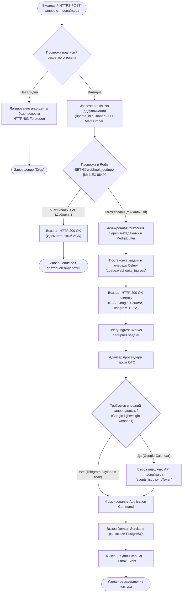

#### Техническая спецификация этапов пайплайна AD-01:
1. **Проверка подлинности (Signature Verification):**
   - Для Telegram: сравнение заголовка `X-Telegram-Bot-Api-Secret-Token` с переменной окружения `TELEGRAM_BOT_SECRET`.
   - Для Google Calendar: сопоставление `X-Goog-Channel-Token` с токеном зарегистрированного канала из таблицы `calendar_connections`.
   - При несовпадении: возврат HTTP 401/403, фиксация метрики `security_webhook_unauthorized_total` в Prometheus.
2. **Дедупликация на уровне Ingress (Redis Deduplication):**
   - Ключ: `webhook_dedupe:{provider}:{event_id}`.
   - Операция: `SET webhook_dedupe:telegram:987654 1 EX 86400 NX`.
   - Если ключ уже существует, возвращается `200 OK`. Это предотвращает повторную обработку в случае, если провайдер повторил отправку из-за сетевого лага на пути к клиенту.
3. **Быстрый ACK (Fast Acknowledgement):**
   - Никаких долгих синхронных вызовов к внешним API (LLM, Google API) в теле HTTP-хендлера FastAPI!
   - Задержка ответа `200 OK` составляет в среднем 15–40 мс (максимум до 200 мс).
4. **Асинхронный воркер и адаптеры:**
   - Celery воркер считывает полезную нагрузку из Redis очереди `queue:webhooks_ingress`.
   - При необходимости инкрементального запроса (Google) воркер сам обращается к внешнему Google REST API с `syncToken`, превращая полученные события в типизированные команды домена (`CalendarSyncCommand`).

---

### 4.2 AD-02: Transactional Outbox Relay Pipeline (Пайплайн релея Outbox)

Пайплайн реализует шаблон Transactional Outbox, обеспечивая гарантированную доставку доменных событий (At-Least-Once Delivery) без использования тяжелых распределенных транзакций (XA / 2PC).

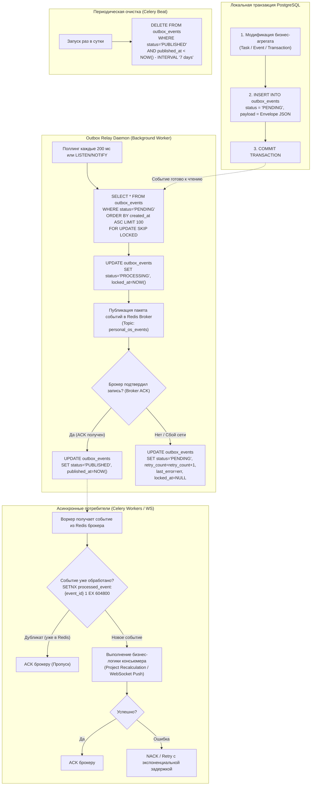

#### Техническая спецификация этапов пайплайна AD-02:
1. **Конкурентная выборка без блокировок (FOR UPDATE SKIP LOCKED):**
   - Запрос Outbox Relay:
     ```sql
     SELECT event_id, workspace_id, event_type, payload 
     FROM outbox_events 
     WHERE status = 'PENDING' 
     ORDER BY created_at ASC 
     LIMIT 100 
     FOR UPDATE SKIP LOCKED;
     ```
   - Механизм `SKIP LOCKED` позволяет параллельно запускать несколько независимых релей-процессов (Outbox Relay Pods/Processes) — они мгновенно разбирают разные пачки записей без дедлоков.
2. **Гарантия At-Least-Once и дедупликация:**
   - Если релей опубликовал событие в Redis, но упал до выполнения `UPDATE outbox_events SET status='PUBLISHED'`, при следующем перезапуске событие будет прочитано и отправлено повторно.
   - Поэтому каждый потребитель (консьюмер) **обязан быть идемпотентным**.
   - Перед обработкой консьюмер выполняет проверку:
     `SETNX processed_event:{event_id} 1 EX 604800` (TTL 7 дней).
   - Если ключ существовал — событие безопасно игнорируется, и брокеру отдается подтверждение (ACK).
3. **Очистка исторической таблицы (Retention Policy):**
   - Опубликованные события со статусом `PUBLISHED` хранятся в БД 7 суток для целей отладки и аудита, после чего удаляются ночным заданием Celery Beat.

---

### 4.3 AD-03: Google Calendar 410 Full Resync Protocol (Протокол полной ресинхронизации)

Протокол ресинхронизации автоматически активируется, когда инкрементальная синхронизация с Google Calendar возвращает ошибку `HTTP 410 Gone`. Данная ошибка означает, что `syncToken` устарел (истек срок жизни > 7 дней или произошли масштабные изменения календаря на стороне Google). Протокол выполняет полный постраничный сбор актуального состояния и корректно удаляет локальные события-сироты.

```mermaid
flowchart TD
    TriggerSync(["Триггер синхронизации (Webhook или Cron)"]) --> LoadToken["Загрузка sync_token из sync_states"]
    
    LoadToken --> CallGCalDelta["Вызов Google Calendar API:<br/>events.list(calendarId, syncToken)"]
    
    CallGCalDelta --> CheckStatus{"HTTP статус ответа?"}
    
    CheckStatus -->|"200 OK"| StandardDelta["Стандартная инкрементальная дельта<br/>(Поток SD-02)"]
    StandardDelta --> EndStandard(["Завершение инкрементальной синхронизации"])
    
    CheckStatus -->|"410 Gone (Token Expired)"| Log410["Логирование WARNING: GCAL_SYNC_TOKEN_EXPIRED<br/>Запуск протокола AD-03"]
    
    Log410 --> SetStateResync["UPDATE sync_states<br/>SET status='FULL_SYNC_IN_PROGRESS', sync_token=NULL"]
    
    SetStateResync --> InitCollection["Инициализация локального множества:<br/>RemoteIds = new Set()"]
    
    InitCollection --> FetchFirstPage["Запрос первой страницы:<br/>GET events.list(calendarId) БЕЗ syncToken"]
    
    FetchFirstPage --> ProcessPage["Итерация по элементам страницы:<br/>1. RemoteIds.add(item.id)<br/>2. Upsert в calendar_events (sync_status='Synced')<br/>3. Upsert в external_mappings"]
    
    ProcessPage --> HasNextPage{"Есть nextPageToken в ответе?"}
    
    HasNextPage -->|"Да"| FetchNextPage["Запрос следующей страницы с pageToken"]
    FetchNextPage --> ProcessPage
    
    HasNextPage -->|"Нет (Все страницы получены)"| SaveNewSyncToken["Сохранение нового nextSyncToken из последней страницы"]
    
    SaveNewSyncToken --> DetectOrphans["Поиск осиротевших локальных событий:<br/>SELECT id FROM calendar_events<br/>WHERE external_calendar_id = :cal_id<br/>AND external_id NOT IN (RemoteIds)<br/>AND is_deleted = FALSE"]
    
    DetectOrphans --> HasOrphans{"Найдены локальные сироты?"}
    
    HasOrphans -->|"Да"| PruneOrphans["Пометка событий как удаленных:<br/>UPDATE calendar_events<br/>SET sync_status='Deleted', is_deleted=TRUE, updated_at=NOW()<br/>WHERE id IN (orphan_ids)"]
    HasOrphans -->|"Нет"| FinalizeSync
    
    PruneOrphans --> EmitDeletedEvents["Генерация событий calendar.event_changed.v1<br/>в outbox_events для удаленных сущностей"]
    
    EmitDeletedEvents --> FinalizeSync["UPDATE sync_states<br/>SET status='SYNCED', sync_token=new_token, last_synced_at=NOW()"]
    
    FinalizeSync --> NotifyUI["WebSocket Broadcast:<br/>CALENDAR_FULL_RESYNC_COMPLETED"]
    
    NotifyUI --> EndFullSuccess(["Полная ресинхронизация успешно завершена"])
```

#### Техническая спецификация этапов протокола AD-03:
1. **Перехват исключения Google API 410 Gone:**
   - Библиотека интеграции отлавливает `googleapiclient.errors.HttpError` со статусом 410.
   - Состояние в `sync_states` мгновенно переводится в `FULL_SYNC_IN_PROGRESS`, предотвращая параллельные инкрементальные попытки.
2. **Постраничная загрузка полного календаря (Full Pagination):**
   - Запрос к Google API выполняется **без параметра `syncToken`**:
     `GET /calendars/{calId}/events?maxResults=250&singleEvents=true`.
   - В цикле обрабатываются все страницы через `pageToken` вплоть до достижения последней страницы, где возвращается новый `nextSyncToken`.
3. **Обнаружение и зачистка сирот (Orphan Pruning Algorithm):**
   - Все полученные `event.id` агрегируются во временную структуру памяти (или временную таблицу PostgreSQL `temp_gcal_remote_ids`).
   - Выполняется поиск локальных записей, которые ранее были привязаны к этому внешнему календарю, но отсутствуют в актуальной выгрузке Google (например, были удалены во время отсутствия связи):
     ```sql
     UPDATE calendar_events ce
     SET is_deleted = TRUE,
         sync_status = 'Deleted',
         updated_at = NOW()
     FROM external_mappings em
     WHERE ce.id = em.internal_id
       AND em.provider = 'google'
       AND em.external_calendar_id = :calendar_id
       AND em.external_id NOT IN (SELECT unnest(:remote_ids_array))
       AND ce.is_deleted = FALSE;
     ```
4. **Фиксация нового состояния:**
   - В таблицу `sync_states` записывается новый валидный `sync_token`.
   - По WebSocket клиенту отправляется сигнал для полной перезагрузки сетки календаря в представлении месяца/недели.
---

## 5. СКВОЗНЫЕ ИНЖЕНЕРНЫЕ СПЕЦИФИКАЦИИ

### 5.1 Матрица идемпотентности и контроля конкурентности

Для предотвращения состояний гонки, двойных списаний и коллизий данных на всех уровнях архитектуры зафиксированы механизмы блокировок:

| Точка интеграции / Эндпоинт | Механизм защиты | Ключ / Стратегия | Время жизни (TTL) / Сфера действия | Поведение при конфликте |
|---|---|---|---|---|
| `POST /v1/tasks` (Quick Add) | HTTP Idempotency | Redis `idempotency:{key}` | 24 часа | Возврат кэшированного ответа 201 Created |
| `PATCH /v1/tasks/{id}` | Optimistic Locking | HTTP `If-Match: "version"` vs `Task.version` | На время транзакции | `412 Precondition Failed` |
| `POST /v1/advisor/plans/{id}/apply` | State & ETag Lock | `ai_action_proposals.status = 'PROPOSED'` | 1 час (срок действия плана) | `409 Conflict` (план уже применен или истек) |
| Google Calendar Sync Job | Distributed Mutex | Redis `lock:gcal_sync:{connection_id}` | 60 секунд | Отмена параллельной задачи (skip redundant run) |
| Webhook Ingress (TG / GCal) | Gateway Deduplication | Redis `webhook_dedupe:{provider}:{id}` | 24 часа | Немедленный возврат HTTP 200 OK без обработки |
| Outbox Relay Daemon | Row-Level Lock | PostgreSQL `FOR UPDATE SKIP LOCKED` | На время транзакции выборки | Автоматический переход к следующей пачке строк |
| Celery Consumer Events | Event Deduplication | Redis `SETNX processed_event:{event_id}` | 7 суток | Пропуск обработки, ACK брокеру |

---

### 5.2 Таксономия ошибок RFC 9457 Problem Details

Все ошибки REST API и асинхронных контуров приводятся к единому стандарту RFC 9457:

```json
{
  "type": "https://personal-os.net/errors/task-concurrency-conflict",
  "title": "Task Concurrency Conflict",
  "status": 412,
  "detail": "Задача была обновлена в параллельной сессии. Текущая версия: 3, передана версия: 2.",
  "instance": "/v1/tasks/0191e3f2-89a1-7c30-9e41-61b9a9d24003",
  "error_code": "ERR_TASK_VERSION_MISMATCH",
  "invalid_params": [
    {
      "name": "If-Match",
      "reason": "Provided ETag does not match current entity version"
    }
  ],
  "trace_id": "4bf92f3577b34da6a3ce929d0e0e4736",
  "timestamp": "2026-09-11T10:30:00Z"
}
```

#### Реестр типовых кодов ошибок:
- `ERR_IDEMPOTENCY_IN_PROGRESS`: Повторный запрос отправлен до завершения первичного вызова (HTTP 409).
- `ERR_GCAL_SYNC_TOKEN_EXPIRED`: Устарел syncToken Google API (HTTP 410 / внутренний триггер AD-03).
- `ERR_BUDGET_LIMIT_EXCEEDED`: Сумма проводки превышает жесткий лимит бюджета категории (HTTP 422 / warning).
- `ERR_AI_SAFETY_VALIDATION_FAILED`: Параметры инструмента Tool Gateway не прошли валидацию политик (HTTP 400).
- `ERR_NOTIFICATION_CHANNEL_DOWN`: Не удалось доставить уведомление после 3 попыток retry (HTTP 502 / DLQ).

---

### 5.3 Сквозная модель трассировки (Distributed Tracing Protocol)

Для обеспечения 100% прозрачности и аудита распределенных саг и очередей внедряется стандарт сквозной трассировки W3C Trace Context:
- **`traceparent` (HTTP Header):** Передается клиентом или генерируется Reverse Proxy в формате `00-4bf92f3577b34da6a3ce929d0e0e4736-00f067aa0ba902b7-01`.
- **`correlation_id` (Event Envelope & Log Context):** Сквозной идентификатор сквозной бизнес-операции (например, от клика кнопки в Telegram до фиксации в финансовом журнале).
- **`causation_id`:** Идентификатор непосредственного сообщения или события, вызвавшего текущую операцию.
- При сохранении события в `outbox_events` и передаче в Celery метаданные трассировки (`traceparent`, `correlation_id`, `actor_id`) инжектируются в заголовок задачи Celery (`task.request.headers`), обеспечивая неразрывный трейс в OpenTelemetry / Jaeger.

---

## 6. ПЕРЕДАЧА СЛЕДУЮЩЕМУ ЭТАПУ (HANDOFF TO DATABASE ARCHITECT)

Спецификации системного анализа (Этап 06) сформировали исчерпывающие функциональные и динамические требования к физической модели данных PostgreSQL 16 для агента **07-database-architect**:

### 6.1 Требования к реляционным таблицам и колонкам:
1. **Таблица `tasks`:**
   - Поля: `id` (UUIDv7), `workspace_id`, `title`, `description_markdown`, `status` (Enum: `inbox`, `todo`, `scheduled`, `in_progress`, `waiting`, `done`, `archived`, `cancelled`), `priority` (Enum: `P1`, `P2`, `P3`, `P4`), `due_date` (`TIMESTAMPTZ`), `version` (`INTEGER DEFAULT 1` для Optimistic Lock), `waiting_for_reason` (`TEXT NULL`), `tracked_seconds` (`INTEGER DEFAULT 0`), `created_at`, `updated_at`, `completed_at`, `cancelled_at`.
2. **Таблица `calendar_events`:**
   - Поля: `id`, `workspace_id`, `title`, `start_time`, `end_time`, `is_all_day`, `status` (Enum: `Draft`, `Confirmed`, `Cancelled`), `sync_status` (Enum: `Local`, `SyncPending`, `Synced`, `RemoteChanged`, `Conflict`, `DeletePending`, `Deleted`, `SyncFailed`), `external_id` (Google ID), `external_etag`, `version`.
3. **Таблица `time_blocks`:**
   - Поля: `id`, `workspace_id`, `task_id` (FK nullable), `start_time`, `end_time`, `label`, `is_fixed`, `created_at`.
4. **Таблица `financial_transactions` (Immutable Ledger):**
   - Поля: `id`, `workspace_id`, `account_id`, `category_id`, `amount_minor` (`BIGINT NOT NULL`), `type` (Enum: `EXPENSE`, `INCOME`, `TRANSFER`, `REVERSAL`), `status` (Enum: `DRAFT`, `PENDING_REVIEW`, `POSTED`, `REVERSED`, `REJECTED`), `reversed_transaction_id` (FK self nullable), `posted_at`, `created_at`.
   - **Инвариант прав:** Запрет `UPDATE` и `DELETE` на уровне ролей PostgreSQL.
5. **Таблица `sync_states`:**
   - Поля: `id`, `workspace_id`, `connection_id`, `provider` (google/telegram), `sync_token` (`TEXT NULL`), `status` (`SYNCED`, `FULL_SYNC_IN_PROGRESS`, `ERROR`), `last_synced_at`.
6. **Таблица `outbox_events` (Transactional Outbox):**
   - Поля: `event_id`, `workspace_id`, `event_type`, `aggregate_type`, `aggregate_id`, `payload` (`JSONB`), `status` (`PENDING`, `PROCESSING`, `PUBLISHED`, `FAILED`), `retry_count`, `last_error`, `created_at`, `published_at`.
   - Индексы:
     `CREATE INDEX idx_outbox_pending ON outbox_events (created_at ASC) WHERE status = 'PENDING';`
     `CREATE INDEX idx_outbox_cleanup ON outbox_events (published_at) WHERE status = 'PUBLISHED';`
7. **Таблица `ai_action_proposals` & `ai_plan_undo_logs`:**
   - Поля: `id`, `workspace_id`, `diff_payload` (`JSONB`), `status` (`PROPOSED`, `APPLIED`, `REJECTED`, `EXPIRED`), `expires_at`, `created_at`.
   - Поля undo: `id`, `plan_id`, `workspace_id`, `entity_snapshots` (`JSONB`), `expires_at`.

---

## NEXT_AGENT: 07-database-architect
