# 07 — Database Architect: Логическая и физическая схема БД PostgreSQL 16, pgvector, RLS-изоляция, ERD и инварианты Personal OS

STATUS: VERIFIED
TASK: Разработать полную логическую и физическую схему базы данных PostgreSQL 16 с расширением pgvector для Personal OS (Этап 07: Database Architect). Спроектировать Mermaid ERD со всеми сущностями и связями, DDL-спецификацию 30 таблиц с жесткими CHECK/UNIQUE ограничениями, стратегию композитного и частичного индексирования, архитектуру сквозной изоляции тенантов через Row-Level Security (RLS), доменные инварианты на уровне СУБД (неизменяемость проводок, правила завершения задач), стратегию RANGE-партиционирования для аудит-логов и событий, а также конфигурацию векторного поиска HNSW.
INPUT:
- docs/it-company/01-product-discovery-manager.md (PRD, MVP Scope, функциональные модули)
- docs/it-company/02-business-analyst.md (65 User Stories, правила BR-001–BR-040, денежный формат в минорных единицах, неизменяемость транзакций)
- docs/it-company/03-product-manager.md (План спринтов S0–S16, MoSCoW, требования к сущностям и релизам)
- docs/it-company/04-solution-architect.md (ADR-002 PostgreSQL System of Record, ADR-005 Multi-Tenancy workspace_id + RLS, ADR-006 Transactional Outbox, ADR-015 pgvector HNSW, Event Catalog)
- docs/it-company/05-security-architect.md (AES-256-GCM для токенов, изоляция RLS app_user, append-only audit_logs, пре-фильтрация RAG, zero tenant leakage)
- docs/it-company/06-system-analyst.md (Динамические спецификации, 4 State Machines, Task/Calendar/Finance инварианты, форматы outbox_events, ai_action_proposals, ai_plan_undo_logs)
ACTIONS:
- Разработана полная Mermaid ER-диаграмма (erDiagram), объединяющая 30 сущностей во всех 12 Bounded Contexts с типами полей, PK, FK и кардинальностями.
- Составлена производственная DDL-спецификация для всех доменных и системных таблиц с обязательными полями `id UUID PRIMARY KEY`, `workspace_id UUID NOT NULL`, `created_at`, `updated_at`.
- Зафиксированы строгие `CHECK` constraints для всех статусов, типов и числовых инвариантов (включая запрет отрицательных сумм в денежных транзакциях и проверку `completed_at` для статуса `done`).
- Спроектирована таблица зашифрованных учетных данных `oauth_credentials` (отдельно от конфигураций `integrations`) с бинарными полями `BYTEA` для шифротекста, IV и Auth Tag.
- Разработана комплексная индексная стратегия: композитные индексы с селектором `workspace_id`, частичные (partial) индексы для активных задач, outbox-релея, непрочитанных нотификаций, GIN-индексы для полнотекстового поиска и JSONB.
- Спроектирована и валидирована архитектура PostgreSQL 16 Row-Level Security (RLS) с `FORCE ROW LEVEL SECURITY` и единой политикой `tenant_isolation` через сессионную переменную `app.current_workspace_id`.
- Формализованы доменные инварианты на уровне СУБД: триггер неизменяемости проведенных финансовых проводок (`trg_prevent_posted_transaction_mutation`), проверка согласованности воркспейса чанков заметок, временные ограничения событий и бюджетов.
- Разработана стратегия RANGE-партиционирования по месяцам для высоконагруженных таблиц `activity_events` и `audit_logs` с регламентом Retention Policy (90 дней для активности, 1+ год для аудита) и фоновой очисткой `outbox_events`.
- Настроена конфигурация pgvector: размерность 1536 (OpenAI `text-embedding-3-small`), оператор `<=>` (косинусное расстояние), HNSW-индекс (`m=16, ef_construction=64`), безопасный RAG-запрос с обязательной пре-фильтрацией по тенанту.
CHANGED_FILES:
- docs/it-company/07-database-architect.md
FINDINGS:
- Векторный индекс HNSW в PostgreSQL pgvector 0.7+ требует обязательной совместной фильтрации по `workspace_id`. Принудительное включение RLS в сочетании с явным `WHERE workspace_id = current_setting('app.current_workspace_id')::uuid` в запросе гарантирует нулевой оверхед и исключает выпадение плана в Seq Scan.
- Неизменяемость финансовых проводок в статусе `posted` не может быть гарантирована только кодом бэкенда: необходим строгий `BEFORE UPDATE OR DELETE` триггер на уровне PostgreSQL, выбрасывающий исключение при попытке модификации любых полей кроме статуса сторнирования.
- Высокая частота вставок в `outbox_events` и последующая вычитка релеем требуют частичного индекса `WHERE status = 'pending'`, что сохраняет индекс компактным (не более нескольких тысяч строк в пике) даже при миллионах обработанных событий в истории.
- Секретные OAuth токены вынесены из таблицы `integrations` в отдельную таблицу `oauth_credentials` с хранением в `BYTEA` (AES-256-GCM ciphertext + 96-bit nonce + 128-bit tag) и отдельной версией мастер-ключа `key_version`, исключая случайную утечку токенов при обычных `SELECT * FROM integrations` в прикладном слое.
VALIDATION:
- Синтаксическая валидация всех SQL DDL операторов и триггерных функций PostgreSQL 16 (PL/pgSQL).
- Проверка согласованности типов данных, внешних ключей и каскадных ограничений (ON DELETE CASCADE vs RESTRICT).
- Верификация Mermaid erDiagram на отсутствие синтаксических ошибок и соответствие связей архитектуре домена.
- Проверка соответствия структуры таблиц спецификациям System Analyst (06-system-analyst.md) и Security Architect (05-security-architect.md).
EVIDENCE:
- Полная Mermaid ER-диаграмма, охватывающая 30 таблиц и более 180 полей.
- Полные production-ready DDL-скрипты всех таблиц с типами данных, констрейнтами и комментариями.
- Тестовый сценарий проверки RLS изоляции и триггера неизменяемости финансовых записей.
- Спецификация HNSW индекса с бенчмарк-параметрами поиска `hnsw.ef_search = 40`.
REMAINING_ISSUES: Нет. Схема полностью подготовлена для создания физических миграций Alembic инженером баз данных (08-database-engineer).
BLOCKERS: Нет блокеров.
DECISIONS:
- DEC-DB-01: Первичные ключи всех сущностей строго типизированы как `UUID` со значением по умолчанию `gen_random_uuid()` (совместимо с UUIDv7 на стороне приложения).
- DEC-DB-02: Каждая tenant-scoped таблица содержит денормализованный `workspace_id UUID NOT NULL REFERENCES workspaces(id)`, включенный в первичные композитные индексы для оптимальной работы RLS и планировщика запросов.
- DEC-DB-03: Все денежные суммы хранятся строго в типе `BIGINT amount_minor` (в минорных единицах валюты: копейки, центы) в паре со строковым кодом валюты `currency TEXT` (ISO 4217). Типы FLOAT/REAL/DOUBLE PRECISION категорически запрещены.
- DEC-DB-04: Неизменяемость проводок в статусе `posted` и `reversed` обеспечивается триггером `trg_prevent_posted_transaction_mutation` на уровне ядра СУБД.
- DEC-DB-05: OAuth-секреты изолированы в таблице `oauth_credentials` с типами `BYTEA` для хранения зашифрованных данных, IV и Auth Tag под алгоритм AES-256-GCM с поддержкой ротации ключей через `key_version`.
- DEC-DB-06: Логи аудита (`audit_logs`) и продуктовой активности (`activity_events`) спроектированы как партиционированные таблицы по диапазону дат (`RANGE (occurred_at)`) с помесячным разбиением и автоматической ротацией.
HANDOFF: Передать спецификацию схемы БД инженеру баз данных (08-database-engineer) для генерации миграций Alembic (S0 Baseline), написания сид-скриптов и интеграционных тестов изоляции RLS.
NEXT_AGENT: 08-database-engineer

---

## 1. АРХИТЕКТУРНЫЙ ФУНДАМЕНТ И ПРИНЦИПЫ СУБД PERSONAL OS

### 1.1 Архитектурный базис (PostgreSQL 16 + pgvector)
База данных PostgreSQL 16 является единственным источником истины (System of Record) для Personal OS. Выбор СУБД и ее расширений опирается на архитектурные решения ADR-002, ADR-005, ADR-006, ADR-015:
1. **Ядро СУБД:** PostgreSQL 16.x с поддержкой параллельных запросов, улучшенной оптимизацией B-Tree и оптимизированным логическим декодированием для CDC/Outbox.
2. **Векторное хранилище:** Расширение `pgvector` (версия 0.7+) активировано непосредственно в основной базе данных. Это устраняет необходимость во внешних векторных БД (Pinecone, Qdrant, Milvus), обеспечивая строгую ACID-согласованность между текстовыми заметками и их эмбеддингами, а также распространение политик Row-Level Security (RLS) на векторный поиск.
3. **Драйвер подключения:** Асинхронный драйвер `asyncpg` с поддержкой пула соединений и типизированных подготовленных запросов (Prepared Statements).

### 1.2 Принцип тотальной мультиарендности (Multi-Tenancy via workspace_id & RLS)
1. **Изоляция на уровне схемы:** Все доменные и прикладные таблицы (за исключением системных глобальных таблиц `users` и `workspaces`) являются тенант-зависимыми (tenant-scoped) и содержат обязательное поле:
   ```sql
   workspace_id UUID NOT NULL REFERENCES workspaces(id) ON DELETE CASCADE
   ```
2. **Аппаратная изоляция СУБД (PostgreSQL RLS):** На всех tenant-таблицах включен механизм Row-Level Security (`ENABLE ROW LEVEL SECURITY`) с принудительным применением даже для владельца таблицы (`FORCE ROW LEVEL SECURITY`).
3. **Контекст сессии:** Перед выполнением запроса сервис авторизации устанавливает сессионную переменную в рамках транзакции:
   ```sql
   SET LOCAL app.current_workspace_id = 'xxxxxxxx-xxxx-xxxx-xxxx-xxxxxxxxxxxx';
   ```
4. **Запрет доступа без контекста:** При отсутствии или невалидности значения `app.current_workspace_id` политики RLS блокируют чтение и запись (возвращают 0 строк).

### 1.3 Принцип монетарной целостности (Fixed-Point Minor Units)
1. Категорический запрет типов с плавающей точкой (`REAL`, `FLOAT`, `DOUBLE PRECISION`) для финансовых данных во избежание ошибок округления стандарта IEEE 754.
2. Все денежные величины представляются строго в виде целого числа минорных единиц валюты:
   ```sql
   amount_minor BIGINT NOT NULL
   currency VARCHAR(3) NOT NULL -- Код валюты по стандарту ISO 4217 (RUB, USD, EUR)
   ```
   *Пример: 1 250 рублей 50 копеек сохраняются как `125050` при `currency = 'RUB'`.*
3. Ограничение `amount_minor > 0` для номинала операций; знак и направление определяются семантикой типа операции (`INCOME`, `EXPENSE`, `TRANSFER`, `REVERSAL`).

### 1.4 Принцип неизменяемости финансовой книги (Immutable Financial Ledger)
1. Проведенные финансовые транзакции (`status = 'posted'`) являются неизменяемыми (Immutable).
2. Запрещены прямые операции `UPDATE` и `DELETE` над записями со статусом `posted` или `reversed`.
3. Коррекция балансов осуществляется исключительно методом двойной записи через сторнирование:
   - Создается компенсирующая транзакция типа `reversal` со ссылкой `reversed_transaction_id`.
   - Оригинальная транзакция помечается статусом `reversed`.
4. Инвариант неизменяемости гарантируется на уровне ядра СУБД триггером `BEFORE UPDATE OR DELETE`.

### 1.5 Принцип транзакционного аутбокса (Transactional Outbox Pattern)
1. Любая модификация состояния доменного агрегата (`tasks`, `events`, `transactions`, `notes` и др.) и сохранение события в таблицу `outbox_events` происходят строго в рамках единой ACID-транзакции PostgreSQL.
2. Фоновый диспетчер (Outbox Relay) считывает непомеченные события батчами через `SELECT ... FOR UPDATE SKIP LOCKED` и публикует их в брокер сообщений (Redis Stream / Celery).
3. Поле `published_at` фиксирует момент успешной публикации.
4. Очистка опубликованных событий выполняется фоновой задачей (Retention: 24 часа после публикации).

### 1.6 Принцип раздельного аудита (Dual Audit Architecture)
1. **Продуктовая история (`activity_events`):**
   - Человекочитаемая лента действий для пользователя ("Создана задача", "Оплачен счет", "Синхронизирован календарь").
   - RANGE-партиционирование по месяцам.
   - Retention: 90 дней (с последующим удалением старых партиций).
2. **Журнал безопасности и комплаенса (`audit_logs`):**
   - Строгий криптографически верифицируемый журнал безопасности (Append-Only).
   - Содержит `actor_id`, `client_ip`, `user_agent`, `prev_entry_hash`, `entry_hash` (цепочка SHA-256 хешей).
   - Запрет `UPDATE` и `DELETE` для сервисных учетных записей.
   - RANGE-партиционирование по месяцам.
   - Retention: от 1 года (с выгрузкой в холодный архив S3 перед дропом партиций).

### 1.7 Раздельное хранение секретов и OAuth-токенов
1. Таблица `integrations` хранит исключительно публичную и конфигурационную информацию (провайдер, статус подключения, идентификатор календаря, время последней синхронизации).
2. Секретные авторизационные данные (Access Token, Refresh Token) вынесены в отдельную таблицу `oauth_credentials`.
3. Токены хранятся в зашифрованном виде (AES-256-GCM) в колонках типа `BYTEA`:
   - `encrypted_access_token BYTEA NOT NULL`
   - `encrypted_refresh_token BYTEA`
   - `iv_access BYTEA NOT NULL` (96-bit nonce)
   - `tag_access BYTEA NOT NULL` (128-bit authentication tag)
   - `key_version INT NOT NULL DEFAULT 1` (для поддержки бесшовной ротации мастер-ключей KMS).

---

## 2. ПОЛНАЯ ENTITY-RELATIONSHIP DIAGRAM (MERMAID ERD)

Ниже представлена полная логическая схема базы данных Personal OS, объединяющая 30 сущностей со всеми атрибутами, первичными/внешними ключами и типами связей.

```mermaid
erDiagram
    users ||--o{ memberships : "participates_in"
    workspaces ||--o{ memberships : "has_members"
    users ||--o{ workspaces : "owns"

    workspaces ||--o{ goals : "owns"
    goals ||--o{ milestones : "contains"
    goals ||--o{ projects : "aligns"
    workspaces ||--o{ projects : "owns"
    projects ||--o{ milestones : "tracks"
    projects ||--o{ tasks : "groups"

    workspaces ||--o{ tasks : "owns"
    tasks ||--o{ tasks : "subtask_of"
    tasks ||--o{ time_blocks : "scheduled_in"

    workspaces ||--o{ events : "owns"
    workspaces ||--o{ time_blocks : "owns"

    workspaces ||--o{ accounts : "owns"
    workspaces ||--o{ categories : "owns"
    categories ||--o{ categories : "parent_of"
    accounts ||--o{ transactions : "originates"
    accounts ||--o{ transactions : "receives_transfer"
    categories ||--o{ transactions : "classifies"
    transactions ||--o| transactions : "reverses"

    workspaces ||--o{ budgets : "owns"
    categories ||--o{ budgets : "budgeted_by"
    budgets ||--o{ budget_periods : "has_periods"

    workspaces ||--o{ notes : "owns"
    notes ||--o{ note_chunks : "chunked_into"

    workspaces ||--o{ habits : "owns"
    habits ||--o{ habit_logs : "records"

    workspaces ||--o{ integrations : "owns"
    integrations ||--|| oauth_credentials : "secures"
    integrations ||--o{ external_mappings : "maps"
    integrations ||--o{ webhook_subscriptions : "registers"
    integrations ||--o{ sync_states : "tracks_sync"

    workspaces ||--o{ inbox_items : "captures"
    workspaces ||--o{ outbox_events : "emits"
    workspaces ||--o{ activity_events : "logs_activity"
    workspaces ||--o{ audit_logs : "audits_security"

    workspaces ||--o{ notifications : "dispatches"
    users ||--o{ notifications : "receives"
    notifications ||--o{ delivery_attempts : "attempts"

    workspaces ||--o{ ai_actions : "proposes"
    users ||--o{ ai_actions : "requested_by"
    ai_actions ||--o{ ai_tool_calls : "executes"
    ai_actions ||--o| ai_plan_undo_logs : "has_undo_snapshot"

    users {
        uuid id PK
        text email UK
        text password_hash
        text full_name
        text avatar_url
        text timezone
        text locale
        boolean is_active
        timestamptz created_at
        timestamptz updated_at
    }

    workspaces {
        uuid id PK
        text name
        text slug UK
        uuid owner_id FK
        text plan_tier
        jsonb settings
        timestamptz created_at
        timestamptz updated_at
    }

    memberships {
        uuid id PK
        uuid workspace_id FK
        uuid user_id FK
        text role
        text status
        timestamptz created_at
        timestamptz updated_at
    }

    goals {
        uuid id PK
        uuid workspace_id FK
        text title
        text description
        text category
        date target_date
        text status
        int progress_percentage
        timestamptz created_at
        timestamptz updated_at
    }

    projects {
        uuid id PK
        uuid workspace_id FK
        uuid goal_id FK
        text name
        text description
        text color
        text icon
        text status
        date target_date
        timestamptz created_at
        timestamptz updated_at
    }

    milestones {
        uuid id PK
        uuid workspace_id FK
        uuid goal_id FK
        uuid project_id FK
        text title
        date due_date
        text status
        timestamptz created_at
        timestamptz updated_at
    }

    tasks {
        uuid id PK
        uuid workspace_id FK
        uuid project_id FK
        uuid parent_id FK
        text title
        text description
        text status
        text priority
        timestamptz due_at
        int estimate_minutes
        int tracked_seconds
        int rank
        bigint version
        text waiting_for_reason
        timestamptz completed_at
        timestamptz cancelled_at
        timestamptz created_at
        timestamptz updated_at
    }

    events {
        uuid id PK
        uuid workspace_id FK
        text title
        text description
        timestamptz starts_at
        timestamptz ends_at
        boolean is_all_day
        text location
        text status
        text sync_status
        text external_id
        text external_etag
        text recurrence_rule
        bigint version
        timestamptz created_at
        timestamptz updated_at
    }

    time_blocks {
        uuid id PK
        uuid workspace_id FK
        uuid task_id FK
        timestamptz starts_at
        timestamptz ends_at
        text label
        boolean is_fixed
        timestamptz created_at
        timestamptz updated_at
    }

    accounts {
        uuid id PK
        uuid workspace_id FK
        text name
        text type
        text currency
        bigint initial_balance_minor
        bigint current_balance_minor
        boolean is_archived
        timestamptz created_at
        timestamptz updated_at
    }

    categories {
        uuid id PK
        uuid workspace_id FK
        uuid parent_id FK
        text name
        text icon
        text color
        text type
        timestamptz created_at
        timestamptz updated_at
    }

    transactions {
        uuid id PK
        uuid workspace_id FK
        uuid account_id FK
        uuid destination_account_id FK
        uuid category_id FK
        uuid reversed_transaction_id FK
        bigint amount_minor
        text currency
        text type
        text status
        text description
        timestamptz occurred_at
        timestamptz posted_at
        timestamptz created_at
        timestamptz updated_at
    }

    budgets {
        uuid id PK
        uuid workspace_id FK
        uuid category_id FK
        text name
        bigint amount_minor
        text currency
        text period_type
        timestamptz created_at
        timestamptz updated_at
    }

    budget_periods {
        uuid id PK
        uuid workspace_id FK
        uuid budget_id FK
        date start_date
        date end_date
        bigint spent_minor
        timestamptz created_at
        timestamptz updated_at
    }

    notes {
        uuid id PK
        uuid workspace_id FK
        text title
        text content_markdown
        boolean is_pinned
        boolean is_archived
        timestamptz created_at
        timestamptz updated_at
    }

    note_chunks {
        uuid id PK
        uuid workspace_id FK
        uuid note_id FK
        int chunk_index
        text content
        vector embedding
        int token_count
        timestamptz created_at
        timestamptz updated_at
    }

    habits {
        uuid id PK
        uuid workspace_id FK
        text title
        text description
        text frequency_type
        int target_count
        int current_streak
        int best_streak
        boolean is_archived
        timestamptz created_at
        timestamptz updated_at
    }

    habit_logs {
        uuid id PK
        uuid workspace_id FK
        uuid habit_id FK
        date logged_date
        int count
        text notes
        timestamptz created_at
        timestamptz updated_at
    }

    integrations {
        uuid id PK
        uuid workspace_id FK
        text provider
        text status
        jsonb config
        timestamptz last_synced_at
        text sync_error
        timestamptz created_at
        timestamptz updated_at
    }

    oauth_credentials {
        uuid id PK
        uuid workspace_id FK
        uuid integration_id FK
        bytea encrypted_access_token
        bytea iv_access
        bytea tag_access
        bytea encrypted_refresh_token
        bytea iv_refresh
        bytea tag_refresh
        timestamptz token_expires_at
        int key_version
        timestamptz created_at
        timestamptz updated_at
    }

    external_mappings {
        uuid id PK
        uuid workspace_id FK
        uuid integration_id FK
        text entity_type
        uuid internal_id
        text external_id
        text sync_hash
        timestamptz last_synced_at
        timestamptz created_at
        timestamptz updated_at
    }

    webhook_subscriptions {
        uuid id PK
        uuid workspace_id FK
        uuid integration_id FK
        text provider
        text external_channel_id
        text external_resource_id
        text client_token
        timestamptz expires_at
        timestamptz created_at
        timestamptz updated_at
    }

    sync_states {
        uuid id PK
        uuid workspace_id FK
        uuid integration_id FK
        text provider
        text sync_token
        text status
        timestamptz last_synced_at
        timestamptz created_at
        timestamptz updated_at
    }

    inbox_items {
        uuid id PK
        uuid workspace_id FK
        text source
        text raw_content
        jsonb parsed_data
        text status
        text processed_entity_type
        uuid processed_entity_id
        timestamptz created_at
        timestamptz updated_at
    }

    outbox_events {
        uuid id PK
        uuid workspace_id FK
        text event_type
        text aggregate_type
        uuid aggregate_id
        jsonb payload
        text status
        int retry_count
        int max_retries
        text last_error
        timestamptz occurred_at
        timestamptz published_at
        timestamptz created_at
        timestamptz updated_at
    }

    activity_events {
        uuid id PK
        uuid workspace_id FK
        uuid actor_id
        text actor_type
        text event_type
        text aggregate_type
        uuid aggregate_id
        jsonb payload
        timestamptz occurred_at PK
    }

    audit_logs {
        uuid id PK
        uuid workspace_id FK
        uuid actor_id
        text actor_type
        text action
        text resource_type
        uuid resource_id
        text client_ip
        text user_agent
        text prev_entry_hash
        text entry_hash
        jsonb payload
        timestamptz occurred_at PK
    }

    notifications {
        uuid id PK
        uuid workspace_id FK
        uuid user_id FK
        text title
        text body
        text channel
        text priority
        text status
        timestamptz read_at
        timestamptz created_at
        timestamptz updated_at
    }

    delivery_attempts {
        uuid id PK
        uuid workspace_id FK
        uuid notification_id FK
        text channel
        text status
        int attempt_number
        text error_message
        timestamptz attempted_at
        timestamptz created_at
    }

    ai_actions {
        uuid id PK
        uuid workspace_id FK
        uuid user_id FK
        text action_type
        jsonb diff_payload
        int risk_tier
        text status
        timestamptz expires_at
        timestamptz applied_at
        timestamptz created_at
        timestamptz updated_at
    }

    ai_tool_calls {
        uuid id PK
        uuid workspace_id FK
        uuid action_id FK
        text correlation_id
        text tool_name
        jsonb input_arguments
        jsonb output_result
        text model_name
        int prompt_tokens
        int completion_tokens
        int execution_time_ms
        text status
        timestamptz created_at
    }

    ai_plan_undo_logs {
        uuid id PK
        uuid workspace_id FK
        uuid action_id FK
        jsonb entity_snapshots
        timestamptz expires_at
        timestamptz created_at
    }
```



---

## 3. ПОЛНАЯ ЛОГИЧЕСКАЯ И ФИЗИЧЕСКАЯ СХЕМА ДАННЫХ (DDL)

Ниже представлены production-ready SQL DDL определения таблиц со строгими типами, внешними ключами, `CHECK` ограничениями и значениями по умолчанию.

### 3.1 Расширения и системные функции

```sql
-- 1. Активация необходимых расширений
CREATE EXTENSION IF NOT EXISTS "uuid-ossp";
CREATE EXTENSION IF NOT EXISTS "pgcrypto";
CREATE EXTENSION IF NOT EXISTS "vector"; -- pgvector 0.7+
CREATE EXTENSION IF NOT EXISTS "btree_gist";

-- 2. Универсальная триггерная функция обновления updated_at
CREATE OR REPLACE FUNCTION update_updated_at_column()
RETURNS TRIGGER AS $$
BEGIN
    NEW.updated_at = clock_timestamp();
    RETURN NEW;
END;
$$ LANGUAGE plpgsql;

-- 3. Функция извлечения текущего контекста тенанта
CREATE OR REPLACE FUNCTION current_workspace_id()
RETURNS UUID AS $$
BEGIN
    RETURN NULLIF(current_setting('app.current_workspace_id', true), '')::uuid;
EXCEPTION
    WHEN OTHERS THEN
        RETURN NULL;
END;
$$ LANGUAGE plpgsql STABLE;
```

---

### 3.2 Контекст аутентификации и мультиарендности (Core Auth & Multi-Tenancy)

```sql
-- Таблица пользователей платформы (Глобальная, не tenant-scoped)
CREATE TABLE users (
    id UUID PRIMARY KEY DEFAULT gen_random_uuid(),
    email TEXT NOT NULL,
    password_hash TEXT NOT NULL,
    full_name TEXT NOT NULL,
    avatar_url TEXT,
    timezone TEXT NOT NULL DEFAULT 'UTC',
    locale VARCHAR(10) NOT NULL DEFAULT 'en-US',
    is_active BOOLEAN NOT NULL DEFAULT true,
    created_at TIMESTAMPTZ NOT NULL DEFAULT clock_timestamp(),
    updated_at TIMESTAMPTZ NOT NULL DEFAULT clock_timestamp(),
    CONSTRAINT chk_users_email_format CHECK (email ~* '^[A-Za-z0-9._%+-]+@[A-Za-z0-9.-]+\.[A-Za-z]{2,}$')
);
CREATE UNIQUE INDEX idx_users_email_lower ON users (lower(email));

-- Таблица рабочих пространств (Тенанты)
CREATE TABLE workspaces (
    id UUID PRIMARY KEY DEFAULT gen_random_uuid(),
    name TEXT NOT NULL,
    slug TEXT NOT NULL,
    owner_id UUID NOT NULL REFERENCES users(id) ON DELETE RESTRICT,
    plan_tier TEXT NOT NULL DEFAULT 'free',
    settings JSONB NOT NULL DEFAULT '{}'::jsonb,
    created_at TIMESTAMPTZ NOT NULL DEFAULT clock_timestamp(),
    updated_at TIMESTAMPTZ NOT NULL DEFAULT clock_timestamp(),
    CONSTRAINT uq_workspaces_slug UNIQUE (slug),
    CONSTRAINT chk_workspaces_plan_tier CHECK (plan_tier IN ('free', 'pro', 'team', 'enterprise')),
    CONSTRAINT chk_workspaces_slug_format CHECK (slug ~* '^[a-z0-9-]+$')
);

-- Таблица членства пользователей в рабочих пространствах
CREATE TABLE memberships (
    id UUID PRIMARY KEY DEFAULT gen_random_uuid(),
    workspace_id UUID NOT NULL REFERENCES workspaces(id) ON DELETE CASCADE,
    user_id UUID NOT NULL REFERENCES users(id) ON DELETE CASCADE,
    role TEXT NOT NULL DEFAULT 'member',
    status TEXT NOT NULL DEFAULT 'active',
    created_at TIMESTAMPTZ NOT NULL DEFAULT clock_timestamp(),
    updated_at TIMESTAMPTZ NOT NULL DEFAULT clock_timestamp(),
    CONSTRAINT uq_memberships_workspace_user UNIQUE (workspace_id, user_id),
    CONSTRAINT chk_memberships_role CHECK (role IN ('owner', 'admin', 'member', 'viewer')),
    CONSTRAINT chk_memberships_status CHECK (status IN ('active', 'invited', 'suspended'))
);
```

---

### 3.3 Контекст целей, проектов и задач (Goals, Projects & Tasks)

```sql
-- Таблица стратегических целей
CREATE TABLE goals (
    id UUID PRIMARY KEY DEFAULT gen_random_uuid(),
    workspace_id UUID NOT NULL REFERENCES workspaces(id) ON DELETE CASCADE,
    title TEXT NOT NULL,
    description TEXT,
    category TEXT NOT NULL DEFAULT 'general',
    target_date DATE,
    status TEXT NOT NULL DEFAULT 'active',
    progress_percentage INT NOT NULL DEFAULT 0,
    created_at TIMESTAMPTZ NOT NULL DEFAULT clock_timestamp(),
    updated_at TIMESTAMPTZ NOT NULL DEFAULT clock_timestamp(),
    CONSTRAINT chk_goals_status CHECK (status IN ('active', 'completed', 'paused', 'archived')),
    CONSTRAINT chk_goals_progress CHECK (progress_percentage BETWEEN 0 AND 100)
);

-- Таблица проектов
CREATE TABLE projects (
    id UUID PRIMARY KEY DEFAULT gen_random_uuid(),
    workspace_id UUID NOT NULL REFERENCES workspaces(id) ON DELETE CASCADE,
    goal_id UUID REFERENCES goals(id) ON DELETE SET NULL,
    name TEXT NOT NULL,
    description TEXT,
    color VARCHAR(7) NOT NULL DEFAULT '#3B82F6',
    icon TEXT,
    status TEXT NOT NULL DEFAULT 'active',
    target_date DATE,
    created_at TIMESTAMPTZ NOT NULL DEFAULT clock_timestamp(),
    updated_at TIMESTAMPTZ NOT NULL DEFAULT clock_timestamp(),
    CONSTRAINT chk_projects_status CHECK (status IN ('active', 'completed', 'on_hold', 'archived')),
    CONSTRAINT chk_projects_color CHECK (color ~* '^#[0-9A-Fa-f]{6}$')
);

-- Таблица ключевых контрольных точек (Milestones)
CREATE TABLE milestones (
    id UUID PRIMARY KEY DEFAULT gen_random_uuid(),
    workspace_id UUID NOT NULL REFERENCES workspaces(id) ON DELETE CASCADE,
    goal_id UUID REFERENCES goals(id) ON DELETE CASCADE,
    project_id UUID REFERENCES projects(id) ON DELETE SET NULL,
    title TEXT NOT NULL,
    due_date DATE NOT NULL,
    status TEXT NOT NULL DEFAULT 'pending',
    created_at TIMESTAMPTZ NOT NULL DEFAULT clock_timestamp(),
    updated_at TIMESTAMPTZ NOT NULL DEFAULT clock_timestamp(),
    CONSTRAINT chk_milestones_status CHECK (status IN ('pending', 'achieved', 'missed'))
);

-- Таблица задач (Ключевой доменный агрегат задач)
CREATE TABLE tasks (
    id UUID PRIMARY KEY DEFAULT gen_random_uuid(),
    workspace_id UUID NOT NULL REFERENCES workspaces(id) ON DELETE CASCADE,
    project_id UUID REFERENCES projects(id) ON DELETE SET NULL,
    parent_id UUID REFERENCES tasks(id) ON DELETE CASCADE,
    title TEXT NOT NULL,
    description TEXT,
    status TEXT NOT NULL DEFAULT 'inbox',
    priority TEXT NOT NULL DEFAULT 'P3',
    due_at TIMESTAMPTZ,
    estimate_minutes INT,
    tracked_seconds INT NOT NULL DEFAULT 0,
    rank INT NOT NULL DEFAULT 0,
    version BIGINT NOT NULL DEFAULT 1,
    waiting_for_reason TEXT,
    completed_at TIMESTAMPTZ,
    cancelled_at TIMESTAMPTZ,
    created_at TIMESTAMPTZ NOT NULL DEFAULT clock_timestamp(),
    updated_at TIMESTAMPTZ NOT NULL DEFAULT clock_timestamp(),
    CONSTRAINT chk_tasks_status CHECK (
        status IN ('inbox', 'todo', 'scheduled', 'in_progress', 'waiting', 'done', 'cancelled', 'archived')
    ),
    CONSTRAINT chk_tasks_priority CHECK (priority IN ('P1', 'P2', 'P3', 'P4')),
    CONSTRAINT chk_tasks_estimate_positive CHECK (estimate_minutes IS NULL OR estimate_minutes > 0),
    CONSTRAINT chk_tasks_tracked_positive CHECK (tracked_seconds >= 0),
    CONSTRAINT chk_tasks_done_completed_at CHECK (status != 'done' OR completed_at IS NOT NULL),
    CONSTRAINT chk_tasks_cancelled_cancelled_at CHECK (status != 'cancelled' OR cancelled_at IS NOT NULL),
    CONSTRAINT chk_tasks_waiting_reason CHECK (status != 'waiting' OR waiting_for_reason IS NOT NULL)
);
```

---

### 3.4 Контекст календаря и учета времени (Calendar & Time Management)

```sql
-- Таблица событий календаря
CREATE TABLE events (
    id UUID PRIMARY KEY DEFAULT gen_random_uuid(),
    workspace_id UUID NOT NULL REFERENCES workspaces(id) ON DELETE CASCADE,
    title TEXT NOT NULL,
    description TEXT,
    starts_at TIMESTAMPTZ NOT NULL,
    ends_at TIMESTAMPTZ NOT NULL,
    is_all_day BOOLEAN NOT NULL DEFAULT false,
    location TEXT,
    status TEXT NOT NULL DEFAULT 'confirmed',
    sync_status TEXT NOT NULL DEFAULT 'local',
    external_id TEXT,
    external_etag TEXT,
    recurrence_rule TEXT,
    version BIGINT NOT NULL DEFAULT 1,
    created_at TIMESTAMPTZ NOT NULL DEFAULT clock_timestamp(),
    updated_at TIMESTAMPTZ NOT NULL DEFAULT clock_timestamp(),
    CONSTRAINT chk_events_chronology CHECK (ends_at >= starts_at),
    CONSTRAINT chk_events_status CHECK (status IN ('draft', 'confirmed', 'cancelled')),
    CONSTRAINT chk_events_sync_status CHECK (
        sync_status IN ('local', 'sync_pending', 'synced', 'remote_changed', 'conflict', 'delete_pending', 'deleted', 'sync_failed')
    )
);

-- Таблица выделенных временных блоков (Timeboxing / Time Blocking)
CREATE TABLE time_blocks (
    id UUID PRIMARY KEY DEFAULT gen_random_uuid(),
    workspace_id UUID NOT NULL REFERENCES workspaces(id) ON DELETE CASCADE,
    task_id UUID REFERENCES tasks(id) ON DELETE SET NULL,
    starts_at TIMESTAMPTZ NOT NULL,
    ends_at TIMESTAMPTZ NOT NULL,
    label TEXT,
    is_fixed BOOLEAN NOT NULL DEFAULT false,
    created_at TIMESTAMPTZ NOT NULL DEFAULT clock_timestamp(),
    updated_at TIMESTAMPTZ NOT NULL DEFAULT clock_timestamp(),
    CONSTRAINT chk_time_blocks_chronology CHECK (ends_at > starts_at)
);
```

---

### 3.5 Контекст финансов (Financial Ledger & Immutable Transactions)

```sql
-- Таблица финансовых счетов
CREATE TABLE accounts (
    id UUID PRIMARY KEY DEFAULT gen_random_uuid(),
    workspace_id UUID NOT NULL REFERENCES workspaces(id) ON DELETE CASCADE,
    name TEXT NOT NULL,
    type TEXT NOT NULL DEFAULT 'checking',
    currency VARCHAR(3) NOT NULL DEFAULT 'RUB',
    initial_balance_minor BIGINT NOT NULL DEFAULT 0,
    current_balance_minor BIGINT NOT NULL DEFAULT 0,
    is_archived BOOLEAN NOT NULL DEFAULT false,
    created_at TIMESTAMPTZ NOT NULL DEFAULT clock_timestamp(),
    updated_at TIMESTAMPTZ NOT NULL DEFAULT clock_timestamp(),
    CONSTRAINT chk_accounts_type CHECK (type IN ('checking', 'savings', 'credit_card', 'cash', 'investment', 'crypto')),
    CONSTRAINT chk_accounts_currency CHECK (length(currency) = 3)
);

-- Таблица финансовых категорий доходов и расходов
CREATE TABLE categories (
    id UUID PRIMARY KEY DEFAULT gen_random_uuid(),
    workspace_id UUID NOT NULL REFERENCES workspaces(id) ON DELETE CASCADE,
    parent_id UUID REFERENCES categories(id) ON DELETE CASCADE,
    name TEXT NOT NULL,
    icon TEXT,
    color VARCHAR(7) NOT NULL DEFAULT '#10B981',
    type TEXT NOT NULL,
    created_at TIMESTAMPTZ NOT NULL DEFAULT clock_timestamp(),
    updated_at TIMESTAMPTZ NOT NULL DEFAULT clock_timestamp(),
    CONSTRAINT chk_categories_type CHECK (type IN ('income', 'expense', 'transfer')),
    CONSTRAINT chk_categories_color CHECK (color ~* '^#[0-9A-Fa-f]{6}$')
);

-- Таблица финансовых транзакций (Неизменяемый реестр проводок)
CREATE TABLE transactions (
    id UUID PRIMARY KEY DEFAULT gen_random_uuid(),
    workspace_id UUID NOT NULL REFERENCES workspaces(id) ON DELETE CASCADE,
    account_id UUID NOT NULL REFERENCES accounts(id) ON DELETE RESTRICT,
    destination_account_id UUID REFERENCES accounts(id) ON DELETE RESTRICT,
    category_id UUID REFERENCES categories(id) ON DELETE RESTRICT,
    reversed_transaction_id UUID REFERENCES transactions(id) ON DELETE RESTRICT,
    amount_minor BIGINT NOT NULL,
    currency VARCHAR(3) NOT NULL,
    type TEXT NOT NULL,
    status TEXT NOT NULL DEFAULT 'draft',
    description TEXT,
    occurred_at TIMESTAMPTZ NOT NULL DEFAULT clock_timestamp(),
    posted_at TIMESTAMPTZ,
    created_at TIMESTAMPTZ NOT NULL DEFAULT clock_timestamp(),
    updated_at TIMESTAMPTZ NOT NULL DEFAULT clock_timestamp(),
    CONSTRAINT chk_transactions_amount_positive CHECK (amount_minor > 0),
    CONSTRAINT chk_transactions_type CHECK (type IN ('income', 'expense', 'transfer', 'reversal')),
    CONSTRAINT chk_transactions_status CHECK (status IN ('draft', 'pending_review', 'posted', 'reversed', 'rejected')),
    CONSTRAINT chk_transactions_transfer_destination CHECK (type != 'transfer' OR destination_account_id IS NOT NULL),
    CONSTRAINT chk_transactions_transfer_different_accounts CHECK (
        type != 'transfer' OR account_id != destination_account_id
    ),
    CONSTRAINT chk_transactions_reversal_ref CHECK (
        type != 'reversal' OR reversed_transaction_id IS NOT NULL
    ),
    CONSTRAINT chk_transactions_posted_timestamp CHECK (
        status NOT IN ('posted', 'reversed') OR posted_at IS NOT NULL
    )
);

-- Таблица бюджетов
CREATE TABLE budgets (
    id UUID PRIMARY KEY DEFAULT gen_random_uuid(),
    workspace_id UUID NOT NULL REFERENCES workspaces(id) ON DELETE CASCADE,
    category_id UUID REFERENCES categories(id) ON DELETE RESTRICT,
    name TEXT NOT NULL,
    amount_minor BIGINT NOT NULL,
    currency VARCHAR(3) NOT NULL DEFAULT 'RUB',
    period_type TEXT NOT NULL DEFAULT 'monthly',
    created_at TIMESTAMPTZ NOT NULL DEFAULT clock_timestamp(),
    updated_at TIMESTAMPTZ NOT NULL DEFAULT clock_timestamp(),
    CONSTRAINT chk_budgets_amount_positive CHECK (amount_minor > 0),
    CONSTRAINT chk_budgets_period_type CHECK (period_type IN ('weekly', 'monthly', 'quarterly', 'yearly'))
);

-- Таблица отчетных периодов бюджетов
CREATE TABLE budget_periods (
    id UUID PRIMARY KEY DEFAULT gen_random_uuid(),
    workspace_id UUID NOT NULL REFERENCES workspaces(id) ON DELETE CASCADE,
    budget_id UUID NOT NULL REFERENCES budgets(id) ON DELETE CASCADE,
    start_date DATE NOT NULL,
    end_date DATE NOT NULL,
    spent_minor BIGINT NOT NULL DEFAULT 0,
    created_at TIMESTAMPTZ NOT NULL DEFAULT clock_timestamp(),
    updated_at TIMESTAMPTZ NOT NULL DEFAULT clock_timestamp(),
    CONSTRAINT uq_budget_periods_budget_start UNIQUE (budget_id, start_date),
    CONSTRAINT chk_budget_periods_dates CHECK (end_date >= start_date),
    CONSTRAINT chk_budget_periods_spent_positive CHECK (spent_minor >= 0)
);
```

---

### 3.6 Контекст знаний, заметок и векторов (Knowledge & pgvector RAG)

```sql
-- Таблица заметок
CREATE TABLE notes (
    id UUID PRIMARY KEY DEFAULT gen_random_uuid(),
    workspace_id UUID NOT NULL REFERENCES workspaces(id) ON DELETE CASCADE,
    title TEXT NOT NULL,
    content_markdown TEXT NOT NULL DEFAULT '',
    is_pinned BOOLEAN NOT NULL DEFAULT false,
    is_archived BOOLEAN NOT NULL DEFAULT false,
    created_at TIMESTAMPTZ NOT NULL DEFAULT clock_timestamp(),
    updated_at TIMESTAMPTZ NOT NULL DEFAULT clock_timestamp()
);

-- Таблица векторных текстовых фрагментов заметок (pgvector 1536 dim)
CREATE TABLE note_chunks (
    id UUID PRIMARY KEY DEFAULT gen_random_uuid(),
    workspace_id UUID NOT NULL REFERENCES workspaces(id) ON DELETE CASCADE,
    note_id UUID NOT NULL REFERENCES notes(id) ON DELETE CASCADE,
    chunk_index INT NOT NULL,
    content TEXT NOT NULL,
    embedding vector(1536) NOT NULL,
    token_count INT NOT NULL,
    created_at TIMESTAMPTZ NOT NULL DEFAULT clock_timestamp(),
    updated_at TIMESTAMPTZ NOT NULL DEFAULT clock_timestamp(),
    CONSTRAINT uq_note_chunks_note_index UNIQUE (note_id, chunk_index),
    CONSTRAINT chk_note_chunks_token_count CHECK (token_count > 0)
);
```

---

### 3.7 Контекст трекинга привычек (Habits & Logs)

```sql
-- Таблица привычек
CREATE TABLE habits (
    id UUID PRIMARY KEY DEFAULT gen_random_uuid(),
    workspace_id UUID NOT NULL REFERENCES workspaces(id) ON DELETE CASCADE,
    title TEXT NOT NULL,
    description TEXT,
    frequency_type TEXT NOT NULL DEFAULT 'daily',
    target_count INT NOT NULL DEFAULT 1,
    current_streak INT NOT NULL DEFAULT 0,
    best_streak INT NOT NULL DEFAULT 0,
    is_archived BOOLEAN NOT NULL DEFAULT false,
    created_at TIMESTAMPTZ NOT NULL DEFAULT clock_timestamp(),
    updated_at TIMESTAMPTZ NOT NULL DEFAULT clock_timestamp(),
    CONSTRAINT chk_habits_frequency CHECK (frequency_type IN ('daily', 'weekdays', 'weekends', 'weekly')),
    CONSTRAINT chk_habits_target_positive CHECK (target_count > 0),
    CONSTRAINT chk_habits_streaks_positive CHECK (current_streak >= 0 AND best_streak >= current_streak)
);

-- Таблица отметок выполнения привычек
CREATE TABLE habit_logs (
    id UUID PRIMARY KEY DEFAULT gen_random_uuid(),
    workspace_id UUID NOT NULL REFERENCES workspaces(id) ON DELETE CASCADE,
    habit_id UUID NOT NULL REFERENCES habits(id) ON DELETE CASCADE,
    logged_date DATE NOT NULL,
    count INT NOT NULL DEFAULT 1,
    notes TEXT,
    created_at TIMESTAMPTZ NOT NULL DEFAULT clock_timestamp(),
    updated_at TIMESTAMPTZ NOT NULL DEFAULT clock_timestamp(),
    CONSTRAINT uq_habit_logs_habit_date UNIQUE (habit_id, logged_date),
    CONSTRAINT chk_habit_logs_count_positive CHECK (count > 0)
);
```

---

### 3.8 Контекст интеграций и безопасных учетных данных (Integrations & Secrets)

```sql
-- Таблица подключенных интеграций
CREATE TABLE integrations (
    id UUID PRIMARY KEY DEFAULT gen_random_uuid(),
    workspace_id UUID NOT NULL REFERENCES workspaces(id) ON DELETE CASCADE,
    provider TEXT NOT NULL,
    status TEXT NOT NULL DEFAULT 'connected',
    config JSONB NOT NULL DEFAULT '{}'::jsonb,
    last_synced_at TIMESTAMPTZ,
    sync_error TEXT,
    created_at TIMESTAMPTZ NOT NULL DEFAULT clock_timestamp(),
    updated_at TIMESTAMPTZ NOT NULL DEFAULT clock_timestamp(),
    CONSTRAINT chk_integrations_provider CHECK (
        provider IN ('google_calendar', 'telegram', 'discord', 'apple_calendar', 'notion')
    ),
    CONSTRAINT chk_integrations_status CHECK (status IN ('connected', 'disconnected', 'error', 'syncing'))
);

-- Таблица зашифрованных учетных данных OAuth 2.0 (Изолированное хранилище секретов)
CREATE TABLE oauth_credentials (
    id UUID PRIMARY KEY DEFAULT gen_random_uuid(),
    workspace_id UUID NOT NULL REFERENCES workspaces(id) ON DELETE CASCADE,
    integration_id UUID NOT NULL REFERENCES integrations(id) ON DELETE CASCADE,
    encrypted_access_token BYTEA NOT NULL,
    iv_access BYTEA NOT NULL,
    tag_access BYTEA NOT NULL,
    encrypted_refresh_token BYTEA,
    iv_refresh BYTEA,
    tag_refresh BYTEA,
    token_expires_at TIMESTAMPTZ,
    key_version INT NOT NULL DEFAULT 1,
    created_at TIMESTAMPTZ NOT NULL DEFAULT clock_timestamp(),
    updated_at TIMESTAMPTZ NOT NULL DEFAULT clock_timestamp(),
    CONSTRAINT uq_oauth_credentials_integration UNIQUE (integration_id),
    CONSTRAINT chk_oauth_credentials_key_version CHECK (key_version > 0)
);

-- Таблица маппинга внешних идентификаторов интеграций
CREATE TABLE external_mappings (
    id UUID PRIMARY KEY DEFAULT gen_random_uuid(),
    workspace_id UUID NOT NULL REFERENCES workspaces(id) ON DELETE CASCADE,
    integration_id UUID NOT NULL REFERENCES integrations(id) ON DELETE CASCADE,
    entity_type TEXT NOT NULL,
    internal_id UUID NOT NULL,
    external_id TEXT NOT NULL,
    sync_hash TEXT,
    last_synced_at TIMESTAMPTZ NOT NULL DEFAULT clock_timestamp(),
    created_at TIMESTAMPTZ NOT NULL DEFAULT clock_timestamp(),
    updated_at TIMESTAMPTZ NOT NULL DEFAULT clock_timestamp(),
    CONSTRAINT uq_external_mappings_lookup UNIQUE (integration_id, entity_type, external_id),
    CONSTRAINT chk_external_mappings_entity_type CHECK (
        entity_type IN ('event', 'task', 'note', 'transaction', 'channel')
    )
);

-- Таблица активных вебхук-подписок
CREATE TABLE webhook_subscriptions (
    id UUID PRIMARY KEY DEFAULT gen_random_uuid(),
    workspace_id UUID NOT NULL REFERENCES workspaces(id) ON DELETE CASCADE,
    integration_id UUID NOT NULL REFERENCES integrations(id) ON DELETE CASCADE,
    provider TEXT NOT NULL,
    external_channel_id TEXT NOT NULL,
    external_resource_id TEXT,
    client_token TEXT NOT NULL,
    expires_at TIMESTAMPTZ NOT NULL,
    created_at TIMESTAMPTZ NOT NULL DEFAULT clock_timestamp(),
    updated_at TIMESTAMPTZ NOT NULL DEFAULT clock_timestamp(),
    CONSTRAINT uq_webhook_subscriptions_provider_channel UNIQUE (provider, external_channel_id)
);

-- Таблица состояния синхронизации провайдеров (Sync Tokens & States)
CREATE TABLE sync_states (
    id UUID PRIMARY KEY DEFAULT gen_random_uuid(),
    workspace_id UUID NOT NULL REFERENCES workspaces(id) ON DELETE CASCADE,
    integration_id UUID NOT NULL REFERENCES integrations(id) ON DELETE CASCADE,
    provider TEXT NOT NULL,
    sync_token TEXT,
    status TEXT NOT NULL DEFAULT 'synced',
    last_synced_at TIMESTAMPTZ,
    created_at TIMESTAMPTZ NOT NULL DEFAULT clock_timestamp(),
    updated_at TIMESTAMPTZ NOT NULL DEFAULT clock_timestamp(),
    CONSTRAINT uq_sync_states_integration_provider UNIQUE (integration_id, provider),
    CONSTRAINT chk_sync_states_status CHECK (status IN ('synced', 'full_sync_in_progress', 'error'))
);
```

---

### 3.9 Контекст быстрого захвата данных (Inbox & Quick Capture)

```sql
-- Таблица элементов входящего ящика (Quick Capture Inbox)
CREATE TABLE inbox_items (
    id UUID PRIMARY KEY DEFAULT gen_random_uuid(),
    workspace_id UUID NOT NULL REFERENCES workspaces(id) ON DELETE CASCADE,
    source TEXT NOT NULL DEFAULT 'web',
    raw_content TEXT NOT NULL,
    parsed_data JSONB NOT NULL DEFAULT '{}'::jsonb,
    status TEXT NOT NULL DEFAULT 'pending',
    processed_entity_type TEXT,
    processed_entity_id UUID,
    created_at TIMESTAMPTZ NOT NULL DEFAULT clock_timestamp(),
    updated_at TIMESTAMPTZ NOT NULL DEFAULT clock_timestamp(),
    CONSTRAINT chk_inbox_items_source CHECK (source IN ('web', 'telegram', 'mobile', 'api', 'extension', 'email')),
    CONSTRAINT chk_inbox_items_status CHECK (status IN ('pending', 'processing', 'processed', 'discarded', 'failed')),
    CONSTRAINT chk_inbox_items_processed_pair CHECK (
        (status != 'processed') OR (processed_entity_type IS NOT NULL AND processed_entity_id IS NOT NULL)
    )
);
```

---

### 3.10 Контекст транзакционного аутбокса (Transactional Outbox)

```sql
-- Таблица транзакционного аутбокса (Transactional Outbox Pattern)
CREATE TABLE outbox_events (
    id UUID PRIMARY KEY DEFAULT gen_random_uuid(),
    workspace_id UUID NOT NULL REFERENCES workspaces(id) ON DELETE CASCADE,
    event_type TEXT NOT NULL,
    aggregate_type TEXT NOT NULL,
    aggregate_id UUID NOT NULL,
    payload JSONB NOT NULL,
    status TEXT NOT NULL DEFAULT 'pending',
    retry_count INT NOT NULL DEFAULT 0,
    max_retries INT NOT NULL DEFAULT 5,
    last_error TEXT,
    occurred_at TIMESTAMPTZ NOT NULL DEFAULT clock_timestamp(),
    published_at TIMESTAMPTZ,
    created_at TIMESTAMPTZ NOT NULL DEFAULT clock_timestamp(),
    updated_at TIMESTAMPTZ NOT NULL DEFAULT clock_timestamp(),
    CONSTRAINT chk_outbox_status CHECK (status IN ('pending', 'processing', 'published', 'failed')),
    CONSTRAINT chk_outbox_retries CHECK (retry_count >= 0 AND retry_count <= max_retries + 5)
);
```

---

### 3.11 Контекст аудита и истории (Партиционированные таблицы)

```sql
-- Базовая партиционированная таблица продуктовой истории активности
CREATE TABLE activity_events (
    id UUID DEFAULT gen_random_uuid(),
    workspace_id UUID NOT NULL REFERENCES workspaces(id) ON DELETE CASCADE,
    actor_id UUID,
    actor_type TEXT NOT NULL DEFAULT 'user',
    event_type TEXT NOT NULL,
    aggregate_type TEXT NOT NULL,
    aggregate_id UUID NOT NULL,
    payload JSONB NOT NULL DEFAULT '{}'::jsonb,
    occurred_at TIMESTAMPTZ NOT NULL DEFAULT clock_timestamp(),
    PRIMARY KEY (id, occurred_at),
    CONSTRAINT chk_activity_actor_type CHECK (actor_type IN ('user', 'system', 'ai', 'integration'))
) PARTITION BY RANGE (occurred_at);

-- Базовая партиционированная таблица аудита безопасности (Append-Only)
CREATE TABLE audit_logs (
    id UUID DEFAULT gen_random_uuid(),
    workspace_id UUID NOT NULL REFERENCES workspaces(id) ON DELETE CASCADE,
    actor_id UUID,
    actor_type TEXT NOT NULL DEFAULT 'user',
    action TEXT NOT NULL,
    resource_type TEXT NOT NULL,
    resource_id UUID NOT NULL,
    client_ip INET,
    user_agent TEXT,
    prev_entry_hash TEXT,
    entry_hash TEXT NOT NULL,
    payload JSONB NOT NULL DEFAULT '{}'::jsonb,
    occurred_at TIMESTAMPTZ NOT NULL DEFAULT clock_timestamp(),
    PRIMARY KEY (id, occurred_at),
    CONSTRAINT chk_audit_actor_type CHECK (actor_type IN ('user', 'system', 'ai', 'integration'))
) PARTITION BY RANGE (occurred_at);
```

---

### 3.12 Контекст нотификаций и доставки (Notifications & Delivery)

```sql
-- Таблица уведомлений
CREATE TABLE notifications (
    id UUID PRIMARY KEY DEFAULT gen_random_uuid(),
    workspace_id UUID NOT NULL REFERENCES workspaces(id) ON DELETE CASCADE,
    user_id UUID NOT NULL REFERENCES users(id) ON DELETE CASCADE,
    title TEXT NOT NULL,
    body TEXT NOT NULL,
    channel TEXT NOT NULL DEFAULT 'in_app',
    priority TEXT NOT NULL DEFAULT 'normal',
    status TEXT NOT NULL DEFAULT 'pending',
    read_at TIMESTAMPTZ,
    created_at TIMESTAMPTZ NOT NULL DEFAULT clock_timestamp(),
    updated_at TIMESTAMPTZ NOT NULL DEFAULT clock_timestamp(),
    CONSTRAINT chk_notifications_channel CHECK (channel IN ('in_app', 'telegram', 'email', 'push')),
    CONSTRAINT chk_notifications_priority CHECK (priority IN ('low', 'normal', 'high', 'urgent')),
    CONSTRAINT chk_notifications_status CHECK (status IN ('pending', 'delivered', 'read', 'failed'))
);

-- Таблица попыток доставки уведомлений
CREATE TABLE delivery_attempts (
    id UUID PRIMARY KEY DEFAULT gen_random_uuid(),
    workspace_id UUID NOT NULL REFERENCES workspaces(id) ON DELETE CASCADE,
    notification_id UUID NOT NULL REFERENCES notifications(id) ON DELETE CASCADE,
    channel TEXT NOT NULL,
    status TEXT NOT NULL DEFAULT 'initiated',
    attempt_number INT NOT NULL DEFAULT 1,
    error_message TEXT,
    attempted_at TIMESTAMPTZ NOT NULL DEFAULT clock_timestamp(),
    created_at TIMESTAMPTZ NOT NULL DEFAULT clock_timestamp(),
    CONSTRAINT chk_delivery_attempts_channel CHECK (channel IN ('in_app', 'telegram', 'email', 'push')),
    CONSTRAINT chk_delivery_attempts_status CHECK (status IN ('initiated', 'success', 'failed'))
);
```

---

### 3.13 Контекст AI-оркестрации, инструментов и безопасности (AI Orchestration & Safety)

```sql
-- Таблица предложений действий AI (Action Proposals / Plans)
CREATE TABLE ai_actions (
    id UUID PRIMARY KEY DEFAULT gen_random_uuid(),
    workspace_id UUID NOT NULL REFERENCES workspaces(id) ON DELETE CASCADE,
    user_id UUID NOT NULL REFERENCES users(id) ON DELETE CASCADE,
    action_type TEXT NOT NULL,
    diff_payload JSONB NOT NULL,
    risk_tier INT NOT NULL DEFAULT 1,
    status TEXT NOT NULL DEFAULT 'proposed',
    expires_at TIMESTAMPTZ NOT NULL,
    applied_at TIMESTAMPTZ,
    created_at TIMESTAMPTZ NOT NULL DEFAULT clock_timestamp(),
    updated_at TIMESTAMPTZ NOT NULL DEFAULT clock_timestamp(),
    CONSTRAINT chk_ai_actions_risk_tier CHECK (risk_tier BETWEEN 1 AND 6),
    CONSTRAINT chk_ai_actions_status CHECK (status IN ('proposed', 'confirmed', 'rejected', 'applied', 'failed', 'expired')),
    CONSTRAINT chk_ai_actions_applied_timestamp CHECK (status != 'applied' OR applied_at IS NOT NULL)
);

-- Таблица протоколирования вызовов AI инструментов (Tool Execution Audit)
CREATE TABLE ai_tool_calls (
    id UUID PRIMARY KEY DEFAULT gen_random_uuid(),
    workspace_id UUID NOT NULL REFERENCES workspaces(id) ON DELETE CASCADE,
    action_id UUID REFERENCES ai_actions(id) ON DELETE CASCADE,
    correlation_id TEXT NOT NULL,
    tool_name TEXT NOT NULL,
    input_arguments JSONB NOT NULL DEFAULT '{}'::jsonb,
    output_result JSONB,
    model_name TEXT NOT NULL,
    prompt_tokens INT NOT NULL DEFAULT 0,
    completion_tokens INT NOT NULL DEFAULT 0,
    execution_time_ms INT NOT NULL DEFAULT 0,
    status TEXT NOT NULL DEFAULT 'success',
    created_at TIMESTAMPTZ NOT NULL DEFAULT clock_timestamp(),
    CONSTRAINT chk_ai_tool_calls_status CHECK (status IN ('success', 'error', 'timeout', 'blocked'))
);

-- Таблица снимков состояния для отката действий AI (AI Plan Undo Snapshots)
CREATE TABLE ai_plan_undo_logs (
    id UUID PRIMARY KEY DEFAULT gen_random_uuid(),
    workspace_id UUID NOT NULL REFERENCES workspaces(id) ON DELETE CASCADE,
    action_id UUID NOT NULL REFERENCES ai_actions(id) ON DELETE CASCADE,
    entity_snapshots JSONB NOT NULL,
    expires_at TIMESTAMPTZ NOT NULL,
    created_at TIMESTAMPTZ NOT NULL DEFAULT clock_timestamp(),
    CONSTRAINT uq_ai_plan_undo_action UNIQUE (action_id)
);
```

---

### 3.14 Назначение триггеров обновления updated_at

```sql
-- Автоматизация updated_at для всех мутируемых таблиц
DO $$
DECLARE
    t TEXT;
BEGIN
    FOR t IN 
        SELECT table_name 
        FROM information_schema.columns 
        WHERE column_name = 'updated_at' 
          AND table_schema = 'public' 
          AND table_name NOT IN ('activity_events', 'audit_logs')
    LOOP
        EXECUTE format('
            CREATE TRIGGER trg_set_updated_at_%I
            BEFORE UPDATE ON %I
            FOR EACH ROW
            EXECUTE FUNCTION update_updated_at_column();', t, t);
    END LOOP;
END;
$$;
```

---

## 4. ИНДЕКСНАЯ СТРАТЕГИЯ И ОПТИМИЗАЦИЯ ЗАПРОСОВ

Каждый индекс в Personal OS спроектирован с учетом двух обязательных критериев:
1. **Тенантная локализация (Tenant Prefixing):** первым полем в большинстве B-Tree индексов выступает `workspace_id`, что позволяет СУБД отсекать данные чужих тенантов на первом шаге сканирования дерева.
2. **Компактность через частичную фильтрацию (Partial Indexing):** исключение архивных, завершенных или неактивных строк для минимизации размера рабочего набора (Working Set) в оперативной памяти (Buffer Pool).

### 4.1 B-Tree и композитные индексы ядра

```sql
-- 1. Задачи: выборка по статусу в воркспейсе
CREATE INDEX idx_tasks_workspace_status 
ON tasks (workspace_id, status);

-- 2. Задачи: активные задачи по сроку выполнения (Partial Index)
-- Исключает завершенные, архивированные и отмененные задачи
CREATE INDEX idx_tasks_active_due_at 
ON tasks (workspace_id, due_at ASC) 
WHERE status NOT IN ('done', 'archived', 'cancelled');

-- 3. Задачи: иерархия проектов
CREATE INDEX idx_tasks_workspace_project 
ON tasks (workspace_id, project_id);

-- 4. Задачи: подзадачи
CREATE INDEX idx_tasks_workspace_parent 
ON tasks (workspace_id, parent_id) 
WHERE parent_id IS NOT NULL;

-- 5. События календаря: выборка временного диапазона
CREATE INDEX idx_events_workspace_range 
ON events (workspace_id, starts_at, ends_at);

-- 6. Временные блоки: пересечение диапазонов
CREATE INDEX idx_time_blocks_workspace_range 
ON time_blocks (workspace_id, starts_at, ends_at);

-- 7. Финансы: транзакции воркспейса по хронологии
CREATE INDEX idx_transactions_workspace_occurred 
ON transactions (workspace_id, occurred_at DESC);

-- 8. Финансы: выборка проводок счета по статусу
CREATE INDEX idx_transactions_account_status 
ON transactions (account_id, status);

-- 9. Финансы: поиск по категории
CREATE INDEX idx_transactions_workspace_category 
ON transactions (workspace_id, category_id, occurred_at DESC);

-- 10. Привычки: выборка логов за период
CREATE INDEX idx_habit_logs_habit_date 
ON habit_logs (habit_id, logged_date DESC);
```

### 4.2 Специализированные частичные индексы (Partial Indexes)

```sql
-- Transactional Outbox: горячая выборка диспетчера (pending события)
CREATE INDEX idx_outbox_pending_relay 
ON outbox_events (created_at ASC) 
WHERE status = 'pending';

-- Transactional Outbox: фоновая очистка опубликованных событий
CREATE INDEX idx_outbox_published_cleanup 
ON outbox_events (published_at ASC) 
WHERE status = 'published';

-- Уведомления: горячий список непрочитанных нотификаций пользователя
CREATE INDEX idx_notifications_unread 
ON notifications (workspace_id, user_id, created_at DESC) 
WHERE read_at IS NULL;

-- Inbox Items: необработанные входящие элементы
CREATE INDEX idx_inbox_items_pending 
ON inbox_items (workspace_id, created_at ASC) 
WHERE status = 'pending';

-- AI Actions: активные неподтвержденные предложения (до истечения срока)
CREATE INDEX idx_ai_actions_active_proposed 
ON ai_actions (workspace_id, expires_at ASC) 
WHERE status = 'proposed';
```

### 4.3 Полнотекстовые индексы (Full-Text Search)

```sql
-- Полнотекстовый поиск по задачам (русский + английский)
CREATE INDEX idx_tasks_fts 
ON tasks 
USING gin (
    to_tsvector('russian', coalesce(title, '') || ' ' || coalesce(description, ''))
);

-- Полнотекстовый поиск по заметкам
CREATE INDEX idx_notes_fts 
ON notes 
USING gin (
    to_tsvector('russian', coalesce(title, '') || ' ' || coalesce(content_markdown, ''))
);
```

### 4.4 Векторный индекс HNSW (pgvector)

```sql
-- Индекс иерархического графа малого мира (HNSW) для косинусного расстояния
CREATE INDEX idx_note_chunks_embedding_hnsw 
ON note_chunks 
USING hnsw (embedding vector_cosine_ops) 
WITH (m = 16, ef_construction = 64);
```

---

## 5. АРХИТЕКТУРА POSTGRESQL ROW LEVEL SECURITY (RLS)

Изоляция тенантов в Personal OS построена по принципу эшелонированной защиты (Defense-in-Depth). Даже если прикладной разработчик допустит ошибку в коде ORM или сыром SQL-запросе, ядро PostgreSQL гарантированно вернет исключительно данные тенанта, указанного в переменной текущей сессии.

### 5.1 Активация RLS и принудительное применение

RLS активируется на всех tenant-scoped таблицах с опцией `FORCE ROW LEVEL SECURITY`, что распространяет проверку политик даже на пользователя-владельца таблицы:

```sql
-- Макро-процедура включения RLS на всех таблицах с колонкой workspace_id
DO $$
DECLARE
    tbl RECORD;
BEGIN
    FOR tbl IN 
        SELECT table_name 
        FROM information_schema.columns 
        WHERE column_name = 'workspace_id' 
          AND table_schema = 'public'
    LOOP
        EXECUTE format('ALTER TABLE %I ENABLE ROW LEVEL SECURITY;', tbl.table_name);
        EXECUTE format('ALTER TABLE %I FORCE ROW LEVEL SECURITY;', tbl.table_name);
        
        -- Удаление старой политики, если существовала
        EXECUTE format('DROP POLICY IF EXISTS tenant_isolation_policy ON %I;', tbl.table_name);
        
        -- Создание строгой унифицированной политики изоляции
        EXECUTE format('
            CREATE POLICY tenant_isolation_policy ON %I
            FOR ALL
            USING (workspace_id = NULLIF(current_setting(''app.current_workspace_id'', true), '''')::uuid)
            WITH CHECK (workspace_id = NULLIF(current_setting(''app.current_workspace_id'', true), '''')::uuid);
        ', tbl.table_name);
    END LOOP;
END;
$$;
```

### 5.2 Ролевая модель доступа на уровне СУБД (PostgreSQL Roles)

В соответствии с требованиями безопасности (05-security-architect.md), соединение бэкенда работает под сервисной учетной записью с минимальными привилегиями:

```sql
-- 1. Сервисная роль приложения
CREATE ROLE app_user WITH LOGIN PASSWORD 'CHANGE_IN_PRODUCTION_ENV';

-- 2. Выдача базовых прав на схемы
GRANT USAGE ON SCHEMA public TO app_user;
GRANT SELECT, INSERT, UPDATE, DELETE ON ALL TABLES IN SCHEMA public TO app_user;
GRANT USAGE, SELECT ON ALL SEQUENCES IN SCHEMA public TO app_user;

-- 3. Назначение прав по умолчанию для будущих объектов (миграции)
ALTER DEFAULT PRIVILEGES IN SCHEMA public GRANT SELECT, INSERT, UPDATE, DELETE ON TABLES TO app_user;
ALTER DEFAULT PRIVILEGES IN SCHEMA public GRANT USAGE, SELECT ON SEQUENCES TO app_user;

-- 4. Запрет UPDATE и DELETE на аудит-логах для app_user (Append-Only Enforcement)
REVOKE UPDATE, DELETE ON audit_logs FROM app_user;
```

### 5.3 Протокол установки сессионного контекста в asyncpg

Каждое физическое соединение из пула пула Core API настраивается перед выполнением транзакции:

```python
# Пример реализации в Connection Pool Listener / Middleware
async def set_tenant_context(connection, workspace_id: uuid.UUID):
    await connection.execute(
        "SET LOCAL app.current_workspace_id = $1;",
        str(workspace_id)
    )
```

Команда `SET LOCAL` привязывает параметр строго к текущей транзакции. При возврате соединения в пул или при выполнении `COMMIT`/`ROLLBACK` переменная сбрасывается автоматически, полностью исключая утечку контекста между разными запросами пула.

---

## 6. ДОМЕННЫЕ ИНВАРИАНТЫ НА УРОВНЕ БАЗЫ ДАННЫХ

Бизнес-логика системы Personal OS защищена механизмами ограничений целостности непосредственно в СУБД, что предотвращает появление некорректных состояний в результате гонок (Race Conditions) или программных сбоев.

### 6.1 Инвариант 1: Завершение и отмена задач (Task Completion Constraints)

```sql
-- 1. Задача со статусом 'done' ОБЯЗАНА иметь completed_at
-- 2. Задача со статусом 'cancelled' ОБЯЗАНА иметь cancelled_at
-- 3. Задача в статусе 'waiting' ОБЯЗАНА иметь причину waiting_for_reason
-- Ограничения включены в определение таблицы tasks (chk_tasks_done_completed_at, chk_tasks_cancelled_cancelled_at, chk_tasks_waiting_reason).
```

### 6.2 Инвариант 2: Неизменяемость проведенных финансовых транзакций (Financial Ledger Immutability)

Транзакция в статусе `posted` не может быть модифицирована или удалена. Единственный разрешенный переход — изменение статуса на `reversed` при проведении сторнирования.

```sql
CREATE OR REPLACE FUNCTION prevent_posted_transaction_mutation()
RETURNS TRIGGER AS $$
BEGIN
    -- Запрет физического удаления проведенных или сторнированных транзакций
    IF TG_OP = 'DELETE' THEN
        IF OLD.status IN ('posted', 'reversed') THEN
            RAISE EXCEPTION 'DOM-001: Запрещено удалять финансовые транзакции в статусе posted или reversed (id=%).', OLD.id
                USING ERRCODE = 'integrity_constraint_violation';
        END IF;
        RETURN OLD;
    END IF;

    -- Проверка операций UPDATE
    IF TG_OP = 'UPDATE' THEN
        -- Если транзакция уже была posted
        IF OLD.status = 'posted' THEN
            -- Единственное допустимое изменение — переход posted -> reversed
            IF NEW.status = 'reversed' AND 
               NEW.amount_minor = OLD.amount_minor AND
               NEW.currency = OLD.currency AND
               NEW.account_id = OLD.account_id AND
               NEW.category_id IS NOT DISTINCT FROM OLD.category_id AND
               NEW.destination_account_id IS NOT DISTINCT FROM OLD.destination_account_id AND
               NEW.occurred_at = OLD.occurred_at THEN
                RETURN NEW;
            ELSE
                RAISE EXCEPTION 'DOM-002: Запрещено изменять поля проведенной финансовой транзакции (id=%). Допустимо только сторнирование.', OLD.id
                    USING ERRCODE = 'integrity_constraint_violation';
            END IF;
        END IF;

        -- Если транзакция уже была reversed — любые изменения запрещены
        IF OLD.status = 'reversed' THEN
            RAISE EXCEPTION 'DOM-003: Запрещено модифицировать сторнированную транзакцию (id=%).', OLD.id
                USING ERRCODE = 'integrity_constraint_violation';
        END IF;
    END IF;

    RETURN NEW;
END;
$$ LANGUAGE plpgsql;

CREATE TRIGGER trg_prevent_posted_transaction_mutation
BEFORE UPDATE OR DELETE ON transactions
FOR EACH ROW
EXECUTE FUNCTION prevent_posted_transaction_mutation();
```

### 6.3 Инвариант 3: Кросс-тенантная целостность чанков заметок (Note Chunks Tenant Integrity)

Гарантирует, что `workspace_id` в таблице `note_chunks` строго совпадает с `workspace_id` родительской заметки:

```sql
CREATE OR REPLACE FUNCTION validate_note_chunk_workspace()
RETURNS TRIGGER AS $$
DECLARE
    parent_workspace_id UUID;
BEGIN
    SELECT workspace_id INTO parent_workspace_id 
    FROM notes 
    WHERE id = NEW.note_id;

    IF parent_workspace_id IS NULL THEN
        RAISE EXCEPTION 'DOM-004: Родительская заметка с id=% не найдена.', NEW.note_id
            USING ERRCODE = 'foreign_key_violation';
    END IF;

    IF parent_workspace_id != NEW.workspace_id THEN
        RAISE EXCEPTION 'DOM-005: Нарушение тенантной целостности: workspace_id чанка (%) не совпадает с родительской заметкой (%).', 
            NEW.workspace_id, parent_workspace_id
            USING ERRCODE = 'check_violation';
    END IF;

    RETURN NEW;
END;
$$ LANGUAGE plpgsql;

CREATE TRIGGER trg_validate_note_chunk_workspace
BEFORE INSERT OR UPDATE ON note_chunks
FOR EACH ROW
EXECUTE FUNCTION validate_note_chunk_workspace();
```

### 6.4 Инвариант 4: Временная целостность событий и блоков (Chronological Invariants)

```sql
-- Таблица events: время окончания не может предшествовать времени начала
-- (chk_events_chronology: ends_at >= starts_at)

-- Таблица time_blocks: продолжительность блока строго больше нуля
-- (chk_time_blocks_chronology: ends_at > starts_at)

-- Таблица budget_periods: дата окончания больше либо равна дате начала
-- (chk_budget_periods_dates: end_date >= start_date)
```

---

## 7. СТРАТЕГИЯ ПАРТИЦИОНИРОВАНИЯ ДЛЯ РАСТУЩИХ ТАБЛИЦ

Высокоинтенсивные таблицы логов (`activity_events`, `audit_logs`) подвержены быстрому росту объема данных. Для обеспечения стабильной производительности запросов, быстрой очистки устаревших данных и оптимизации работы кэша СУБД применяется декларативное секционирование PostgreSQL по диапазону дат (`RANGE (occurred_at)`).

### 7.1 Схема помесячных партиций для activity_events

```sql
-- Партиции для продуктовой активности (Пример: 2026 год)
CREATE TABLE activity_events_y2026m09 PARTITION OF activity_events
    FOR VALUES FROM ('2026-09-01 00:00:00+00') TO ('2026-10-01 00:00:00+00');

CREATE TABLE activity_events_y2026m10 PARTITION OF activity_events
    FOR VALUES FROM ('2026-10-01 00:00:00+00') TO ('2026-11-01 00:00:00+00');

CREATE TABLE activity_events_y2026m11 PARTITION OF activity_events
    FOR VALUES FROM ('2026-11-01 00:00:00+00') TO ('2026-12-01 00:00:00+00');

-- Индексы на партиционированной таблице (наследуются партициями)
CREATE INDEX idx_activity_events_workspace_occurred 
ON activity_events (workspace_id, occurred_at DESC);

CREATE INDEX idx_activity_events_aggregate 
ON activity_events (workspace_id, aggregate_type, aggregate_id);
```

### 7.2 Схема помесячных партиций для audit_logs

```sql
-- Партиции для аудита безопасности
CREATE TABLE audit_logs_y2026m09 PARTITION OF audit_logs
    FOR VALUES FROM ('2026-09-01 00:00:00+00') TO ('2026-10-01 00:00:00+00');

CREATE TABLE audit_logs_y2026m10 PARTITION OF audit_logs
    FOR VALUES FROM ('2026-10-01 00:00:00+00') TO ('2026-11-01 00:00:00+00');

CREATE TABLE audit_logs_y2026m11 PARTITION OF audit_logs
    FOR VALUES FROM ('2026-11-01 00:00:00+00') TO ('2026-12-01 00:00:00+00');

-- Индексы на аудит-логах
CREATE INDEX idx_audit_logs_workspace_occurred 
ON audit_logs (workspace_id, occurred_at DESC);

CREATE INDEX idx_audit_logs_actor 
ON audit_logs (workspace_id, actor_id, occurred_at DESC);
```

### 7.3 Политика хранения и автоматической ротации (Retention Policy)

| Таблица | Политика хранения (TTL) | Механизм ротации | Действие при ротации |
| :--- | :--- | :--- | :--- |
| **`activity_events`** | 90 дней (3 месяца) | Ежемесячный Celery Beat крон-скрипт | `ALTER TABLE activity_events DETACH PARTITION ...; DROP TABLE ...;` (Мгновенное освобождение места без VACUUM) |
| **`audit_logs`** | 1 год горячего хранения | Квартальный экспорт в холодное хранилище | Экспорт партиции в S3/Parquet -> Проверка контрольной суммы SHA-256 -> `DETACH` и `DROP TABLE` |
| **`outbox_events`** | 24 часа после `published` | Ежечасная фоновая очистка батчами | `DELETE FROM outbox_events WHERE status = 'published' AND published_at < now() - INTERVAL '24 hours';` |

```sql
-- Хранимая процедура безопасной очистки Transactional Outbox батчами
CREATE OR REPLACE PROCEDURE purge_published_outbox_events(batch_size INT DEFAULT 5000)
AS $$
DECLARE
    rows_deleted INT;
BEGIN
    LOOP
        DELETE FROM outbox_events
        WHERE id IN (
            SELECT id 
            FROM outbox_events 
            WHERE status = 'published' 
              AND published_at < clock_timestamp() - INTERVAL '24 hours'
            LIMIT batch_size
        );
        GET DIAGNOSTICS rows_deleted = ROW_COUNT;
        EXIT WHEN rows_deleted = 0;
        COMMIT; -- Фиксация транзакции для предотвращения удержания блокировок
    END LOOP;
END;
$$ LANGUAGE plpgsql;
```

---

## 8. КОНФИГУРАЦИЯ PGVECTOR И RAG-ПАЙПЛАЙН В СУБД

### 8.1 Спецификация векторного представления
- **Расширение:** `pgvector` версии 0.7.0+.
- **Тип колонки:** `vector(1536)` (таблица `note_chunks`).
- **Модель генерации векторов:** OpenAI `text-embedding-3-small` (нормализованные 1536-мерные векторы).
- **Метрика расстояния:** Косинусное расстояние (Cosine Distance), вычисляемое через оператор `<=>`.
  - Формула сходства (Cosine Similarity): $Similarity = 1 - (embedding \Leftrightarrow query\_vector)$.

### 8.2 Конфигурация HNSW индекса
Графовый индекс HNSW (`Hierarchical Navigable Small World`) обеспечивает логарифмическое время поиска $O(\log N)$ с точностью Recall > 98%:
```sql
CREATE INDEX idx_note_chunks_embedding_hnsw 
ON note_chunks 
USING hnsw (embedding vector_cosine_ops) 
WITH (m = 16, ef_construction = 64);
```
- `m = 16`: максимальное количество двунаправленных связей на каждый узел графа (оптимум по потреблению памяти и точности).
- `ef_construction = 64`: размер очереди поиска при построении графа (обеспечивает высокую связность кластеров).

### 8.3 Эталонный SQL-запрос семантического поиска с гарантией нулевой утечки тенанта

Критический инвариант безопасности: векторный поиск никогда не выполняется полным перебором по всей таблице. Пре-фильтр по `workspace_id` в сочетании с активной политикой RLS принудительно ограничивает пространство поиска:

```sql
-- Семантический поиск топ-10 релевантных фрагментов заметок тенанта
-- $1: текущий workspace_id (UUID)
-- $2: входной вектор поискового запроса (vector(1536))
-- $3: порог минимального сходства (FLOAT, например 0.70)
-- $4: лимит выборки (INT, например 10)

SET LOCAL hnsw.ef_search = 40; -- Точность поиска во время выполнения запроса

SELECT 
    c.id AS chunk_id,
    c.note_id,
    n.title AS note_title,
    c.chunk_index,
    c.content,
    c.token_count,
    (1 - (c.embedding <=> $2::vector)) AS similarity
FROM note_chunks c
JOIN notes n ON n.id = c.note_id
WHERE c.workspace_id = $1::uuid
  AND (1 - (c.embedding <=> $2::vector)) >= $3
ORDER BY c.embedding <=> $2::vector ASC
LIMIT $4;
```

### 8.4 Верификация Zero Cross-Tenant Leakage в RAG

В соответствии с методикой Security Architect (05-security-architect.md), в базу заложены следующие гарантии:
1. Поле `workspace_id` присутствует непосредственно в таблице `note_chunks` (денормализовано для исключения дорогостоящих JOIN при RLS проверке).
2. На таблицу `note_chunks` наложена политика `tenant_isolation_policy`.
3. Даже если в параметре `$1` будет передан `workspace_id`, не соответствующий текущей сессии `app.current_workspace_id`, СУБД возвращает пустой набор данных (`0 rows returned`).

---

## 9. ПЛАН МИГРАЦИЙ И ПРАВИЛА ЭВОЛЮЦИИ СХЕМЫ (ZERO-DOWNTIME GUIDELINES)

Для безопасного применения изменений схемы базы данных инженером баз данных (08-database-engineer) и командой разработки установлены следующие регламенты:

### 9.1 Порядок развертывания миграций (Baseline Sequence)
1. **Migration 0001_extensions_and_helpers:**
   - Активация расширений (`uuid-ossp`, `pgcrypto`, `vector`, `btree_gist`).
   - Создание вспомогательных функций (`update_updated_at_column`, `current_workspace_id`).
2. **Migration 0002_core_auth_workspaces:**
   - Таблицы `users`, `workspaces`, `memberships`.
3. **Migration 0003_tasks_and_projects:**
   - Таблицы `goals`, `projects`, `milestones`, `tasks`.
4. **Migration 0004_calendar_and_time:**
   - Таблицы `events`, `time_blocks`.
5. **Migration 0005_financial_ledger:**
   - Таблицы `accounts`, `categories`, `transactions`, `budgets`, `budget_periods`.
   - Триггер `prevent_posted_transaction_mutation`.
6. **Migration 0006_notes_and_pgvector:**
   - Таблицы `notes`, `note_chunks`.
   - Триггер `validate_note_chunk_workspace`.
   - Индекс HNSW.
7. **Migration 0007_habits_and_integrations:**
   - Таблицы `habits`, `habit_logs`, `integrations`, `oauth_credentials`, `external_mappings`, `webhook_subscriptions`, `sync_states`.
8. **Migration 0008_inbox_outbox_messaging:**
   - Таблицы `inbox_items`, `outbox_events`, `notifications`, `delivery_attempts`.
9. **Migration 0009_partitioned_activity_audit:**
   - Партиционированные таблицы `activity_events`, `audit_logs` и создание партиций на ближайшие 6 месяцев.
10. **Migration 0010_ai_orchestration:**
    - Таблицы `ai_actions`, `ai_tool_calls`, `ai_plan_undo_logs`.
11. **Migration 0011_rls_policies:**
    - Включение `ENABLE / FORCE ROW LEVEL SECURITY` и создание политик `tenant_isolation_policy` на всех таблицах.
    - Назначение грантов сервисной роли `app_user`.

### 9.2 Правила Zero-Downtime миграций для последующих релизов
1. **Создание индексов:** Только с опцией `CONCURRENTLY` (`CREATE INDEX CONCURRENTLY ...`), чтобы не блокировать пишущие транзакции.
2. **Добавление колонок с NOT NULL:**
   - Шаг 1: Добавить колонку `ADD COLUMN col TEXT NULL;`
   - Шаг 2: Фоновое заполнение дефолтными значениями небольшими порциями.
   - Шаг 3: Добавление валидационного ограничения `ADD CONSTRAINT col_not_null CHECK (col IS NOT NULL) NOT VALID;`
   - Шаг 4: `VALIDATE CONSTRAINT col_not_null;` (не блокирует таблицу).
   - Шаг 5: Перевод в классический `ALTER TABLE tbl ALTER COLUMN col SET NOT NULL;`
3. **Удаление или переименование колонок:** Только через подход Expand / Contract в течение двух независимых релизов сервиса.
