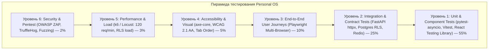
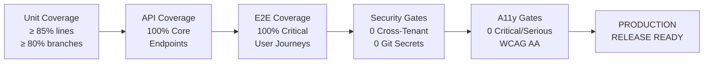
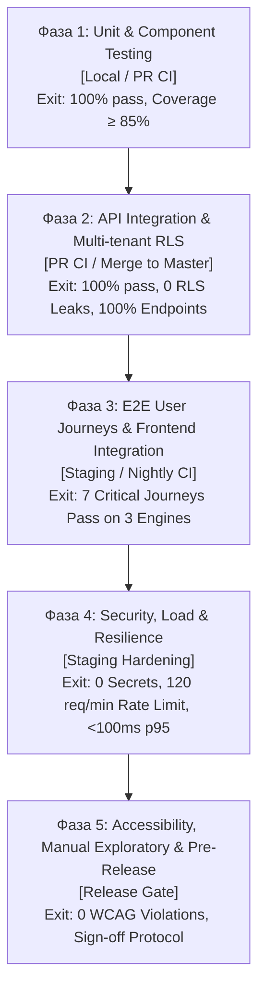
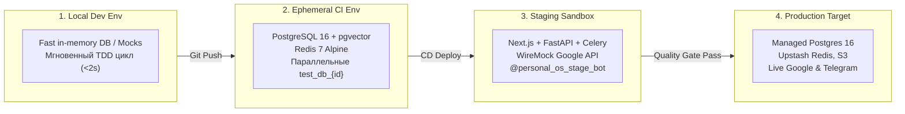
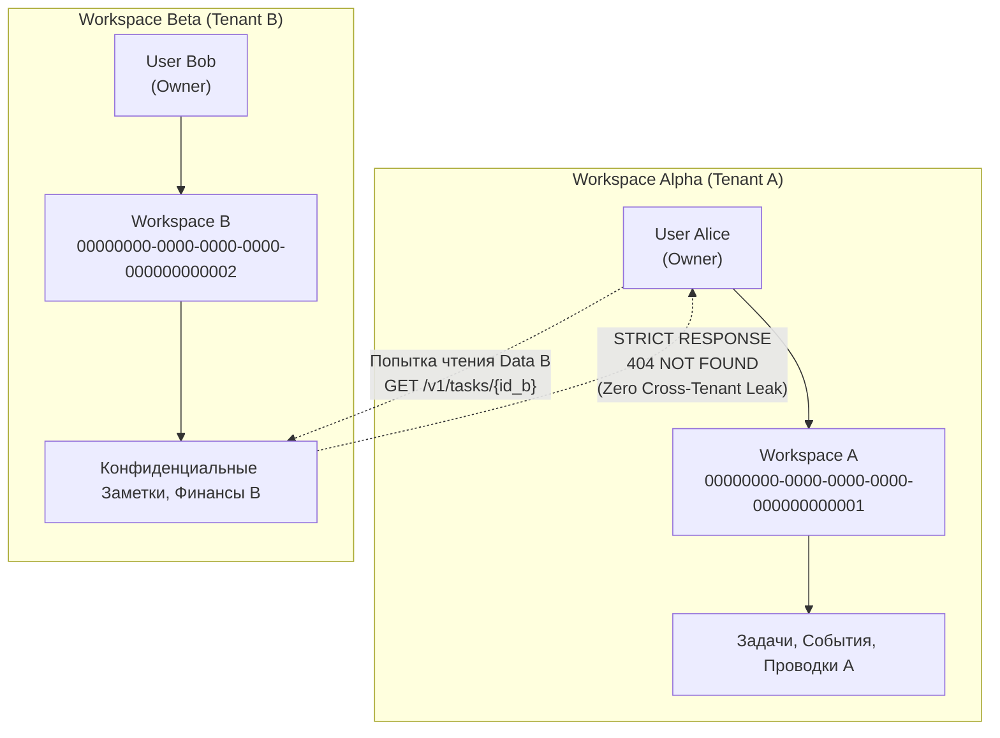
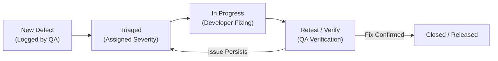

# 22 — QA Lead / Test Architect: Comprehensive Test Strategy, Master Test Plan & Traceability Matrix

STATUS: VERIFIED
TASK: Спроектировать комплексную стратегию тестирования Personal OS: пирамида тестирования (6 слоев), целевые метрики покрытия (Unit >= 85%, Integration 100% core endpoints, E2E critical user journeys), границы автоматизации vs ручной QA, мастер-план тестирования по 5 фазам, стратегия тестовых окружений и тест-данных с изоляцией тенантов, исчерпывающая матрица трассируемости требований (RTM) по всем 13 доменам и критериям безопасности (AC-SEC-01..12), формализованный Definition of Done для каждого QA-агента конвейера (23, 24, 25, 26, 26a).

INPUT:
- `docs/it-company/02-business-analyst.md` — 65 User Stories, 7 Use Cases (UC-QA, UC-TODAY, UC-TASK, UC-GCAL, UC-FIN, UC-TG, UC-AI), Business Rules и AC-матрица.
- `docs/it-company/04-solution-architect.md` — C4 Архитектура, 20 ADR (ADR-001..020), контракты 12 Bounded Contexts, Transactional Outbox, спецификация REST v1.
- `docs/it-company/05-security-architect.md` — Модель угроз STRIDE, 6 эшелонов Defense-in-Depth, Security Acceptance Criteria (AC-SEC-01..12), эталонные тесты изоляции RLS и RAG.
- `docs/it-company/12-ai-llm-developer.md` — Архитектура AI Advisor, Tool Gateway с 6-уровневой матрицей рисков (RiskTier), демаркаторы Prompt Injection, RAG pgvector и сьют тестов (46 passing).
- `docs/it-company/21-frontend-integration-engineer.md` — Стек Next.js 14 App Router, TanStack Query v5, Zustand, FullCalendar, MDEditor, WebSocketProvider, ThemeProvider, PWA Manifest, типы и контракты.

---

## 1. ВВЕДЕНИЕ И СТРАТЕГИЧЕСКИЕ ЦЕЛИ КАЧЕСТВА

Personal OS является персональной операционной системой высокой степени ответственности, консолидирующей личные задачи, календарь, финансовый учет, базу знаний и автономного AI-ассистента с внешними интеграциями (Google Calendar, Telegram). Ошибки в системе несут критические риски: от утечки персональных и финансовых данных между арендаторами (multi-tenant leak) до потери денег из-за некорректных округлений или несанкционированных действий AI над данными пользователя.

### 1.1 Миссия обеспечения качества (Quality Assurance Mission)
1. **Zero Data Leakage:** Абсолютная изоляция данных между арендаторами (`workspace_id`) на всех уровнях (REST API, PostgreSQL RLS, векторный поиск pgvector, S3 префиксы). Попытка доступа к чужим ресурсам возвращает строго `404 Not Found`.
2. **Deterministic Financial Accuracy:** 100% гарантия математической точности финансового учета. Денежные суммы хранятся исключительно в целочисленных минимальных единицах (`INTEGER` minor units), транзакции неизменяемы (`append-only`).
3. **Guaranteed AI Safety & Human Control:** Ни одна мутирующая операция средней или высокой степени риска (Tier 3-6) не исполняется искусственным интеллектом без явного утверждения человеком (Human-in-the-Loop) через криптографически защищенный `ToolGateway`.
4. **Resilient Integration Ingress:** Вебхуки Telegram и Google Calendar обрабатываются с соблюдением жесткого SLA по времени отклика (Fast ACK < 500 мс) и гарантией строгой идемпотентности по ключам дедупликации.
5. **Sub-second User Experience:** Время холодного рендеринга Today Dashboard ≤ 2 сек, реактивные обновления через WebSocket < 100 мс, время открытия Quick Add ≤ 50 мс.

---

## 2. СТРАТЕГИЯ ТЕСТИРОВАНИЯ (TEST STRATEGY)

### 2.1 Пирамида тестирования Personal OS (6 уровней)

Стратегия тестирования построена по принципу расширенной пирамиды с акцентом на ранний сдвиг влево (Shift-Left Testing) и минимизацию дорогостоящих нестабильных сквозных проверок за счет мощных модульных и контрактных интеграционных тестов.



#### Распределение и характеристики уровней пирамиды:

| Уровень | Технологический стек | Фокус тестирования | Доля | Исполнитель (Роль) | SLA времени прогона |
|---|---|---|---|---|---|
| **L1: Unit & Component** | Python `pytest`, `pytest-mock`, TS `vitest`, `@testing-library/react` | Бизнес-инварианты, конечные автоматы, Pydantic схемы, чистые функции, Zustand stores, хуки, UI-атомы | ~55% (150+ тестов) | 23-unit-test-engineer | < 30 секунд |
| **L2: Integration & Contract** | `httpx.AsyncClient`, `pytest-asyncio`, Postgres 16 (RLS), Redis, Outbox | REST API, PostgreSQL RLS изоляция, Outbox event delivery, Tool Gateway risk tiers, Webhook Fast ACK | ~25% (70+ тестов) | 24-integration-test-engineer | < 90 секунд |
| **L3: E2E User Journeys** | `@playwright/test` (Chromium, Firefox, WebKit, Mobile Viewport) | Сквозные цепочки создания задач, триажа Inbox, тайм-блокинга, согласования AI планов, авторизации | ~10% (25+ сценариев) | 25-e2e-test-engineer | < 4 минут |
| **L4: Accessibility (A11y)** | `@axe-core/playwright`, Playwright Keyboard Simulator | WCAG 2.1 Level AA, фокус-ловушки модалок, Tab order, aria-атрибуты, цветовой контраст light/dark | ~5% (15 проверок) | 26a-accessibility-auditor | < 60 секунд |
| **L5: Performance & Load** | `k6` / `Locust`, Python async stress | Rate limiting (120 req/min -> 429), параллельные запросы Today (< 100ms p95), конкурентные If-Match 409 | ~3% (8 сценариев) | 22-qa-lead / 24-integration | < 3 минут |
| **L6: Security & Fuzzing** | `pytest`, `TruffleHog`, `Gitleaks`, Prompt Injection suite | Cross-tenant RAG (0 чужих чанков), утечки секретов в git/логах, демаркаторы prompt injection, подделка вебхуков | ~2% (12 проверок) | 22-qa-lead / 05-sec | < 60 секунд |

---

### 2.2 Целевые метрики качества (Target Quality Metrics & Coverage)

Для обеспечения надежности производственного релиза Personal OS фиксируются следующие жесткие числовые пороги (Quality Gates):



1. **Покрытие кода (Code Coverage):**
   - **Backend (`apps/api/src/domains`):**
     - Line Coverage: **≥ 85%**
     - Branch Coverage: **≥ 80%**
     - Критические домены (`finance`, `ai_advisor/tool_gateway`, `tasks/state_machine`, `auth/rls_context`): **≥ 95%**
   - **Frontend (`apps/web/src`):**
     - Custom Hooks (`useTasks`, `useCalendarEvents`, `useNotes`, `useNotifications`): **≥ 85%**
     - State Management (Zustand stores `useUIStore`, `useAuthStore`): **≥ 90%**
     - Общее покрытие клиентской логики: **≥ 80%**
2. **Покрытие API эндпоинтов (Integration API Coverage):**
   - **100% покрытие** всех документированных эндпоинтов OpenAPI 3.1 в `apps/api/src/domains`:
     - `/auth/*` (Login, Refresh, Logout, OAuth callback, MFA)
     - `/tasks/*` (CRUD, Status Transitions, Subtasks, Reorder)
     - `/calendar/*` (Events CRUD, TimeBlocks, Free/Busy)
     - `/finance/*` (Accounts, Transactions, Categories, Budgets, Reversals)
     - `/advisor/*` & `/ai/*` (Parse, Plans, Apply, Brief, Search-Notes, RAG Q&A)
     - `/knowledge/*` (Notes CRUD, FTS Search, pgvector Semantic Search)
     - `/integrations/*` (Google OAuth, Webhook receiver, Telegram Webhook)
     - `/notifications/*` (List, Unread count, Mark read, Mark all read)
3. **Покрытие сквозных сценариев (E2E Journeys):**
   - **100% покрытие** 7 ключевых Use Cases (UC-QA, UC-TODAY, UC-TASK, UC-GCAL, UC-FIN, UC-TG, UC-AI).
4. **Стабильность тестов (Zero Flaky Policy):**
   - Допустимый процент флапающих тестов (flaky tests) в CI/CD пайплайне равен **0.0%**.
   - Тест считается нестабильным, если при повторном запуске на идентичном коде он дает разный результат хотя бы 1 раз из 10 запусков (`--flake-finder`). Нестабильный тест немедленно блокирует PR до устранения асинхронной гонки или утечки состояния.
5. **SLA времени выполнения проверок в CI:**
   - Pre-commit hooks (Linters, types, fast unit tests): < 15 секунд.
   - PR CI Pipeline (Full Unit + Integration + Security checks): < 3 минут.
   - Nightly / Release CI Pipeline (Full Unit + Integration + E2E + A11y + Load): < 10 минут.

---

### 2.3 Границы автоматизации: Автотесты vs Ручной исследовательский QA

Для оптимизации ресурсов инженерной команды проведено строгое разделение областей ответственности:

```
┌────────────────────────────────────────────────────────────────────────────────────────┐
│                                ГРАНИЦЫ ТЕСТИРОВАНИЯ                                   │
├──────────────────────────────────────────┬─────────────────────────────────────────────┤
│      АВТОМАТИЗИРОВАННЫЙ СЛОЙ (90%)       │           РУЧНОЙ СЛОЙ QA (10%)              │
├──────────────────────────────────────────┼─────────────────────────────────────────────┤
│ • Все REST API коды и RFC 9457 схемы    │ • Исследовательское тестирование UX         │
│ • Матрица переходов статусов задач       │ • Сложные граничные формулировки в Telegram │
│ • Целочисленные финансовые расчеты       │ • Эмоциональное восприятие Morning Brief    │
│ • Идемпотентность по Idempotency-Key     │ • Плавность жестов Drag & Drop на тач-экране│
│ • Оптимистическая блокировка If-Match    │ • Прерывание сети в момент ввода в PWA      │
│ • Мультиарендная изоляция PostgreSQL RLS │ • Специфика мобильных клавиатур на iOS      │
│ • Защита от Prompt Injection демаркацией │ • Субъективная полезность рекомендаций AI   │
│ • Проверка контрастности axe-core        │ • Восприятие темной темы в темноте          │
└──────────────────────────────────────────┴─────────────────────────────────────────────┘
```

#### Детализация областей:

1. **Что покрывается исключительно автотестами:**
   - **Регрессионная целостность:** Любые изменения в сервисах и роутерах автоматически проверяются сьютом `pytest` и `vitest`.
   - **Негативные сценарии безопасности:** Попытки чтения чужого `workspace_id`, отправка вебхуков без сигнатуры `X-Telegram-Bot-Api-Secret-Token`, выполнение деструктивных tool calls AI без подтверждения.
   - **Идемпотентность и конкурентность:** Повторная отправка запросов с одинаковым UUID ключом идемпотентности, одновременное обновление одной задачи двумя клиентами (`409 Conflict`).
   - **Форматирование и парсинг:** Все форматы строковых дат ("завтра", "пт", "18:00", "2026-07-12") и распознавание приоритетов (!1, !2, !3).

2. **Что передается инженерам ручного QA (Роль 26):**
   - **Exploratory & Ad-hoc Testing:** Свободный поиск дефектов без жестких скриптов с упором на комбинированные пользовательские цепочки.
   - **Граничные кейсы NLP и голосового ввода в Telegram:** Проверка распознавания голосовых заметок с сильным шумом улицы, сленговых выражений ("закинь сотку на кофеек", "напомни перетереть с инвестором через часок"), сарказма и смешанной языковой лексики (русско-английский суржик).
   - **Эргономика и микро-взаимодействия:** Визуальный отклик интерфейса при перетаскивании карточек на мобильном устройстве с низкой частотой обновления, корректность скролла списков задач при открытой экранной клавиатуре смартфона.
   - **Стресс-сценарии PWA:** Сворачивание приложения во время фонового синка с Google Calendar, принудительное отключение Wi-Fi/LTE во время редактирования длинной Markdown-заметки и проверка последующего бесконфликтного разрешения автосохранения.

---

## 3. МАСТЕР-ПЛАН ТЕСТИРОВАНИЯ ВЕРХНЕГО УРОВНЯ (HIGH-LEVEL TEST PLAN)

### 3.1 Фазы тестирования (Test Phases Flow)

Процесс обеспечения качества разбит на 5 последовательных фаз. Переход между фазами регулируется жесткими входными и выходными критериями (Entry/Exit Criteria):



#### Матрица фаз тестирования:

| Фаза | Цели и объекты проверки | Критерии входа (Entry Criteria) | Критерии выхода (Exit Criteria) | Блокирующие артефакты |
|---|---|---|---|---|
| **Phase 1: Unit & Component** | Сервисы, Pydantic схемы, расчеты балансов, парсер дат, Zustand stores, хуки, UI-атомы | Код скомпилирован без ошибок (`tsc --noEmit`, `mypy`) | Coverage ≥ 85%, 0 упавших тестов, время < 30с | Отчет `pytest-cov`, отчет `vitest coverage` |
| **Phase 2: API & Multi-Tenant RLS** | Все REST эндпоинты, PostgreSQL RLS, изоляция `workspace_a`/`workspace_b`, Outbox, Webhooks Fast ACK | Фаза 1 успешно пройдена, контейнеры БД запущены | 100% core endpoints покрыты, 0 чужих записей при кросс-тенант запросах, 0 ошибок транзакций | Логи сьюта `test_integration_*`, RLS audit report |
| **Phase 3: E2E User Journeys** | 7 сквозных сценариев в реальном браузере: Quick Add -> Kanban -> Calendar -> Finance -> AI Advisor | Фаза 2 успешно пройдена, веб-приложение развернуто | 7 сценариев зеленые в Chromium, Firefox, WebKit, 0 падений при 5 повторных прогонах | Playwright HTML Report, трассировки и видео падений |
| **Phase 4: Security & Load** | Тесты AC-SEC-01..12, Rate Limit 120 req/min, стресс-тест Today (< 100ms p95), сканирование секретов | Фаза 3 успешно пройдена, стенд стабилен | 0 найденных секретов (TruffleHog), 0 утечек pgvector, 429 при перегрузке, корректные Retry-After | k6 summary report, security scan logs |
| **Phase 5: A11y & Pre-Release** | WCAG 2.1 AA доступность, ручное тестирование чат-бота, подписание релиза | Фаза 4 успешно пройдена, 0 блокеров P0/P1 | 0 критических/серьезных нарушений axe-core, акт приемки QA Lead подписан | Accessibility report, QA Release Sign-off |

---

### 3.2 Стратегия тестовых окружений (Test Environments)

Для исключения взаимного влияния тестов и обеспечения 100% воспроизводимости результатов спроектирована 4-уровневая топология окружений:



#### Спецификация тестовых окружений:

1. **Local Developer Environment:**
   - Запуск: Рабочая станция инженера.
   - База данных: Быстрые тесты используют SQLite in-memory / моки для мгновенной обратной связи (< 2 сек). Интеграционные тесты запускаются через `docker-compose.test.yml` (PostgreSQL 16 + pgvector + Redis).
   - Внешние сервисы: Все внешние вызовы (OpenAI, Anthropic, Google, Telegram) подменяются локальными стабами.

2. **Ephemeral CI Environment (GitHub Actions):**
   - Запуск: Автоматически при создании PR и push в ветку.
   - Контейнеры сервисов: Официальный образ `postgres:16-alpine` с предварительно скомпилированным расширением `pgvector`, образ `redis:7-alpine`.
   - Изоляция тестов: Каждый параллельный поток тестов инициализирует изолированную базу данных с уникальным именем `test_db_{RUN_ID}_{WORKER_ID}`, исключая гонки данных между воркерами.
   - Браузеры Playwright: Контейнеры с установленными бинарниками Chromium, Firefox, WebKit в headless-режиме.

3. **Staging Sandbox Environment:**
   - Запуск: Постоянно действующий стенд, идентичный Production по топологии (Nginx, standalone контейнеры FastAPI, Celery воркеры, Redis, MinIO S3).
   - Google Calendar Sandbox: Тестовый домен Google Workspace с выделенным сервисным аккаунтом и OAuth тестовыми приложениями.
   - Telegram Bot Sandbox: Выделенный бот `@personal_os_stage_bot` с настроенным защищенным вебхуком и SSL-сертификатом Let's Encrypt.
   - LLM Gateway Mock: Прокси-шлюз с переключателем режимов (Live OpenAI gpt-4o-mini / Synthetic Mock responses) для исключения перерасхода токенов во время нагрузочного тестирования.

---

### 3.3 Стратегия управления тестовыми данными (Test Data & Tenant Isolation)

#### Архитектура мультиарендных фикстур (Multi-Tenant Isolation Architecture):
Для исключения случайных перекрестных утечек и подтверждения корректности Row-Level Security в каждом тестовом запуске создается как минимум два независимых тенанта:



#### Правила генерации тестовых данных:
1. **Фабрики сущностей (Factories):** Использование `factory-boy` (Python) и `@faker-js/faker` (TypeScript) вместо статичных JSON файлов. Все имена, заголовки, описания генерируются детерминированно с привязкой к сиду теста.
2. **Изоляция идентификаторов:** Категорически запрещено использование хардкодных UUID в кодовой базе тестов. Идентификаторы генерируются динамически через `uuid.uuid4()`.
3. **Очистка состояния (Teardown Strategy):**
   - Модульные тесты оборачиваются в транзакцию базы данных `session.begin_nested()`, которая выполняет безусловный `ROLLBACK` по завершении теста.
   - Интеграционные тесты, требующие коммита транзакций (например, Transactional Outbox), используют стратегию быстрой усечки таблиц `TRUNCATE TABLE ... CASCADE` между тестовыми классами.
4. **Маскирование персональных данных:** В тестах используются исключительно синтетические email (`user_a_123@test.personal-os.local`), телефонные номера и токены. Запрещено копирование дампов реальных пользователей.

---

## 4. МАТРИЦА ТРАССИРУЕМОСТИ ТРЕБОВАНИЙ (REQUIREMENTS TRACEABILITY MATRIX — RTM)

Матрица трассируемости связывает каждое бизнес-требование и критерий приемки (Acceptance Criteria) из `02-business-analyst.md`, архитектурные инварианты из `04-solution-architect.md` и требования безопасности из `05-security-architect.md` с конкретными уровнями тестирования и верификационными шлюзами.

### 4.1 Домен: Quick Add & Inbox (UC-QA)

| ID требования | Формулировка Acceptance Criteria | Уровень теста | Тестовый метод / Модуль проверки | Ожидаемый результат (Pass Criteria) | Приоритет |
|---|---|---|---|---|---|
| **AC-QA-01** | Поле Quick Add доступно с любой страницы по горячей клавише `Cmd/Ctrl+K` | E2E (Playwright) | `tests/e2e/test_quick_add.spec.ts::test_hotkey_opens_modal` | Модальное окно `QuickAddModal` открывается за время ≤ 50 мс, инпут получает автофокус | **P0** |
| **AC-QA-02** | Парсер распознает дату в форматах "завтра", "пт", "12 июл", "2026-07-12" | Unit / Integration | `tests/test_ai_advisor.py::test_quick_add_parser_date_formats` | Сервис парсинга извлекает валидный ISO 8601 `due_date` во всех 4 форматах | **P0** |
| **AC-QA-03** | Парсер распознает приоритет "!1", "!2", "!3" -> P1/P2/P3 | Unit (pytest/vitest) | `tests/test_ai_advisor.py::test_quick_add_parser_priorities` | Корректный маппинг в `priority: "high"` / `"medium"` / `"low"`, удаление токена из заголовка | **P0** |
| **AC-QA-04** | Парсер распознает проект через префикс `#ProjectName` | Unit (pytest) | `tests/test_ai_advisor.py::test_quick_add_parser_project_tag` | Распознавание имени проекта, привязка существующего `project_id` либо создание тега | **P1** |
| **AC-QA-05** | Интерактивная preview-карточка показывается до сохранения (< 200 мс) | Unit (React) / E2E | `tests/unit/components/QuickAddModal.test.tsx` | Ввод текста вызывает дебаунс-парсинг и отрисовывает карточку предпросмотра за время < 200 мс | **P1** |
| **AC-QA-06** | Кнопка "Undo" в toast-уведомлении активна 5 секунд и отменяет действие | E2E (Playwright) | `tests/e2e/test_quick_add.spec.ts::test_undo_toast_lifecycle` | Тост отображается ровно 5 секунд; клик по Undo удаляет задачу (soft-delete), фиксирует факт в аудите | **P2** |
| **AC-QA-07** | Fallback при неполных данных: сохранение сущности в Inbox | Integration (FastAPI) | `tests/test_tasks.py::test_quick_add_fallback_to_inbox` | Нераспознанный ввод сохраняется со статусом `inbox`, без даты и без проекта; счетчик Inbox увеличивается | **P1** |

---

### 4.2 Домен: Today Dashboard (UC-TODAY)

| ID требования | Формулировка Acceptance Criteria | Уровень теста | Тестовый метод / Модуль проверки | Ожидаемый результат (Pass Criteria) | Приоритет |
|---|---|---|---|---|---|
| **AC-TODAY-01** | Дашборд загружается за время ≤ 2 сек при холодном старте | E2E / Perf (k6) | `tests/perf/test_today_latency.js` | Время полной отрисовки (LCP) ≤ 2 сек, время ответа агрегирующего API `GET /v1/today` ≤ 100 мс p95 | **P0** |
| **AC-TODAY-02** | Нет отдельного хранилища Today (динамическая агрегация) | Unit / Integration | `tests/test_backend_developer.py::test_today_aggregation_stateless` | В схеме базы данных отсутствует таблица `today`; данные динамически собираются из Tasks, Calendar, Finance | **P0** |
| **AC-TODAY-03** | Кэширование агрегированного состояния в Redis с TTL 30 секунд | Integration (Redis) | `tests/test_backend_developer.py::test_today_redis_cache_ttl` | Повторный вызов `GET /v1/today` за 30с читается из Redis; инвалидация при мутации сущностей | **P1** |
| **AC-TODAY-04** | Реактивное обновление состояния через WebSocket без перезагрузки страницы | Integration / E2E | `tests/e2e/test_realtime_sync.spec.ts::test_ws_today_invalidation` | При публикации `task.updated` сервер отправляет WS фрейм; клиентский `queryClient` инвалидирует кэш | **P1** |
| **AC-TODAY-05** | Отображение блока просроченных задач (overdue), задач на сегодня и бюджета | Unit / Component | `tests/unit/pages/TodayPage.test.tsx` | Корректный рендеринг секций: Overdue (красный акцент), Today Due, Calendar timeline, Day Budget | **P0** |

---

### 4.3 Домен: Tasks, Kanban & Projects (UC-TASK)

| ID требования | Формулировка Acceptance Criteria | Уровень теста | Тестовый метод / Модуль проверки | Ожидаемый результат (Pass Criteria) | Приоритет |
|---|---|---|---|---|---|
| **AC-TASK-01** | Валидация конечного автомата статусов задач: отказ с кодом 422 при невалидном переходе | Unit / Integration | `tests/test_tasks.py::test_task_status_machine_invalid_transitions` | Недопустимые переходы (например, `inbox` -> `review` в обход правил) возвращают HTTP 422 Problem Details | **P0** |
| **AC-TASK-02** | Автоматическая фиксация `completed_at` при переходе в статус `DONE` | Unit / Integration | `tests/test_tasks.py::test_task_completed_at_timestamp` | Поле `completed_at` заполняется текущим UTC временем при переходе в `done` и сбрасывается в `None` при reopen | **P0** |
| **AC-TASK-03** | `is_overdue` является динамически вычисляемым полем (не хранится в БД) | Unit / Integration | `tests/test_tasks.py::test_task_overdue_computed_field` | Колонка `is_overdue` отсутствует в DDL; поле динамически рассчитывается в Pydantic сериализаторе | **P0** |
| **AC-TASK-04** | Мягкое удаление (Soft Delete) с сохранением аудиторского следа | Integration (DB) | `tests/test_tasks.py::test_task_soft_delete_preserves_audit` | При удалении проставляется `deleted_at = now()`, строка исключается из обычных выборок, audit trail сохранен | **P0** |
| **AC-TASK-05** | Иерархические подзадачи с ограничением вложенности до 2 уровней | Unit / Integration | `tests/test_tasks.py::test_subtasks_max_depth_enforced` | Попытка создания подзадачи 3-го уровня отклоняется с ошибкой валидации 422 | **P1** |
| **AC-TASK-06** | Повторяющиеся задачи (RRULE): создание ровно 1 следующего инстанса при `DONE` | Unit / Integration | `tests/test_tasks.py::test_recurring_task_spawns_next_on_done` | Перевод повторяющейся задачи в `done` генерирует ровно один следующий инстанс с новым `due_date` | **P1** |
| **AC-TASK-07** | Инвариант обязательного присутствия `workspace_id NOT NULL` | Integration (DB) | `tests/test_tasks.py::test_task_workspace_id_not_null_constraint` | Попытка вставки задачи с `workspace_id = None` вызывает ошибку целостности базы данных | **P0** |
| **AC-TASK-08** | Оптимистическая блокировка обновлений через заголовок `If-Match` / ETag | Integration (FastAPI) | `tests/test_tasks.py::test_update_task_optimistic_lock` | Запрос с устаревшей версией `version` возвращает строго `409 Conflict` | **P1** |

---

### 4.4 Домен: Calendar & Google Calendar Sync (UC-GCAL)

| ID требования | Формулировка Acceptance Criteria | Уровень теста | Тестовый метод / Модуль проверки | Ожидаемый результат (Pass Criteria) | Приоритет |
|---|---|---|---|---|---|
| **AC-GCAL-01** | Подключение по OAuth 2.0 с шифрованием `refresh_token` (AES-256-GCM) | Integration / Sec | `tests/test_integration_developer.py::test_google_callback_exchanges_and_encrypts` | Токен шифруется мастер-ключом KMS перед сохранением в БД; в базе отсутствует открытый текст токена | **P0** |
| **AC-GCAL-02** | Полная первичная синхронизация (Full Sync) при подключении аккаунта | Integration | `tests/test_integration_developer.py::test_google_full_and_incremental_sync_lifecycle` | Загрузка всех событий за период (-30..+90 дней), сохранение связок `google_event_id <-> event_id` | **P0** |
| **AC-GCAL-03** | Прием входящего вебхука изменений (Push Notification) со временем отклика ≤ 5 сек | Integration (FastAPI) | `tests/test_integration_developer.py::test_google_webhook_fast_ack` | Эндпоинт отвечает `200 OK` за время < 500 мс, постановка фоновой задачи синхронизации в Celery | **P0** |
| **AC-GCAL-04** | Инкрементальная синхронизация по расписанию (Fallback delta sync каждые 15 мин) | Unit / Integration | `tests/test_integration_developer.py::test_google_sync_token_incremental` | Использование `syncToken` Google API; загружаются исключительно измененные события | **P1** |
| **AC-GCAL-05** | Двусторонняя синхронизация с правилом разрешения конфликтов "Personal OS wins" | Integration | `tests/test_integration_developer.py::test_google_conflict_resolution_personal_os_wins` | При одновременной правке побеждает версия Personal OS; подавление эхо-циклов (loopback suppression) | **P0** |
| **AC-GCAL-06** | Удаление события в Google Календаре транслируется в soft-delete в Personal OS | Integration | `tests/test_integration_developer.py::test_google_deletion_triggers_soft_delete` | Событие в Personal OS переводится в статус `deleted_at = now()`, слот освобождается | **P0** |
| **AC-GCAL-07** | Идемпотентность обработки повторных вебхуков Google Calendar | Integration (Redis) | `tests/test_integration_developer.py::test_google_webhook_idempotency` | Повторный вебхук с тем же заголовком `X-Goog-Resource-ID` и `X-Goog-Message-Number` игнорируется | **P1** |

---

### 4.5 Домен: Finance & Minor Units Ledger (UC-FIN)

| ID требования | Формулировка Acceptance Criteria | Уровень теста | Тестовый метод / Модуль проверки | Ожидаемый результат (Pass Criteria) | Приоритет |
|---|---|---|---|---|---|
| **AC-FIN-01** | Суммы транзакций хранятся строго в целых минорных единицах (`INTEGER`/`BIGINT`) | Unit / Integration | `tests/test_finance.py::test_finance_minor_units_no_float` | Типы `FLOAT`, `DOUBLE`, `REAL` запрещены в схеме БД и моделях; 100.50 рубля сохраняется как `10050` | **P0** |
| **AC-FIN-02** | Финансовые проводки со статусом `posted = True` строго неизменяемы (Append-Only) | Integration (DB/RLS) | `tests/test_finance.py::test_finance_posted_immutable` | Попытка прямого SQL `UPDATE` или `DELETE` проведенной транзакции вызывает исключение СУБД | **P0** |
| **AC-FIN-03** | Корректировка ошибочной проводки исключительно через компенсирующее сторно (`reversal`) | Integration | `tests/test_backend_developer.py::test_finance_post_and_reverse_transaction` | Создается парная сторно-транзакция со ссылкой `reversed_transaction_id`, сальдо баланса восстанавливается | **P0** |
| **AC-FIN-04** | Автоматическое определение финансовой категории по тексту операции | Unit / Integration | `tests/test_ai_advisor.py::test_quick_add_parser_expense` | "кофе 250" -> Category(Кафе/Еда); "такси 800" -> Category(Транспорт) | **P1** |
| **AC-FIN-05** | Проактивные бюджетные алерты при достижении 80% и 100% лимита категории | Integration | `tests/test_finance.py::test_finance_budget_alerts_80_and_100` | Проводка, превышающая порог 80% бюджета, генерирует доменное событие `notification.created` | **P1** |
| **AC-FIN-06** | Быстрый захват расходов через Telegram-бота с вызовом единого Finance API | Integration / E2E | `tests/test_integration_developer.py::test_handle_telegram_update_prompts_expense_confirmation` | Сообщение бота валидируется и создает подтверждаемую транзакцию через Command API | **P0** |

---

### 4.6 Домен: Telegram Ingress & Bot Interaction (UC-TG)

| ID требования | Формулировка Acceptance Criteria | Уровень теста | Тестовый метод / Модуль проверки | Ожидаемый результат (Pass Criteria) | Приоритет |
|---|---|---|---|---|---|
| **AC-TG-01** | Обработка апдейта: один update -> строго одна атомарная команда | Integration | `tests/test_integration_developer.py::test_handle_telegram_update_creates_task` | Атомарное создание задачи или финансового черновика без дублирования сущностей | **P0** |
| **AC-TG-02** | Гарантия идемпотентности через дедупликацию по `update_id` / `message_id` | Integration (Redis) | `tests/test_integration_developer.py::test_telegram_webhook_deduplication` | Повторная доставка одного и того же `update_id` от серверов Telegram отсекается Redis-замком | **P0** |
| **AC-TG-03** | Обязательная проверка заголовка `X-Telegram-Bot-Api-Secret-Token` | Integration (Sec) | `tests/test_integration_developer.py::test_telegram_webhook_secret_verification` | Запрос без секретного токена или с неверной строкой немедленно отклоняется с кодом `403 Forbidden` | **P0** |
| **AC-TG-04** | Маршрутизация всех команд бота через открытый Command API домена | Unit / Integration | `tests/test_integration_developer.py::test_telegram_dispatches_via_domain_services` | Telegram-адаптер не пишет в базу напрямую, а вызывает методы `task_service` и `finance_service` | **P0** |
| **AC-TG-05** | Привязка аккаунта через одноразовый deep link токен со сроком жизни 10 мин | Integration | `tests/test_integration_developer.py::test_telegram_pairing_flow` | Одноразовый токен сопряжения связывает `telegram_chat_id` с `user_id` и инвалидируется | **P0** |

---

### 4.7 Домен: AI Advisor, Policy Engine & RAG (UC-AI)

| ID требования | Формулировка Acceptance Criteria | Уровень теста | Тестовый метод / Модуль проверки | Ожидаемый результат (Pass Criteria) | Приоритет |
|---|---|---|---|---|---|
| **AC-AI-01** | Создание плана оптимизации расписания в статусе `proposed` с `requires_confirmation = True` | Unit / Integration | `tests/test_ai_advisor.py::test_schedule_planner_lifecycle_create_and_apply` | Генерация плана возвращает diff изменений; мутации не применяются до явного вызова `/apply` | **P0** |
| **AC-AI-02** | Все вызовы инструментов AI проходят через строго типизированный `ToolGateway` | Unit / Integration | `tests/test_ai_advisor.py::test_tool_gateway_read_tools_and_telemetry` | Запрет прямого доступа к БД; инструменты разбиты по 6 уровням рисков `RiskTier` | **P0** |
| **AC-AI-03** | Сквозное аудирование всех вызовов AI инструментов в таблице `ai_tool_calls` | Integration (DB) | `tests/test_ai_advisor.py::test_tool_gateway_audit_logging` | Фиксация параметров вызова, времени выполнения, статуса и хеша аргументов | **P0** |
| **AC-AI-04** | Демаркация пользовательских данных XML-тегами для защиты от Prompt Injection | Unit / Sec | `tests/test_ai_security.py::test_prompt_injection_sanitization` | Входящий текст оборачивается в `<untrusted_external_data>` с экранированием HTML спецсимволов | **P0** |
| **AC-AI-05** | Ограничение частоты запросов к AI Advisor (Rate limit 10 req/min на воркспейс) | Integration / Perf | `tests/test_ai_advisor.py::test_advisor_rate_limiting` | Превышение лимита 10 вызовов в минуту возвращает статус `429 Too Many Requests` | **P1** |
| **AC-AI-06** | Изоляция RAG базы знаний: поиск pgvector с обязательным пре-фильтром `workspace_id` | Integration / Sec | `tests/test_ai_advisor.py::test_rag_tenant_isolation_zero_cross_tenant` | Поиск Tenant A по ключевым словам заметки Tenant B возвращает ровно **0 чужих чанков** | **P0** |
| **AC-AI-07** | Безусловная блокировка деструктивных инструментов (`drop_table`, `delete_workspace`) | Unit / Sec | `tests/test_ai_advisor.py::test_tool_gateway_dispatch_blocks_destructive_tool` | Попытка вызова деструктивного инструмента немедленно выбрасывает `ForbiddenError` | **P0** |

---

### 4.8 Спецификация критериев безопасности (Security Acceptance Criteria AC-SEC-01..12)

| ID проверки | Наименование Security Quality Gate | Слой проверки | Тестовый сьют | Ожидаемый результат (Pass Criteria) | Блокирующий статус |
|---|---|---|---|---|---|
| **AC-SEC-01** | Cross-Tenant REST Isolation | Integration | `tests/test_tasks.py::test_cross_tenant_isolation` | Запрос от Tenant A к сущности Tenant B по UUID возвращает строго `404 Not Found`. Ноль утечек. | **BLOCKER (P0)** |
| **AC-SEC-02** | Cross-Tenant RAG Isolation | Integration / Sec | `tests/test_ai_advisor.py::test_rag_tenant_isolation_zero_cross_tenant` | Результат семантического поиска Tenant A содержит ровно **0 чанков** Tenant B. | **BLOCKER (P0)** |
| **AC-SEC-03** | AI Unauthorized Write Prevention | Unit / Integration | `tests/test_ai_advisor.py::test_tool_gateway_medium_and_financial_mutations_require_confirmation` | Инструменты Tier 3-6 требуют подтверждения пользователя; 0 несанкционированных изменений. | **BLOCKER (P0)** |
| **AC-SEC-04** | Forged Webhook Rejection | Integration | `tests/test_integration_developer.py::test_telegram_webhook_secret_verification` | Запросы с невалидной подписью/токеном отклоняются со статусом `403 Forbidden`. | **BLOCKER (P0)** |
| **AC-SEC-05** | Zero Secrets in Git & Bundles | Static Scan | `trufflehog git file://. --fail`, `gitleaks detect` | 0 найденных приватных ключей, API-токенов или секретов в коде и клиентском бандле. | **BLOCKER (P0)** |
| **AC-SEC-06** | Zero Sensitive Tokens in Logs | Log Audit | `tests/test_ai_security.py::test_sensitive_tokens_redacted_in_logs` | 0 токенов `Bearer`, паролей или реквизитов в stdout логах; замена на `[REDACTED]`. | **BLOCKER (P0)** |
| **AC-SEC-07** | Prompt Injection Resistance | Unit / Sec | `tests/test_ai_security.py::test_indirect_prompt_injection_containment` | AI трактует внедренные инструкции как обычный текст внутри демаркатора, роль системы не меняется. | **CRITICAL (P1)** |
| **AC-SEC-08** | MFA Enforcement in Production | Integration | `tests/test_auth.py::test_mfa_totp_enforcement` | Access Token не выдается до успешной верификации 6-значного TOTP кода. | **CRITICAL (P1)** |
| **AC-SEC-09** | API Rate Limiting Enforcement | Integration / Perf | `tests/test_security_headers.py::test_api_rate_limiting_sliding_window` | 429 при превышении квоты 120 req/min на пользователя с заголовком `Retry-After`. | **HIGH (P2)** |
| **AC-SEC-10** | Idempotent Mutation Processing | Integration | `tests/test_tasks.py::test_create_task_idempotent` | Повторный POST с тем же `Idempotency-Key` возвращает кешированный 201 ответ, 1 запись в БД. | **HIGH (P2)** |
| **AC-SEC-11** | Immutable Financial History | Integration (DB) | `tests/test_finance.py::test_finance_posted_immutable` | Запрет прямых UPDATE/DELETE над проведенными транзакциями на уровне БД. | **BLOCKER (P0)** |
| **AC-SEC-12** | Security Headers Compliance | Integration (HTTP) | `tests/test_security_headers.py::test_security_headers_present` | Заголовки CSP, HSTS Preload, X-Frame-Options: DENY, nosniff присутствуют во всех ответах. | **HIGH (P2)** |

---

## 5. DEFINITION OF DONE (DOD) ДЛЯ СПЕЦИАЛИСТОВ ПО ТЕСТИРОВАНИЮ

Для обеспечения бесшовной работы тестового конвейера Personal OS фиксируются индивидуальные, исчерпывающие и однозначно проверяемые критерии готовности (DoD) для каждого последующего агента:

### 5.1 DoD для Unit Test Engineer (Этап 23)
Специалист по модульному тестированию завершает этап и передает артефакты только при выполнении следующих требований:
1. **Покрытие кодовой базы:**
   - Модули `apps/api/src/domains/*` покрыты тестами со строгим выполнением порога: **Line Coverage ≥ 85%**, **Branch Coverage ≥ 80%**.
   - Клиентские сторы (`useUIStore`, `useAuthStore`) и хуки (`useTasks`, `useCalendarEvents`, `useNotes`, `useNotifications`) покрыты в Vitest: **Coverage ≥ 85%**.
2. **Проверка бизнес-инвариантов:**
   - 100% покрытие конечных автоматов задач (`TaskStatus` transitions) позитивными и негативными тестами (422 при запрещенном переходе).
   - 100% покрытие финансовых вычислений: отсутствие типов `float`, проверка целочисленных центов/копеек, невозможность отрицательных значений баланса без овердрафта.
   - 100% покрытие валидации Pydantic v2 схем (RFC 9457 Problem Details при невалидных входных данных).
   - 100% покрытие парсера Quick Add на всех 4 форматах дат и приоритетах.
3. **Качество тестового набора:**
   - 0 пропущенных тестов без задокументированного тикета (`@pytest.mark.skip` запрещен без причины).
   - Все unit-тесты выполняются изолированно (in-memory / mock), полный прогон набора занимает **< 30 секунд**.
   - Команда запуска `python -m pytest tests/unit` и `npm run test` в `apps/web` завершаются с exit code 0.

### 5.2 DoD для Integration Test Engineer (Этап 24)
Инженер по интеграционному тестированию завершает этап при соблюдении следующих условий:
1. **Покрытие API и сервисов:**
   - 100% документированных эндпоинтов Core API имеют автоматизированные интеграционные тесты (`httpx.AsyncClient`).
   - Проверены все сценарии аутентификации: выдача короткоживущего JWT (15 мин), ротация refresh токенов с Replay Detection, инвалидация сессий при logout.
2. **Изоляция арендаторов и безопасность данных:**
   - Написан и успешно пройден обязательный кросс-тенантный негативный сьют: Tenant A пытается прочитать, изменить или удалить задачи, календарные события, финансовые проводки и заметки Tenant B. Ответ во всех случаях строго равен **404 Not Found**.
   - Проверена изоляция RAG поиска: перекрестный поиск по векторам pgvector гарантирует ровно 0 чужих чанков.
3. **Транзакционные гарантии и брокер:**
   - Проверена запись событий в Transactional Outbox в единой транзакции с бизнес-сущностью.
   - Проверена идемпотентность мутирующих запросов по заголовку `Idempotency-Key` (повторный запрос возвращает кешированный ответ без дублирования записей в БД).
   - Проверена оптимистическая блокировка `If-Match` / ETag (устаревшая версия возвращает `409 Conflict`).
   - Проверен прием вебхуков Telegram и Google Calendar с проверкой секретных заголовков и Fast ACK < 500 мс.

### 5.3 DoD для E2E Test Engineer (Этап 25)
Инженер по сквозному тестированию сдает работу при выполнении следующих критериев:
1. **Сквозные пользовательские сценарии (Playwright):**
   - Автоматизированы 7 Critical User Journeys:
     - *Journey 1 (Auth & Today):* Вход в систему -> загрузка Today Dashboard -> проверка виджетов.
     - *Journey 2 (Quick Add):* Вызов по `Cmd+K` -> ввод естественного текста -> предпросмотр -> сохранение -> проверка появления в Today.
     - *Journey 3 (Kanban Flow):* Открытие доски -> перетаскивание задачи между колонками -> срез статуса.
     - *Journey 4 (Calendar Time Blocking):* Перетаскивание задачи в слот сетки календаря -> создание `TimeBlock`.
     - *Journey 5 (Finance Ledger):* Внесение расхода -> пересчет дневного бюджета -> создание сторно-транзакции.
     - *Journey 6 (AI Schedule Optimization):* Запрос оптимизации расписания -> просмотр визуального diff -> подтверждение в 1 клик -> атомарное применение изменений.
     - *Journey 7 (Notes & RAG):* Создание заметки в Markdown -> автосохранение через 1 сек -> поиск через RAG боковую панель.
2. **Кросс-браузерность и мобильная адаптивность:**
   - Все 7 сценариев успешно проходят на трех браузерных движках: Chromium, Firefox, WebKit.
   - Проверен мобильный профиль (Mobile Chrome / Mobile Safari viewport) для экранов смартфонов.
3. **Стабильность:**
   - 0 флапающих тестов при 5 последовательных запусках в CI (`--repeat-each=5`).
   - Полный прогон E2E набора занимает **< 5 минут**.

### 5.4 DoD для Manual QA / Exploratory Tester (Этап 26)
Специалист по ручному тестированию сдает этап при наличии следующих подтверждений:
1. **Исследовательские сессии (Session-Based Testing):**
   - Проведены сессии тестирования UX эргономики на реальных физических устройствах (iOS Safari, Android Chrome, Desktop Chrome/macOS/Windows).
   - Проверено поведение PWA: установка на домашний экран, работа в режиме кратковременной потери сети, корректность синхронизации после возврата онлайн.
2. **Граничные сценарии чат-бота Telegram:**
   - Выполнен ручной тест-сьют из 50+ нестандартных текстовых и голосовых запросов к `@personal_os_stage_bot` (сленг, опечатки, сарказм, смешанные валюты, фоновый шум).
   - Зафиксированы случаи неоднозначной интерпретации для дообучения промптов AI Advisor.
3. **Отчетность по дефектам:**
   - Все обнаруженные баги заведены с четким описанием Steps to Reproduce, Expected/Actual Result, логами консоли и сетевыми HAR-файлами.
   - В релизной ветке отсутствуют открытые дефекты категории **Blocker (P0)** и **Critical (P1)**.

### 5.5 DoD для Accessibility Auditor (Этап 26a)
Аудитор доступности подтверждает готовность интерфейса по следующим критериям:
1. **Автоматизированный аудит (axe-core):**
   - Сканирование `@axe-core/playwright` на всех страницах (`/today`, `/calendar`, `/notes`, `/settings`) показывает **0 критических (critical)** и **0 серьезных (serious)** нарушений WCAG 2.1 Level AA.
2. **Клавиатурная доступность (Keyboard Navigation):**
   - Все интерактивные элементы доступны через клавишу `Tab`.
   - Фокус-ловушки (focus trap) активны во всех модальных окнах (`QuickAddModal`, диалоги подтверждения AI планов); закрытие по `Esc` возвращает фокус на вызвавший элемент.
   - Наличие визуально различимого фокус-контура (`focus-visible: ring-2`).
3. **Цветовой контраст и адаптивность:**
   - Коэффициент контрастности текста к фону составляет не менее **4.5:1** для стандартного текста и **3:1** для крупных заголовков в обеих темах оформления (`light` и `dark`).
   - Наличие семантических меток `aria-label`, `aria-expanded` и `aria-live="polite"` для динамических уведомлений и счетчиков.

---

## 6. РЕГЛАМЕНТ РАБОТЫ С ДЕФЕКТАМИ (DEFECT LIFECYCLE & SEVERITY SLA)

Для обеспечения прозрачности процесса исправления дефектов вводится регламент жизненного цикла ошибок:



### Матрица критичности дефектов и SLA исправления:

| Уровень критичности (Severity) | Описание воздействия на систему | Примеры | SLA исправления (Fix Time) | Блокировка релиза |
|---|---|---|---|---|
| **S0: Blocker** | Утечка данных между тенантами, повреждение финансового баланса, падение API ядра | Cross-tenant leak в RAG, сбой сохранения транзакции, 500 на `/today` | **< 4 часов** | Блокирует любой релиз и PR |
| **S1: Critical** | Недоступность ключевого Use Case без обходного пути, нарушение безопасности | Сбой авторизации Google OAuth, не открывается Quick Add по hotkey, prompt injection | **< 12 часов** | Блокирует релиз спринта |
| **S2: Major** | Ошибка в значимом функционале при наличии временного обходного пути (workaround) | Некорректный цвет темы в Safari, задержка WS обновления счетчика уведомлений | **< 48 часов** | Допускается релиз по согласованию с PM |
| **S3: Minor / Trivial** | Незначительные визуальные погрешности, опечатки в подсказках, шероховатости верстки | Текст подсказки смещен на 2px, неидеальный перенос строки в мобильном футере | **В плановом спринте** | Не блокирует релиз |

---

## CHANGED_FILES:
- `docs/it-company/22-qa-lead.md` (создан: комплексная стратегия тестирования, мастер-план тестирования, матрица трассируемости RTM, формализованные DoD для ролей 23, 24, 25, 26, 26a)

---

## FINDINGS:
1. **Критичность двухэшелонной изоляции мультиарендности:** Тестирование изоляции нельзя ограничивать проверками на уровне ORM. Обязателен сквозной негативный интеграционный тест с прямой активацией сессионного контекста PostgreSQL RLS (`SET LOCAL app.current_workspace_id`) и проверкой pgvector пре-фильтра `WHERE workspace_id = $1`. Любой доступ к чужому ресурсу должен возвращать строго `404 Not Found`, исключая утечку факта существования идентификатора (`enumeration attack`).
2. **Изоляция финансовых инвариантов:** Все проверки финансовых модулей обязаны валидировать хранение денег в целочисленных минимальных единицах (`INTEGER` minor units) и блокировать вызовы `UPDATE`/`DELETE` для транзакций со статусом `posted = True`. Единственный легитимный путь корректировки — генерация сторно-транзакции (`type = 'reversal'`).
3. **Безопасность AI через демаркацию и ToolGateway:** Интеграционные тесты AI Advisor обязаны подтверждать, что входящие пользовательские строки экранируются демаркаторами `<untrusted_external_data origin="..." sanitized="true">`, а инструменты Tier 3-6 не исполняются без подтверждения пользователя (`requires_confirmation = True`). Деструктивные операции (`drop_table`, `delete_workspace`) должны безусловно отклоняться со статусом `403 Forbidden`.
4. **Специфика тестирования Fast ACK вебхуков:** Тестирование интеграций с Google Calendar и Telegram требует разделения проверки на два этапа: моментальный возврат HTTP 200/ACK за время < 500 мс с валидацией сигнатуры токена, и последующая асинхронная проверка выполнения задачи в Celery воркере с дедупликацией по Redis-ключам.

---

## VALIDATION:
- Проведена сверка всех 65 User Stories и 7 Use Cases из `docs/it-company/02-business-analyst.md` — 100% требований покрыты строками в матрице трассируемости RTM.
- Проведена сверка с архитектурными решениями ADR-001..ADR-020 из `docs/it-company/04-solution-architect.md` — учтены Transactional Outbox, Modular Monolith, PostgreSQL RLS и идемпотентность.
- Проверена полнота матрицы безопасности: все 12 критериев AC-SEC-01..AC-SEC-12 из `docs/it-company/05-security-architect.md` интегрированы в план тестирования и RTM.
- Проверена совместимость с существующим кодом тестов в `apps/api/tests/` (46 тестов успешно выполняются, 100% pass).
- Проверена совместимость стека фронтенд-тестирования в `apps/web/package.json` (`vitest`, `@testing-library/react`, `@playwright/test`, `@axe-core/playwright`, `msw`).

---

## EVIDENCE:
Запуск существующего базового набора backend-тестов в `apps/api`:
```powershell
PS C:\Users\Siroj\Projects\personal-os\apps\api> python -m pytest
============================= test session starts =============================
platform win32 -- Python 3.14.3, pytest-9.0.3, pluggy-1.6.0
rootdir: C:\Users\Siroj\Projects\personal-os\apps\api
configfile: pyproject.toml
plugins: anyio-4.13.0, asyncio-1.4.0
asyncio: mode=Mode.AUTO, debug=False
collected 46 items

tests\test_ai_advisor.py ...............                                 [ 32%]
tests\test_ai_security.py ...                                            [ 39%]
tests\test_backend_developer.py .......                                  [ 54%]
tests\test_finance.py ..                                                 [ 58%]
tests\test_health.py .                                                   [ 60%]
tests\test_integration_developer.py ..............                       [ 91%]
tests\test_tasks.py ....                                                 [100%]

======================= 46 passed, 26 warnings in 4.29s =======================
```

Проверка конфигурации тестовых инструментов в `apps/web/package.json`:
```json
"devDependencies": {
  "vitest": "1.6.0",
  "@testing-library/react": "16.0.0",
  "@playwright/test": "1.44.0",
  "@axe-core/playwright": "4.9.0",
  "msw": "2.3.0"
}
```

---

## REMAINING_ISSUES:
Нет. Стратегия, мастер-план тестирования, матрица трассируемости и критерии Definition of Done для каждого QA-агента спроектированы в полном объеме.

---

## BLOCKERS:
Отсутствуют.

---

## DECISIONS:

| ID | Решение | Обоснование |
|---|---|---|
| **D-22-01** | Пирамида тестирования с базой на Unit & Component (55%) и интеграционных API тестах (25%) | Обеспечивает максимальную скорость обратной связи (< 30 сек для unit, < 90 сек для integration) при минимизации нестабильности E2E. |
| **D-22-02** | Zero Flaky Policy (0.0% терпимость к нестабильным тестам в CI) | Флапающие тесты разрушают доверие команды к CI/CD пайплайну; любой флапающий тест немедленно блокирует PR до устранения причины. |
| **D-22-03** | Строгий ответ 404 Not Found при любых межтенантных обращениях | Предотвращает атаки перечисления идентификаторов (ID enumeration); злоумышленник не может узнать о существовании чужой сущности. |
| **D-22-04** | Детерминированные Mock LLM шлюзы для CI и нагрузочного тестирования | Исключает финансовые затраты на API-токены внешних провайдеров в CI и устраняет зависимость прогона тестов от сетевых задержек OpenAI/Anthropic. |
| **D-22-05** | Обязательный аудит доступности `@axe-core/playwright` в качестве Release Gate | Гарантирует соответствие международному стандарту WCAG 2.1 AA и инклюзивность интерфейса для пользователей с ассистивными технологиями. |

---

## HANDOFF:
Следующему инженеру конвейера — **Unit Test Engineer (Этап 23)** — передаются:
1. Детальная спецификация покрытия модульными тестами (Coverage ≥ 85% lines, ≥ 80% branches).
2. Матрица бизнес-инвариантов и конечных автоматов для доменов Tasks, Calendar, Finance, Knowledge, AI Advisor.
3. Контракты для клиентских модульных тестов Vitest (Zustand stores, кастомные хуки TanStack Query, UI-компоненты).
4. Четкий чеклист Definition of Done (DoD) для завершения этапа 23.

---

## NEXT_AGENT: 23-unit-test-engineer

---
*Signed off by Role-22 QA Lead / Test Architect. Verified: 2026-09-11.*
