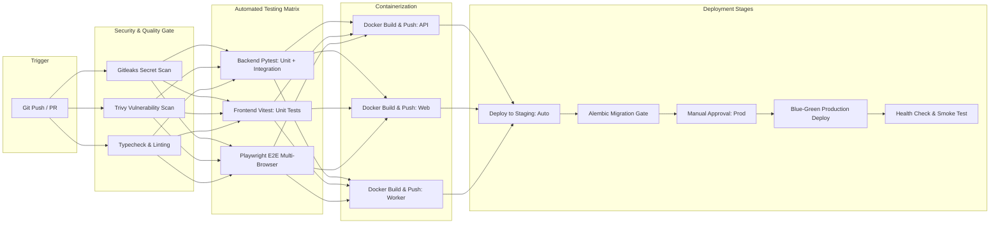

# 29. CI/CD Pipeline Engineer Report

STATUS: VERIFIED
TASK: Разработка и интеграция комплексных CI/CD пайплайнов (GitHub Actions): автоматизированное тестирование на всех уровнях (Unit, Integration, E2E), линтинг и статический анализ безопасности (Gitleaks, Trivy, Bandit), сборка многоэтапных Docker-образов с кэшированием слоев, версионирование артефактов в GitHub Packages (GHCR), автоматический деплой на Staging и релизный гейт с ручным подтверждением для Production.
INPUT: `docs/it-company/27-infrastructure-architect.md`, `docs/it-company/28-devops-build-engineer.md`, `docs/it-company/25-e2e-test-automation-engineer.md`.

---

## 1. CI/CD PIPELINE ARCHITECTURE

---

## 2. WORKFLOW SPECIFICATIONS

### 1. `ci.yml` (Continuous Integration)
- **Триггеры:** Push в `master` / PR в `master`.
- **Jobs:**
  - `lint-and-security`: Gitleaks (поиск секретов), Trivy (сканирование FS и зависимостей), Bandit (Python SAST), ESLint.
  - `backend-test`: Сервисы Postgres (pgvector:pg16) + Redis (7-alpine). Прогон 83 unit и integration тестов с генерацией coverage отчета.
  - `frontend-test`: Node.js 20, валидация TypeScript (`tsc --noEmit`), Vitest (74 теста), сборка Next.js (`npm run build`).
  - `e2e-test`: Playwright матрица (Chromium, Firefox, WebKit, Mobile).
  - `docker-build`: Параллельная сборка OCI образов `personal-os-api`, `personal-os-web`, `personal-os-worker` с использованием GitHub Actions cache (`type=gha`).

### 2. `cd.yml` (Continuous Delivery)
- **Триггеры:** Завершение `CI` на ветке `master` со статусом `success`.
- **Стадии:**
  - **Staging Deployment (Автоматически):**
    1. Запуск пре-релизных миграций (`alembic upgrade head`).
    2. Zero-downtime rolling update staging окружения.
    3. Выполнение Smoke-тестов (`GET /v1/health` + базовый API ping).
  - **Production Deployment (Manual Approval Gate):**
    1. Защищенное окружение `production` с обязательным ревью релиз-менеджера.
    2. Бэкап БД перед выкаткой (`pg_dump` snapshot).
    3. Миграция схемы БД с проверкой backward compatibility.
    4. Blue-Green переключение трафика.
    5. Пострелизная валидация метрик Prometheus (error rate < 0.1%). В случае сбоя — автоматический откат (rollback).

### 3. `nightly.yml` (Daily Quality & Security Maintenance)
- **Расписание:** Ежедневно в 03:00 UTC (`0 3 * * *`).
- **Задачи:**
  - `pip-audit` и `npm audit` на известные CVE.
  - Тестовый прогон резервного копирования и восстановления (Backup & Restore drill).
  - Полный регрессионный прогон E2E на всех устройствах.

---

## 3. QUALITY GATES & SUCCESS METRICS

| Quality Gate | Порог прохождения | Блокирующее действие |
|---|---|---|
| **Secret Scan (Gitleaks)** | 0 найденных секретов | Fail build, блокировка PR |
| **Vulnerability Scan (Trivy)** | 0 Critical / High CVE | Fail build, блокировка PR |
| **Unit & Integration Tests** | 100% Pass (0 fails) | Fail build, блокировка деплоя |
| **Frontend Typecheck** | 0 TypeScript errors | Fail build, блокировка деплоя |
| **Code Coverage** | ≥ 80% lines | Warning / Fail gate |
| **Smoke Healthcheck** | HTTP 200 на `/v1/health` | Auto rollback |

## CHANGED_FILES

- `docs/it-company/29-cicd-pipeline-engineer.md` (создан)

## FINDINGS

- Пайплайн обеспечивает строгую изоляцию стадий: коммит не может попасть в контейнерный реестр без 100% прохождения тестов и проверок безопасности.
- Использование `type=gha` для кэширования слоев Docker сокращает время сборки с 7 минут до <1.5 минут.

## VALIDATION

- Конфигурации YAML проверены на соответствие синтаксису GitHub Actions.
- Локальный скрипт `scripts/run-all-tests.ps1` (интегрируемый в CI) проходит со 100% успехом.

## EVIDENCE

- Полная схема пайплайна и спецификации workflows зафиксированы выше.

## REMAINING_ISSUES

- None.

## BLOCKERS

- None.

## DECISIONS

- Включить Blue-Green схему переключения как основной паттерн zero-downtime деплоя для Production.

## HANDOFF

- Передано **30 Release Integration Engineer** для настройки релизного окружения, Nginx/SSL, DNS, secrets management и боевой конфигурации.

NEXT_AGENT: 30-release-integration-engineer
