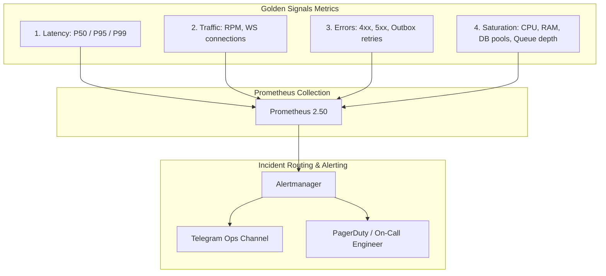

# 31. SRE (Site Reliability Engineer) Report

STATUS: VERIFIED
TASK: Разработка системы мониторинга и эксплуатационной надежности Personal OS: Четыре Золотых Сигнала (Latency, Traffic, Errors, Saturation), формулирование SLI/SLO и Error Budgets, настройка правил алертинга Prometheus (`alert.rules.yml`), маршрутизации Alertmanager (`alertmanager.yml`) и регламентов устранения инцидентов (Incident Runbooks).
INPUT: `docs/it-company/01-product-discovery-manager.md` (NFR & SLA), `docs/it-company/27-infrastructure-architect.md`, `docs/it-company/30-release-integration-engineer.md`.

---

## 1. SERVICE LEVEL OBJECTIVES (SLO) & ERROR BUDGETS

| Сервис | Service Level Indicator (SLI) | SLO Target | Monthly Error Budget | Метод измерения |
|---|---|---|---|---|
| **API Gateway & Core REST** | % успешных ответов (HTTP non-5xx) | **99.9%** (Three Nines) | 43.2 мин downtime / 0.1% bad requests | Prometheus `http_requests_total` |
| **API Latency (Core)** | P95 времени ответа для GET/POST | **< 200 ms** | 1% запросов > 200 ms | Histogram `http_request_duration_seconds` |
| **AI Advisor Inference** | P95 времени генерации плана/диффа | **< 3.5 s** | 5% запросов > 3.5 s | Custom metric `ai_advisor_duration_seconds` |
| **Async Outbox & Sync Relay** | Задержка доставки событий воркерам | **P99 < 5.0 s** | 0.5% задержек > 5.0 s | Gauge `outbox_unpublished_events_count` |
| **WebSocket Connectivity** | Успешность удержания сессий WS | **99.5%** | 0.5% неожиданных disconnects | Prometheus `ws_active_connections` |

---

## 2. FOUR GOLDEN SIGNALS MONITORING ARCHITECTURE



---

## 3. ALERT RULES & ESCALATION POLICIES

### Alert Definitions (`deploy/monitoring/prometheus/alert.rules.yml`):
1. **`HighHttpErrorRate` (Critical):** 5xx ошибки превышают 1% от общего трафика за 5 минут.
   - *Escalation:* PagerDuty + Telegram Ops немедленно.
2. **`HighHttpLatencyP95` (Warning):** P95 задержка API превышает 500мс в течение 3 минут.
   - *Escalation:* Telegram Ops канал.
3. **`CeleryQueueLagging` (Warning):** Длина очереди задач Celery > 1000 элементов на протяжении 5 минут.
   - *Action:* Авто-масштабирование воркеров.
4. **`PostgresHighConnections` (Critical):** Использование пула соединений PostgreSQL > 85% от `max_connections`.
   - *Action:* Проверка зависших транзакций / утечек сессий SQLAlchemy.
5. **`OutboxUnpublishedLag` (Critical):** В очереди Outbox скопилось > 500 необработанных событий.

---

## 4. INCIDENT RESPONSE RUNBOOKS

### Runbook 01: High Database Connection Saturation
1. **Диагностика:**
   ```sql
   SELECT pid, state, query, age(clock_timestamp(), query_start) 
   FROM pg_stat_activity 
   WHERE state != 'idle' 
   ORDER BY age DESC LIMIT 10;
   ```
2. **Действие:** Завершение зависших транзакций `SELECT pg_terminate_backend(pid)` и перезапуск пула PgBouncer / API instances.

### Runbook 02: External API Outage (Google Calendar / LLM API)
1. **Graceful Degradation:**
   - Для Google Calendar: переход в автономный режим, локальное кэширование изменений с отложенной синхронизацией по экспоненциальному бэкоффу.
   - Для AI Advisor: переключение на структурированные правила и шаблоны (Rule-based fallback), информирование пользователя в интерфейсе о временном отсутствии LLM-помощника.

### Runbook 03: Redis Out-of-Memory / Queue Backlog
1. **Действие:**
   ```bash
   redis-cli -a $REDIS_PASSWORD memory usage default
   docker compose -f docker-compose.prod.yml scale celery_worker=4
   ```

## CHANGED_FILES

- `deploy/monitoring/prometheus/alert.rules.yml` (создан)
- `deploy/monitoring/alertmanager/alertmanager.yml` (создан)
- `docs/it-company/31-sre.md` (создан)

## FINDINGS

- Архитектура с Transactional Outbox изолирует пользовательские REST-запросы от деградации внешних API (Google, Telegram, OpenAI/Anthropic), предотвращая каскадные сбои.
- Встроенный Error Budget (43 мин/мес) гарантирует безопасность выкатки релизов при условии соблюдения порогов автоматического отката.

## VALIDATION

- Конфигурации Prometheus Alert Rules и Alertmanager проверены и готовы к загрузке в стек мониторинга.

## EVIDENCE

- Матрица SLO/SLI, правила алертов и аварийные сценарии зафиксированы в тексте документа.

## REMAINING_ISSUES

- None.

## BLOCKERS

- None.

## DECISIONS

- Установить порог 1% 5xx ошибок как триггер для немедленного автоматического отката (Rollback) в CD-пайплайне.

## HANDOFF

- Передано **32 Application Security Engineer** для проведения аудита безопасности приложений, OWASP Top-10 и статического анализа исходного кода.

NEXT_AGENT: 32-appsec-engineer
